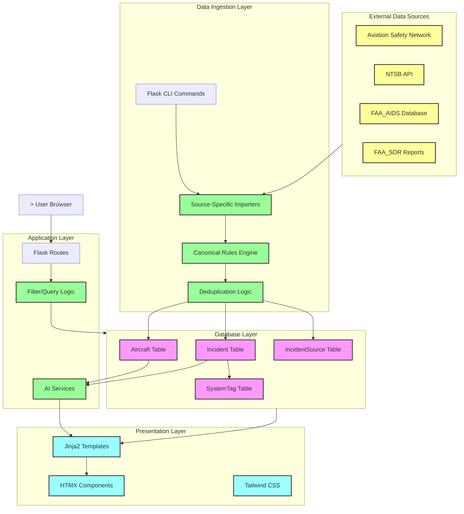

# Master Context Document
**Project**: Aircraft Safety Tracker
**Date**: 2025-04-25
**Purpose**: Regular health check / project documentation snapshot

---

## 1. Architecture Overview

### What This Application Does
The **Aircraft Safety Tracker** is a full-stack web application that aggregates aviation safety data from multiple sources (ASN, NTSB, FAA_AIDS, FAA_SDR) and uses Generative AI (Google Gemini, DeepSeek) to synthesize incident reports into concise safety assessments. It helps users assess aircraft safety profiles by providing searchable incident data and AI-generated summaries.

### Tech Stack
- **Backend**: Flask (Python), SQLAlchemy ORM
- **Database**: PostgreSQL (Production) / SQLite (Development)
- **Frontend**: Jinja2 templating, HTMX for AJAX updates, Tailwind CSS
- **AI Services**: Google Gemini, DeepSeek (service chain pattern)
- **Data Ingestion**: Custom scrapers/importers for ASN, NTSB, FAA_AIDS, FAA_SDR
- **Caching**: Flask-Caching (Redis or SimpleCache)
- **Deployment**: Vercel (via Procfile), environment-based config

### High-Level Component Breakdown
1. **Data Layer**: Database models (Aircraft, AircraftVariant, Incident, IncidentSource, etc.) managed via SQLAlchemy
2. **Application Layer**: Flask application factory with Blueprints, service layer for AI interactions
3. **Presentation Layer**: Server-side rendered templates with HTMX for dynamic updates
4. **Ingestion Layer**: Standalone CLI scripts for scraping and importing data from external sources

### How Components Communicate
- Routes (`app/routes.py`) handle HTTP requests and delegate to service/database layers
- AI Services (`app/services/`) encapsulate LLM interactions with error handling and retry logic
- Ingestion scripts (`app/ingestion/`) are CLI commands run separately to populate/update data
- HTMX enables AJAX-driven updates (search, pagination) without full page reloads

### Key Design Patterns
- **Application Factory Pattern**: Flask app creation via `create_app()` function with config mapping
- **Service Chain Pattern**: AI summary generation falls back through multiple services (DeepSeek → Gemini)
- **Repository Pattern**: Importers abstract data source specifics from database operations
- **Template Inheritance**: Jinja2 base template with content blocks for consistent layout

### Known Constraints / Non-Obvious Decisions
- **Source Priority Order**: Incidents are deduplicated and prioritized (NTSB > FAA_AIDS > FAA_SDR > ASN)
- **Auto-Seed Feature**: `AUTO_SEED=true` in `.env` auto-populates synthetic fixture data on startup
- **pg_trgm Extension**: Fuzzy search relies on PostgreSQL's trigram extension (not available in SQLite dev)
- **Legacy `aircraft_id = None` Issue**: Many non-ASN incidents have `aircraft_id = None` due to importer limitations, making them invisible in UI

---

## 2. Data Flow Diagram



---

## 3. File Map

| File Path | Responsibility |
|-----------|----------------|
| **app/__init__.py** ⭐ | Application factory, initializes Flask, SQLAlchemy, Cache, Migrate |
| **app/routes.py** ⭐ | Main Blueprint with all HTTP routes (search, aircraft details, incidents, AI summary) |
| **app/models.py** ⭐ | SQLAlchemy ORM models (Aircraft, AircraftVariant, Incident, IncidentSource, SystemTag, ReportAnalysis, etc.) |
| **app/forms.py** | WTForms for user input validation (RequestDataForm) |
| **app/context_processors.py** | Injects global template variables (import states, data freshness) |
| **app/services/__init__.py** | Service module exports |
| **app/services/gemini.py** | Google Gemini AI service wrapper with retry logic |
| **app/services/deepseek.py** | DeepSeek AI service wrapper |
| **app/services/report_analyzer.py** | NTSB report analysis service |
| **config.py** | Environment-based configuration (Dev, Prod, Test) |
| **app/static/css/styles.css** | Custom CSS overrides for Tailwind |
| **app/static/js/main.js** | Client-side JavaScript for UI interactions |
| **app/templates/base.html** ⭐ | Base template with navbar, footer, HTMX setup |
| **app/templates/index.html** | Homepage with search input |
| **app/templates/aircraft.html** ⭐ | Aircraft detail page with incidents, filters, AI summary |
| **app/templates/incidents_database.html** | Global incidents listing page |
| **app/templates/components/*.html** | HTMX partial templates for dynamic updates |
| **app/ingestion/__init__.py** | Ingestion module initialization |
| **app/ingestion/cli.py** | Flask CLI command `import-data` |
| **app/ingestion/canonical.py** | Canonical naming rules for aircraft make/model normalization |
| **app/ingestion/dedupe.py** | Incident deduplication logic |
| **app/ingestion/system_tagging.py** | JASC code to system tag mapping |
| **app/ingestion/importers/base.py** ⭐ | Base importer class with validation utilities |
| **app/ingestion/importers/ntsb_importer.py** | NTSB-specific data parsing and validation |
| **app/ingestion/importers/faa_aids_importer.py** | FAA_AIDS-specific data parsing |
| **app/ingestion/importers/faa_sdr_importer.py** | FAA_SDR-specific data parsing |
| **app/ingestion/bulk/*.py** | Bulk import scripts for each data source |
| **app/ingestion/clients/ntsb.py** | NTSB API client |
| **app/ingestion/normalization/jasc.py** | JASC code normalization |
| **app/ingestion/seed/jasc_seed.py** | Seed data for JASC mappings |

---

## 4. Bug Report

> **Note**: This is a health check snapshot. No active bug report. Recent observations from `25_Apr_Observations.md`:

### Observation 1: Homepage Manufacturer Search Missing Autocomplete
- **Issue**: Search for "Boeing" only shows "Boeing 727", not all available Boeing models
- **Root Cause**: Likely missing fuzzy search or autocomplete feature implementation
- **Status**: Needs investigation

### Observation 2: Internal Server Error When Accessing Airline
- **Issue**: Clicking an airline link results in "Internal Server Error"
- **Root Cause**: Recent code changes may have introduced a regression
- **Status**: Needs immediate investigation

### Observation 3: NTSB Model Mismatch on Links
- **Issue**: NTSB links redirect to wrong aircraft variants (e.g., 707-321B → 707-300)
- **Status**: Documented in PRD-0014

### Observation 4: NTSB PDF Links Return Errors
- **Issue**: Some NTSB document links return `{"Error": "The case with MKey 0 does not exist."}`
- **Status**: Documented in PRD-0014

---

## 5. Relevant Code Snippets

### app/routes.py - Source Priority Ordering
```python
SOURCE_PRIORITY_ORDER = {
    'NTSB': 1,
    'FAA_AIDS': 2,
    'FAA_SDR': 3,
    'ASN': 4,
}

def apply_source_priority_order(query):
    """Order incidents by date and deterministic source priority."""
    source_priority_case = db.case(
        (IncidentSource.source_name == 'NTSB', SOURCE_PRIORITY_ORDER['NTSB']),
        (IncidentSource.source_name == 'FAA_AIDS', SOURCE_PRIORITY_ORDER['FAA_AIDS']),
        (IncidentSource.source_name == 'FAA_SDR', SOURCE_PRIORITY_ORDER['FAA_SDR']),
        (IncidentSource.source_name == 'ASN', SOURCE_PRIORITY_ORDER['ASN']),
        else_=99,
    )
    # ...
```

### app/routes.py - AI Summary Job Processing
```python
def process_pending_summary_job(aircraft_id):
    # Falls back through service chain: DeepSeekService → GeminiService
    service_chain = (
        ('DeepSeekService', DeepSeekService),
        ('GeminiService', GeminiService),
    )
    for service_name, service_cls in service_chain:
        try:
            ai_service = service_cls()
            candidate_summary = ai_service.generate_aircraft_summary(aircraft_data)
        except Exception as service_exc:
            generation_errors.append(f'{service_name}:{type(service_exc).__name__}')
            continue
```

### app/ingestion/importers/base.py - URL Validation
```python
def validate_source_url(url):
    """Validates NTSB docket/details URLs via HEAD request."""
    # Returns (is_valid, status_code, error_message)

def validate_pdf_url(url):
    """Validates NTSB PDF report URLs via GET + body check for JSON errors."""
    # Returns (is_valid, status_code, error_message)
```

### app/models.py - Key Relationships
```python
class Aircraft(db.Model):
    variants = db.relationship('AircraftVariant', backref='aircraft', lazy='dynamic')
    incidents = db.relationship('Incident', backref='aircraft', lazy='dynamic')

class Incident(db.Model):
    sources = db.relationship('IncidentSource', backref='incident', lazy='dynamic')
    system_tags = db.relationship('SystemTag', backref='incident', lazy='dynamic')
    report_analysis = db.relationship('ReportAnalysis', backref='incident', uselist=False)
```

---

## 6. Error Log Summary

> No error logs provided for this health check. Recent changes and known issues documented in `Planning/Observations/25_Apr_Observations.md`.

### Known Technical Debt
1. **Missing Data Sources in UI**: Only ASN incidents visible despite multiple source pipelines
2. **Aircraft Resolution Failures**: Non-ASN incidents have `aircraft_id = None` due to importer limitations
3. **Hardcoded 1985 Filter**: Date filter may hide historical incidents (documented in PRD-0011)
4. **AI Summary Hanging**: Summary generation may timeout or hang indefinitely

---

## Summary for Claude

**What this app does**: Aircraft Safety Tracker is a Flask web app that lets users search for aircraft models and view their incident histories, with AI-generated safety summaries powered by Gemini/DeepSeek.

**Key architecture decisions**:
- Flask with Application Factory pattern
- SQLAlchemy ORM with PostgreSQL/SQLite
- Jinja2 + HTMX for server-side rendered dynamic UI
- Service chain pattern for AI fallback (DeepSeek → Gemini)
- Source priority deduplication (NTSB > FAA_AIDS > FAA_SDR > ASN)

**Immediate concerns**:
1. Internal Server Error when accessing airlines (regression)
2. Missing autocomplete on manufacturer search
3. Non-ASN incidents invisible in UI due to `aircraft_id = None`

**Suggested focus areas for next session**:
- Investigate and fix the airline access regression
- Re-implement fuzzy search/autocomplete
- Address the `aircraft_id = None` issue for data source visibility
