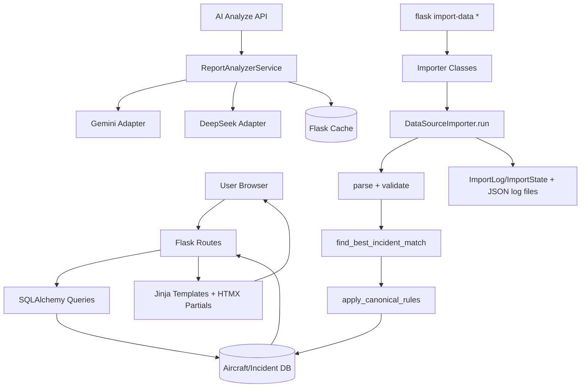

# Master Context Document
**Project**: Aircraft Safety Tracker  
**Date**: 2026-05-06  
**Purpose**: Repository brief / health-check snapshot

---

## 1. Architecture Overview

Aircraft Safety Tracker is a Flask monolith that aggregates aircraft incident data, normalizes and deduplicates it across multiple sources (NTSB, FAA_AIDS, FAA_SDR, ASN/MEDIA), and serves searchable aircraft and incident views with server-rendered templates. It also supports AI-assisted report analysis and aircraft-level summary generation with provider fallback.

### Stack
- Backend: Python, Flask, SQLAlchemy, Flask-Migrate, Flask-Caching
- DB: SQLite (local), PostgreSQL-compatible schema patterns
- Frontend: Jinja2 templates, HTMX interactions, Tailwind CSS, minimal vanilla JS
- AI: Gemini + DeepSeek adapters, request throttling/caching for report analysis
- Ingestion: CLI command group (`flask import-data ...`) + source-specific importer classes

### Core modules
- HTTP and UI orchestration: `app/routes.py`
- Domain models and relationships: `app/models.py`
- Ingestion pipeline and shared guards: `app/ingestion/importers/base.py`
- Source adapters: `app/ingestion/importers/*.py`
- Dedupe and canonicalization: `app/ingestion/dedupe.py`, `app/ingestion/canonical.py`
- AI report extraction service: `app/services/report_analyzer.py`

### Notable design choices
- Source priority determines canonical ordering and merge behavior (`NTSB > FAA_AIDS > FAA_SDR > ASN`)
- Ingestion is class-based with shared `run()` lifecycle (state tracking, logging, validation, upsert)
- Safety hardening includes URL/PDF validation during ingestion and SSRF defenses in report URL fetch
- Summary generation is queued via DB rows (`SummaryGenerationJob`) and processed on-demand from routes

---

## 2. Data Flow Diagram

---

## 3. File Map

| File Path | Responsibility |
|---|---|
| `app/__init__.py` ⭐ | App factory, extension init, blueprint/context processor/CLI registration. |
| `app/routes.py` ⭐ | Main web routes, filtering, CSV export, summary polling, `/api/analyze-report`, source status API. |
| `app/models.py` ⭐ | Core ORM entities: aircraft, incidents, sources, tags, dedupe decisions, import telemetry, link validation logs. |
| `config.py` | Environment-specific settings (size limits, trust headers, cache/model knobs). |
| `app/context_processors.py` | Injects shared template state (import/source health metadata). |
| `app/forms.py` | WTForms definitions for request/feedback flows. |
| `app/templates/base.html` | Base page chrome and global layout shell. |
| `app/templates/index.html` | Search landing page with HTMX-driven query UX. |
| `app/templates/aircraft.html` | Aircraft detail page: filters, summary card, incident list/export. |
| `app/templates/incidents_database.html` | Global incidents dashboard with filters and charts. |
| `app/templates/components/incident_list.html` | Aircraft incident table partial (sources, discrepancies, variants). |
| `app/templates/components/global_incident_list.html` | Paginated global card list partial. |
| `app/templates/components/stats_grid.html` | Aircraft stats summary cards. |
| `app/static/js/main.js` | Sidebar/search/export-link/read-more interactions and HTMX error toasts. |
| `app/ingestion/cli.py` ⭐ | `import-data` command group for per-source and bulk ingestion workflows. |
| `app/ingestion/importers/base.py` ⭐ | Shared importer lifecycle, make/model normalization, aircraft resolution/auto-create, log appenders. |
| `app/ingestion/importers/ntsb_importer.py` ⭐ | NTSB parsing/upsert with URL/PDF validation, variant-aware aircraft resolution. |
| `app/ingestion/importers/faa_aids_importer.py` | FAA AIDS parsing/upsert and dedupe integration. |
| `app/ingestion/importers/faa_sdr_importer.py` | FAA SDR fetch/parse/upsert with CSV path + retry controls. |
| `app/ingestion/dedupe.py` | Scored temporal/entity matching and dedupe decision persistence. |
| `app/ingestion/canonical.py` | Canonical field fill from preferred source and incident-source attachment logic. |
| `app/services/report_analyzer.py` ⭐ | Rate-limited, cached AI extraction from report text/URL with SSRF checks and PDF parsing. |
| `app/services/gemini.py` | Gemini wrapper used by summary/analyzer flows. |
| `app/services/deepseek.py` | DeepSeek wrapper with enablement and fallback behavior. |
| `migrations/versions/*.py` | Alembic schema evolution, including discrepancy and raw variant additions. |
| `tests/test_routes.py` ⭐ | Route-level behavior, API status/payload constraints, rendering guards. |
| `tests/test_importer_base.py` ⭐ | Shared importer behavior: stats, logs, auto-create, make/model normalization. |

---

## 4. Current Health Check Notes

### Strengths
- Ingestion has strong structure: source adapters + shared lifecycle with import telemetry.
- Dedupe decisions are auditable (`DedupeDecision` model and persistence).
- Report analysis endpoint includes payload limits and rate limiting.
- Link/source quality controls exist (source URL validation, PDF payload validation, link validation logs).

### Risks / watch areas
- Multiple Alembic heads can occur during active feature branches; local upgrades may need `flask db upgrade heads`.
- SQLite schema drift can surface quickly when model fields are added (e.g., new incident columns) if migrations are skipped.
- Route-level processing currently triggers summary job progress inline; this keeps UX simple but couples request latency to job state checks.
- Source-specific parsing quality remains a primary correctness lever (especially mixed FAA/NTSB field variants).

---

## 5. Key Runtime Flows

### A. Search and aircraft details
1. User types on `/`; HTMX calls `/search`.
2. Route queries `Aircraft` + `AircraftVariant`, groups by derived series.
3. User opens `/aircraft/<id>`; incidents are filtered + source-priority ordered.
4. Page renders stats, summary card, and incident table partials.

### B. Ingestion (`flask import-data ntsb|faa-aids|faa-sdr|all`)
1. CLI command instantiates importer and calls `run()`.
2. Importer `fetch()` emits raw records; `parse()` normalizes fields.
3. `validate()` drops malformed/old records; `upsert()` dedupes or creates incidents.
4. Canonical rules reconcile incident fields from preferred source.
5. Import metrics/state written to `ImportLog` and `ImportState`, plus JSON line logs.

### C. Report analysis API
1. `/api/analyze-report` validates payload size and required input.
2. Service applies per-client hourly limit and cache keying.
3. If URL input, service fetches content with SSRF/redirect checks.
4. Adapter generates structured result (`root_cause`, `contributing_factors`, `summary`).
5. Response is cached and returned with model + remaining quota metadata.

---

## 6. Suggested Next Deep-Dive Targets

- Normalize and document migration strategy for concurrent heads in active development.
- Add lightweight observability around `resolve_aircraft` miss rates by source to track orphan-risk.
- Consider extracting summary-job processing to worker/cron path if traffic increases.
- Periodically review unresolved `raw_model_variant` rows for parent-model gap fixes.

