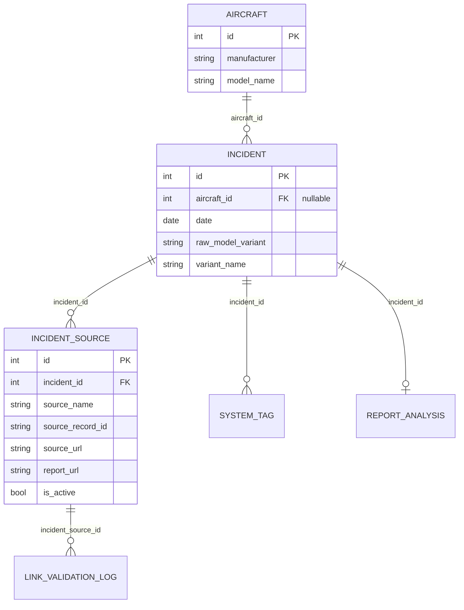
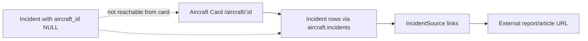

# Incident Report Linking Diagnostic Package
**Project**: Aircraft Safety Tracker  
**Date**: 2026-05-06  
**Scope**: NTSB docket/report link failures, Google CSE/SerpAPI search failures, and article-to-aircraft mapping gaps

## Progress Tracker
- ✅ 20% — Collected NTSB, web-search, mapping, and template code paths
- ✅ 45% — Captured live API request/response diagnostics (NTSB, Google CSE, SerpAPI)
- ✅ 65% — Collected DB evidence for article mapping failures and linkage nulls
- ✅ 85% — Built schema/flow diagrams + expected vs actual datasets
- ✅ 100% — Assembled prioritized bug template + validation test cases

---

## 1. Executive Findings

1. NTSB link quality failures are reproducible and partially expected for WA/international cases, but they currently degrade card-level UX due to sparse fallback handling.
2. Search enrichment backends are not currently returning usable article candidates in this environment:
   - Google CSE: API auth/config failure responses (400/403)
   - SerpAPI: quota/auth failure responses (401/429)
   - Fallback backend (Bing Lite): returns low-signal/search-engine links in raw mode
3. Article-to-aircraft mapping is the largest operational gap:
   - `MEDIA_TOTAL=26`, but `MEDIA_WITHOUT_AIRCRAFT=23`
   - Those 23 records cannot reliably surface on aircraft cards because card pages query by `aircraft_id`.
4. NTSB report link coverage is effectively absent in this DB snapshot:
   - `NTSB total=82664`, `NTSB report_url NULL=82664`
   - This forces reliance on docket/details links only.

---

## 2. NTSB Missing Docket / Report Analysis (with examples)

### Observed behavior
- WA/international dockets can return HTTP 200 but still represent unavailable records (`docket_not_released`).
- Certain report PDF endpoints return API errors (historically `"MKey 0"`), currently observed as HTTP 404 with same semantic failure.
- Legacy CAROL detail URLs are stored broadly and can be active even when no report URL exists.

### Specific failed retrieval examples

| Timestamp (UTC) | Endpoint | Request | HTTP | Error/Body Evidence |
|---|---|---|---:|---|
| 2026-05-06T13:41:29Z | NTSB Docket | `.../Docket/?NTSBNumber=DCA16WA084` | 200 | Validator returns `(False, 200, 'docket_not_released')` |
| 2026-05-06T13:41:31Z | NTSB Report PDF | `.../GenerateNewestReport/DCA90MA019/pdf` | 404 | Validator returns `(False, 404, 'http_404')`; prior known payload: `"The case with MKey 0 does not exist."` |
| 2026-05-06T13:38:38Z | NTSB Report PDF | same as above | 404 | Body snippet: `{"Error":"The case with MKey 0 does not exist.","ErrorCode":0}` |
| 2026-05-06T13:38:39Z | NTSB CAROL detail | `.../investigations/detail/36176` | 200 | HTML app shell (not guaranteed docket/report availability) |

### Local DB shape (link readiness)
- `NTSB total = 82664`
- `NTSB source_url NULL = 0`
- `NTSB report_url NULL = 82664`
- Sample rows:
  - `(id=2, source_record_id='NYC88LA174', source_url='https://carol.ntsb.gov/investigations/detail/36176', report_url=None, is_active=True)`
  - `(id=3, source_record_id='CHI88LA150', source_url='https://carol.ntsb.gov/investigations/detail/14104', report_url=None, is_active=True)`

---

## 3. Google CSE + SerpAPI Configuration and Query Diagnostics

### Configuration surface
- Google CSE env vars:
  - `GOOGLE_CSE_API_KEY`
  - `GOOGLE_CSE_CX`
- SerpAPI env var:
  - `SERPAPI_API_KEY`
- Backend priority in service:
  1. Google CSE
  2. SerpAPI
  3. Bing Lite
  4. DuckDuckGo HTML

### Query builder behavior
- Tier 1 query: `(site:avherald.com OR site:aviation-herald.com) <event_id> <registration> <year>`
- Tier 2 query: `(site:reuters.com OR site:apnews.com OR site:bloomberg.com) <event_id> <registration> <operator> <year>`
- Tier 3 query: `<event_id> <registration> <operator> <location> <year>`

### Runtime evidence (why results are not relevant/usable)

| Timestamp (UTC) | Service | Request (sanitized) | HTTP | Result |
|---|---|---|---:|---|
| 2026-05-06T13:40:28Z | Google CSE | `https://www.googleapis.com/customsearch/v1?key=***&cx=***&q=WPR24LA999+N12345+Delta+2024&num=5` | 400 | `API key not valid` |
| 2026-05-06T13:40:37Z | SerpAPI | `https://serpapi.com/search?engine=duckduckgo&q=WPR24LA999+N12345+Delta+2024&api_key=***&num=5` | 401 | `Invalid API key` |
| 2026-05-06T13:41:57Z | WebSearchService tiered run | Tier 1/2/3 logs | 403 / 429 | `Google CSE returned 403`, `SerpAPI returned 429`, validated result count = 0 |

### Additional quality issue
- Non-validated mode (`validate=False`) returned Tier-1 candidates:
  - `https://www.bing.com/`
  - `https://r.bing.com`
- These are not article links and indicate fallback extraction is collecting low-signal search-engine URLs before validation filters are applied.

---

## 4. Article-to-Aircraft Mapping Failure Analysis

### Evidence of mapping gap
- `MEDIA_TOTAL = 26`
- `MEDIA_WITHOUT_AIRCRAFT = 23`
- `MEDIA_WITH_AIRCRAFT = 3`

### Why this breaks card linkage
- Aircraft cards (`/aircraft/<id>`) load incidents by `aircraft.incidents`.
- MEDIA links are attached to incidents by `incident_id`.
- If incident has `aircraft_id=None`, MEDIA source exists but is effectively detached from aircraft card navigation.

### Sample failed mappings (from DB)
- `(incident_id=2147, aircraft_id=None, source_record_id='MIA88WA207:8da6bb0af6fa8bbf', source_url='https://avherald.com/h?article=51d87446')`
- `(incident_id=3095, aircraft_id=None, source_record_id='DCA88MA032:1022de5b7433516f', source_url='https://www.ntsb.gov/investigations/Pages/DCA88MA032.aspx')`
- `(incident_id=3266, aircraft_id=None, source_record_id='DCA88MA017:dcdfe9dccab0e574', source_url='https://www.ntsb.gov/investigations/Pages/DCA88MA017.aspx')`

### Related NTSB incident linkage gaps
- NTSB incidents with `aircraft_id=None` are present in volume (sample IDs: `2097..2106`), reinforcing that source links can exist without aircraft-card mapping.

---

## 5. API Request/Response Log Appendix (All Three Services)

## 5.1 NTSB
```text
2026-05-06T13:38:36.774662Z
GET https://data.ntsb.gov/Docket/?NTSBNumber=DCA16WA084
HTTP 200
Body snippet: <!DOCTYPE html> ...
Validator interpretation: docket_not_released

2026-05-06T13:38:38.218224Z
GET https://data.ntsb.gov/carol-repgen/api/Aviation/ReportMain/GenerateNewestReport/DCA90MA019/pdf
HTTP 404
Body snippet: {"Error":"The case with MKey 0 does not exist.","ErrorCode":0}
```

## 5.2 Google CSE
```text
2026-05-06T13:40:28.086032Z
GET https://www.googleapis.com/customsearch/v1?key=***&cx=***&q=WPR24LA999+N12345+Delta+2024&num=5
HTTP 400
Body snippet: {"error":{"code":400,"message":"API key not valid. Please pass a valid API key." ...}}
```

## 5.3 SerpAPI
```text
2026-05-06T13:40:37.544697Z
GET https://serpapi.com/search?engine=duckduckgo&q=WPR24LA999+N12345+Delta+2024&api_key=***&num=5
HTTP 401
Body snippet: {"error":"Invalid API key. Your API key should be here: https://serpapi.com/manage-api-key"}
```

---

## 6. Expected vs Actual Search Result Datasets (Airplane Model Queries)

Source of dataset: app test client + DB query snapshot.

| Query | Expected DB direct matches (`Aircraft.model_name ILIKE`) | Actual UI links in `/search` HTML | Interpretation |
|---|---:|---:|---|
| Boeing 707 | 18 | 114 | UI expands series/variant groups beyond direct model match count |
| 707-321B | 1 | 84 | UI returns broad grouped variants; precision ranking likely weak |
| Boeing 737-800 | 1 | 1 | Exact behavior as expected |
| Airbus A320-200 | 0 | 18 | Variant-based reverse mapping finds aircraft despite no exact model row |
| Concorde | 0 | 0 | Correct no-results case |

### Diagnostic takeaway
- Query recall is broad due variant grouping, but precision may degrade for model-specific diagnosis.
- For article-to-aircraft mapping bugs, search-layer behavior can mask underlying incident linkage gaps.

---

## 7. Database Schema + Relationship Diagrams

## 7.1 Entity relationship (card linkage focus)


## 7.2 Card-link path


---

## 8. Relevant Code Snippets (for debugging)

### 8.1 NTSB URL construction and validation
File: `app/ingestion/importers/ntsb_importer.py`
```python
candidate = f"https://data.ntsb.gov/Docket/?NTSBNumber={ntsb_num}"
is_valid, _, _ = validate_source_url(candidate)

candidate = f"https://data.ntsb.gov/carol-repgen/api/Aviation/ReportMain/GenerateNewestReport/{ntsb_num}/pdf"
is_valid, http_status, error_detail = validate_pdf_url(candidate)
```

### 8.2 NTSB WA docket detection
File: `app/ingestion/importers/base.py`
```python
if url and "data.ntsb.gov/Docket/" in url:
    response = client.get(url)
    if "has not been released" in response.text:
        return False, response.status_code, "docket_not_released"
```

### 8.3 Search backend priority
File: `app/services/web_search.py`
```python
backends = [
    lambda: _google_cse_search(query, tier, max_results),
    lambda: _serpapi_search(query, tier, max_results),
    lambda: _bing_lite_search(query, tier, max_results),
    lambda: _duckduckgo_search(query, tier, max_results),
]
```

### 8.4 Article mapping write path
File: `app/ingestion/cli.py`
```python
new_src = IncidentSource(
    incident_id=incident.id,
    source_name='MEDIA',
    source_record_id=source_record_id,
    source_url=best.url,
    is_active=True,
    confidence_level='Low',
)
```

### 8.5 Aircraft-card incident retrieval
File: `app/routes.py`
```python
aircraft = db.get_or_404(Aircraft, aircraft_id)
query = aircraft.incidents
incidents = apply_source_priority_order(query).distinct().limit(50).all()
```

### 8.6 Source link rendering
File: `app/templates/components/incident_list.html`
```jinja2

  
  

  

```

---

## 9. Sanitized Environment Configuration

## 9.1 Current `.env.example` (sanitized)
```env
FLASK_APP=run.py
FLASK_ENV=development
SECRET_KEY=<REDACTED_SECRET_KEY>
DATABASE_URL=sqlite:////absolute/path/to/data/aircraft_safety.db
GOOGLE_GEMINI_API_KEY=<REDACTED_GEMINI_KEY>
CACHE_TYPE=SimpleCache
```

## 9.2 Required link/search-related env vars (sanitized)
```env
# Web enrichment/search backends
GOOGLE_CSE_API_KEY=<REDACTED_GOOGLE_CSE_KEY>
GOOGLE_CSE_CX=<REDACTED_GOOGLE_CSE_ENGINE_ID>
SERPAPI_API_KEY=<REDACTED_SERPAPI_KEY>

# Link validation behavior
LINK_BREAK_ALERT_ENABLED=true|false

# Payload and analyzer limits
MAX_CONTENT_LENGTH=5242880
REPORT_ANALYZER_MAX_REPORT_TEXT_CHARS=50000
```

---

## 10. Reproduction Steps (Concrete)

### Case A: NTSB docket appears reachable but is unusable
1. Run:
   - `validate_source_url("https://data.ntsb.gov/Docket/?NTSBNumber=DCA16WA084")`
2. Observe:
   - HTTP 200, but returns `docket_not_released`.
3. Expected:
   - UI should clearly indicate no official docket and avoid presenting it as a valid report path.

### Case B: NTSB report API returns hard failure
1. Run:
   - `validate_pdf_url("https://data.ntsb.gov/carol-repgen/api/Aviation/ReportMain/GenerateNewestReport/DCA90MA019/pdf")`
2. Observe:
   - `(False, 404, "http_404")` (historically body includes `"MKey 0"` error payload).
3. Expected:
   - Report link suppressed/deactivated and surfaced with fallback guidance.

### Case C: Search enrichment yields no validated articles
1. Run:
   - `WebSearchService(validate=True).search_tiered(event_id="WPR24LA999", registration="N12345", operator="Delta Air Lines", location="Tokyo", date="2024-03-15")`
2. Observe:
   - Google CSE `403`, SerpAPI `429`, validated results `0`.
3. Expected:
   - At least one relevant article candidate or explicit backend-config health warning in operator output.

### Case D: Article exists but not linked to aircraft card
1. Inspect DB row:
   - `IncidentSource(source_name='MEDIA', incident_id=2147, source_url='https://avherald.com/h?article=51d87446')`
2. Observe:
   - `Incident(2147).aircraft_id is NULL`.
3. Expected:
   - Article should be discoverable from relevant aircraft card, requiring aircraft linkage resolution.

---

## 11. Expected Behavior Specifications

1. Clean NTSB link behavior
   - Show `Details` only when docket/details URL is valid and not `docket_not_released`.
   - Show `NTSB Docs` only when report URL validates as actual report content.
   - Deactivate/suppress broken links and mark source inactive after validation job.

2. Search backend behavior
   - If CSE/SerpAPI unavailable, operator-facing logs should include actionable status and fallback reason.
   - Fallback search should never return search-engine root URLs as candidate articles.
   - Tiered search should return relevant article domains before exhausting all tiers.

3. Article-to-aircraft mapping
   - Any MEDIA source attached to incident should map to an incident with non-null `aircraft_id`.
   - If not resolvable, queue remediation/backfill so article is eventually visible from card routes.

---

## 12. Prioritized Bug Report Template (Severity + Validation Tests)

## 12.1 Severity model
- `P0` Critical: Broken links/errors on primary incident navigation, data integrity risk
- `P1` High: Major feature blocked (no enrichment results, widespread mapping misses)
- `P2` Medium: Partial mismatch/precision issues, user confusion but workaround exists
- `P3` Low: Cosmetic/non-blocking diagnostics gaps

## 12.2 Ticket template
```markdown
# [Severity P?] Incident Linking Issue - <short title>

## Summary
<one-line failure statement>

## Impact
- User impact:
- Scope (% of incidents/models affected):
- Data integrity risk:

## Evidence
- Incident IDs / source_record_ids:
- API logs (timestamp/status/body):
- DB rows involved:

## Expected vs Actual
- Expected:
- Actual:

## Reproduction
1.
2.
3.

## Suspected Code Areas
- `app/ingestion/importers/ntsb_importer.py`
- `app/services/web_search.py`
- `app/ingestion/cli.py` (`enrich-wa-incidents`)
- `app/routes.py` / `app/templates/components/incident_list.html`

## Proposed Fix
- Short-term:
- Long-term:

## Validation Tests
- [ ] Unit: NTSB `docket_not_released` handling
- [ ] Unit: Report URL error payload/404 handling
- [ ] Unit: CSE/SerpAPI non-200 fallback behavior
- [ ] Integration: `search_tiered(validate=True)` returns non-search-engine article links
- [ ] Integration: MEDIA source insertion ensures card reachability (`incident.aircraft_id != NULL`)
- [ ] UI: Aircraft details page renders only valid actionable source/report links
```

## 12.3 Immediate test cases (ready to run)
- `tests/test_importer_validation.py` (docket/report validators)
- `tests/test_web_search_service.py` (backend query/fallback behavior)
- `tests/test_validate_incident_links.py` (weekly link validator semantics)
- `tests/test_source_links.py` (source link generation/render assumptions)

---

## 13. Recommended Next Actions (Priority Ordered)

1. **P0** Add strict suppression of non-actionable NTSB links in UI when validator marks unavailable/broken.
2. **P1** Introduce enrichment preflight checks for Google CSE/SerpAPI credentials/quota and fail fast with actionable diagnostics.
3. **P1** Add post-enrichment reconciliation job to backfill `incident.aircraft_id` for MEDIA-linked incidents.
4. **P2** Tighten fallback scraper filtering to block search engine root/result pages before candidate acceptance.
5. **P2** Add structured API telemetry table (service, query hash, status, latency, error code) for ongoing observability.

