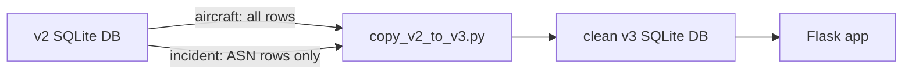

# Product Requirements Document: ASN-only v3 Database Bridge

**Project ID:** 0005  
**Created:** 25 May 2026  
**Author:** Product (with CTO)  
**Status:** Draft  
**Parent initiative:** v3 Boeing/Airbus link rebuild  
**Source plan:** `.cursor/plans/bridge_v2_db_to_v3_10f9ca6c.plan.md`  
**Branch policy:** `v3-boeing-airbus-links`; keep `main` stable

---

## 1. Introduction/Overview

### Problem statement

The v3 branch intentionally restarted from a clean schema after the v2 link-enrichment branch became too complex. A fresh v3 smoke-test database proved the app still runs, but it only contains **40 aircraft** and **1,785 incidents**, far smaller than the working local v2 database.

`main` had a simpler and more trustworthy behavior: incidents used `Incident.asn_url`, and the "Details" link worked consistently. The product decision for this PRD is to restore that proven ASN-only baseline first, using the larger v2 aircraft catalog as a data source, while deliberately excluding NTSB and FAA source rows until they are added back one source at a time with tests.

### Solution

Create a clean v3 database bridge that copies:

1. All aircraft rows from the v2 SQLite database.
2. Only incidents that have a real `asn_url`.
3. Only v3-compatible incident columns.
4. No `incident_source` rows.

This produces a larger v3 starting database with **100% working Details links** for every incident shown on aircraft pages.

### Goal

Start v3 from a trustworthy, ASN-only dataset that preserves `main`'s link quality while benefiting from v2's larger Boeing/Airbus aircraft catalog.

---

## 2. Goals

### Primary goals

1. Restore a larger aircraft catalog in v3 without carrying forward v2 migration or source-link baggage.
2. Ensure every imported incident has a working ASN `Details` link on day one.
3. Keep `incident_source` empty so NTSB and FAA sources can be added deliberately in later phases.
4. Preserve the clean v3 schema and Alembic chain.
5. Provide a repeatable script that can rebuild the clean ASN-only v3 database from the local v2 database.

### Secondary goals

1. Print clear verification counts after the copy operation.
2. Make the script idempotent so it is safe to rerun during development.
3. Document the reset/bridge decision in `JOURNAL.md`.
4. Keep the implementation simple enough for a junior developer to understand and maintain.

---

## 3. User Stories

**As a** portfolio visitor,  
**I want** every visible incident to have a working "Details" link,  
**So that** the app feels trustworthy and does not send me to blank or broken pages.

**As a** product owner,  
**I want** v3 to start from the proven `main` ASN-link behavior,  
**So that** we do not repeat the v2 pattern of adding many sources before validating them.

**As an engineer,**  
**I want** a clean copy script that moves only known-good columns and ASN-linked incidents,  
**So that** the v3 database is reproducible and easy to reason about.

**As an engineer,**  
**I want** `incident_source` to start empty,  
**So that** NTSB and FAA can be added back one source at a time with contract tests.

---

## 4. Functional Requirements

### FR-1: Source and target databases

1. **FR-1.1** The system must read from the local v2 database at `data/aircraft_safety.db`.
2. **FR-1.2** The system must write to the clean v3 database at `data/aircraft_safety_v3.db`.
3. **FR-1.3** The v2 database must be opened read-only or otherwise treated as immutable.
4. **FR-1.4** The copy process must not modify `data/aircraft_safety.db`.
5. **FR-1.5** SQLite database files must remain gitignored and must not be committed.

### FR-2: Aircraft copy

1. **FR-2.1** The system must copy all rows from v2 `aircraft` into v3 `aircraft`.
2. **FR-2.2** The system must preserve original `aircraft.id` values.
3. **FR-2.3** The system must copy only columns that exist in v3 `Aircraft`.
4. **FR-2.4** Expected verification count: **1,266 aircraft**.
5. **FR-2.5** Expected manufacturer breakdown: **1,005 Boeing** and **261 Airbus**.

### FR-3: Incident copy

1. **FR-3.1** The system must copy only incidents where `asn_url IS NOT NULL AND asn_url != ''`.
2. **FR-3.2** The system must preserve original `incident.id` values.
3. **FR-3.3** The system must copy only v3-compatible incident columns:
   - `id`
   - `aircraft_id`
   - `date`
   - `operator`
   - `location`
   - `fatalities`
   - `description`
   - `asn_url`
   - `incident_type`
4. **FR-3.4** The system must not copy v2-only incident columns:
   - `variant_name`
   - `registration`
   - `has_discrepancy`
   - `discrepancy_details`
   - `raw_model_variant`
5. **FR-3.5** Expected verification count: **1,796 incidents**.
6. **FR-3.6** Expected incident breakdown: **312 Boeing** and **1,484 Airbus**.
7. **FR-3.7** Every copied incident must have a non-empty `asn_url`.

### FR-4: IncidentSource reset

1. **FR-4.1** The system must not copy any rows from v2 `incident_source`.
2. **FR-4.2** The v3 `incident_source` table must remain empty after this PRD is complete.
3. **FR-4.3** Expected verification count: **0 incident_source rows**.
4. **FR-4.4** NTSB, FAA AIDS, FAA SDR, MEDIA, and other sources are out of scope for this PRD.

### FR-5: Copy script

1. **FR-5.1** Add a script at `scripts/copy_v2_to_v3.py`.
2. **FR-5.2** The script must use Python's standard `sqlite3` module; it must not require ORM setup.
3. **FR-5.3** The script must be idempotent. Rerunning it must not duplicate rows.
4. **FR-5.4** The script must print verification counts after completion:
   - aircraft count
   - incident count
   - incident_source count
   - ASN incident count by manufacturer
5. **FR-5.5** The script must exit non-zero if expected counts are not met.
6. **FR-5.6** The script must avoid deleting or mutating the source v2 database.

### FR-6: App behavior

1. **FR-6.1** When the app runs against `aircraft_safety_v3.db`, aircraft pages must load successfully.
2. **FR-6.2** Every incident row shown in the initial ASN-only v3 DB must render a "Details" link.
3. **FR-6.3** No initial incident row may render `N/A`.
4. **FR-6.4** The existing v3 `pick_primary_href` behavior must continue to prefer `incident.asn_url`.
5. **FR-6.5** The app must not depend on v2 `incident_source` rows to render the ASN-only baseline.

---

## 5. Non-Goals

1. Do not copy v2 `incident_source` rows.
2. Do not use v2 CAROL, NTSB, FAA AIDS, FAA SDR, or MEDIA links in this PRD.
3. Do not merge or reconcile v2 Alembic migration history.
4. Do not migrate v2-only incident columns into v3 models.
5. Do not add family rollup behavior in this PRD.
6. Do not change the public UI beyond whatever is already in v3 for rendering "Details" links.
7. Do not commit any SQLite database file.
8. Do not run NTSB or FAA bulk importers as part of this PRD.

---

## 6. Design Considerations

No new UI is required.

The visible product behavior should match the proven `main` baseline:

- If an incident exists on an aircraft page, it has a working "Details" link.
- The link points to `Incident.asn_url`.
- No incident row in the ASN-only starting DB should display `N/A`.

---

## 7. Technical Considerations

### Relevant files

- `scripts/copy_v2_to_v3.py` — new copy script.
- `data/aircraft_safety.db` — local v2 source database, not committed.
- `data/aircraft_safety_v3.db` — local clean v3 target database, not committed.
- `app/models.py` — v3 schema source of truth.
- `app/link_picker.py` — ASN-first Details-link behavior.
- `app/templates/components/incident_list.html` — incident list display.
- `JOURNAL.md` — document database bridge decision after implementation.

### Data flow

### Implementation notes

1. Use raw SQL inserts with explicit column lists.
2. Use `INSERT OR IGNORE` or clear target tables before copy, depending on implementation preference.
3. Preserve IDs so aircraft-to-incident foreign keys remain valid.
4. Ensure target schema exists before running the copy script.
5. Use explicit verification queries rather than trusting rowcount alone.

---

## 8. Success Metrics

1. `aircraft_safety_v3.db` contains **1,266 aircraft** after copy.
2. `aircraft_safety_v3.db` contains **1,796 incidents** after copy.
3. `aircraft_safety_v3.db` contains **0 incident_source rows** after copy.
4. `COUNT(*) WHERE incident.asn_url IS NULL OR incident.asn_url = ''` returns **0** for copied incidents.
5. Homepage and representative Boeing/Airbus aircraft pages return HTTP 200.
6. Representative aircraft pages show "Details" links and no `href=""`.
7. Existing pytest suite remains green.

---

## 9. Future Phases

### Phase 2: NTSB

Add NTSB incidents and `IncidentSource` rows one source at a time, using the v3 importer contract:

- Boeing/Airbus only.
- Single validated `source_url`.
- No `source_data.links` display logic.
- CAROL write-time gating for foreign-led and DirectorBrief cases.
- Tests before any bulk import.

### Phase 3: FAA AIDS

Add FAA AIDS rows only after NTSB is green:

- Boeing/Airbus only.
- ASIAS per-record URLs only.
- No catalog or placeholder fallback links.
- Coverage metrics and spot checks before considering the phase complete.

### Phase 4: Family Rollup

Add family rollup only after the source-link baseline is stable.

---

## 10. Open Questions

1. Should the copy script clear the v3 target tables before copying, or use `INSERT OR IGNORE` only?
2. Should aircraft with zero ASN-linked incidents remain visible in search immediately, or should empty aircraft be hidden until they receive incidents in later source phases?
3. Should expected counts be hard-coded as assertions, or passed as command-line flags so the script can be reused after source data changes?
