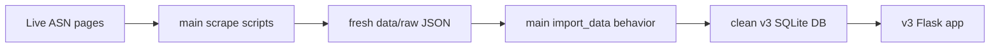

# Product Requirements Document: Rebuild v3 ASN Baseline from Deployed Main Scrape Pipeline

**Project ID:** 0005.1  
**Created:** 25 May 2026  
**Author:** Product (with CTO)  
**Status:** Draft  
**Parent initiative:** v3 Boeing/Airbus link rebuild  
**Supersedes:** PRD 0005 source-data choice (`data/aircraft_safety.db` / local v2 SQLite)  
**Reference PRD:** `Planning/tasks/0005-prd-asn-only-v3-db-bridge.md`  
**Reference deployed main snapshot:** `/Users/Bhavesh/Downloads/Aircraft_Safety_Tracker_main(deployed)/Portfolio-main/Aircraft Safety Tracker`  
**Reference context:** `context/context-main-deployed-2026-05-25.md`  
**Branch policy:** `v3-boeing-airbus-links`; keep `main` stable

---

## 1. Introduction/Overview

### Problem statement

PRD 0005 correctly chose an ASN-only v3 baseline, but used the wrong data source: local v2 SQLite (`data/aircraft_safety.db`). That produced a v3 DB with only **1,796 ASN-linked incidents** and many empty aircraft pages. It also failed to reproduce visible deployed-main behavior, for example:

- Live deployed `/aircraft/24` is **Boeing 747-100**.
- It shows **100 incidents**.
- Every visible incident has a working ASN `Details` link.

The pulled deployed-main repo does not contain a committed SQLite database. It contains the code that can recreate the baseline:

```bash
python scripts/scrape_boeing.py
python scripts/scrape_airbus.py
python scripts/import_data.py
```

The correct source of truth for rebuilding v3's ASN baseline is therefore **the deployed `main` scrape/import pipeline**, not local v2 DB rows and not stale committed raw JSON snapshots.

### Solution

Rebuild the v3 ASN baseline by running the deployed-main ASN scraper/import flow into a clean v3 database:

1. Use the deployed-main scraper behavior as the data-generation reference.
2. Run a fresh Boeing scrape.
3. Run a fresh Airbus scrape.
4. Import the generated raw JSON into `data/aircraft_safety_v3.db`.
5. Keep `Incident.asn_url` as the only link source for this phase.
6. Keep `IncidentSource` empty.

### Goal

Create a v3 local database that behaves like deployed `main`: broad Boeing/Airbus ASN coverage, aircraft pages with incidents, and simple reliable ASN `Details` links.

---

## 2. Goals

### Primary goals

1. Recreate the deployed-main ASN baseline from the scraper/import pipeline, not from local v2 SQLite.
2. Ensure key deployed-main pages are represented locally, especially `Boeing 747-100` with ASN-linked incidents.
3. Preserve the `main` link model: `Incident.asn_url` is the only rendered Details URL.
4. Keep `IncidentSource` empty so NTSB/FAA sources are added later with separate contracts and tests.
5. Produce a repeatable rebuild process that can be run against SQLite locally and later against Postgres if needed.

### Secondary goals

1. Avoid committing generated DB files.
2. Avoid overwriting tracked raw JSON without an explicit choice.
3. Produce a verification report after rebuild.
4. Document the corrected source-data decision in `JOURNAL.md`.
5. Preserve v3 schema changes already made for future sources, while using only ASN data in this phase.

---

## 3. User Stories

**As a** portfolio visitor,  
**I want** aircraft pages like Boeing 747-100 and Boeing 727 variants to show incidents,  
**So that** the v3 app matches the deployed app's useful ASN baseline.

**As a** product owner,  
**I want** v3 to reproduce deployed `main` before adding NTSB/FAA,  
**So that** new source work starts from a known-good product state.

**As an engineer,**  
**I want** the baseline to be recreated from the same scraper/import pipeline as `main`,  
**So that** we do not rely on stale checked-in JSON or contaminated local v2 DB state.

**As an engineer,**  
**I want** `IncidentSource` to remain empty in this phase,  
**So that** future NTSB/FAA work can be tested one source at a time.

---

## 4. Functional Requirements

### FR-1: Source of truth

1. **FR-1.1** The rebuild must use the deployed-main scrape/import flow as the source-data model:
   - `scripts/scrape_boeing.py`
   - `scripts/scrape_airbus.py`
   - `scripts/scraper_utils.py`
   - `scripts/import_data.py`
2. **FR-1.2** The rebuild must not use local v2 SQLite (`data/aircraft_safety.db`) as the source of ASN baseline data.
3. **FR-1.3** The rebuild must not use v2 `IncidentSource` rows.
4. **FR-1.4** The rebuild must not assume the committed `data/raw/*.json` files are complete; they are snapshots and may be stale.
5. **FR-1.5** The rebuild must scrape live ASN pages unless a fresh raw JSON artifact from the same scrape run is explicitly supplied.

### FR-2: Fresh v3 target database

1. **FR-2.1** The system must rebuild into `data/aircraft_safety_v3.db`.
2. **FR-2.2** The target DB must start from clean v3 migrations.
3. **FR-2.3** The target DB must use the v3 schema currently on `v3-boeing-airbus-links`.
4. **FR-2.4** SQLite is acceptable for local rebuild; Postgres is not required for this phase.
5. **FR-2.5** SQLite database files must remain gitignored and uncommitted.

### FR-3: Scrape phase

1. **FR-3.1** Run Boeing scrape using deployed-main behavior from `scripts/scrape_boeing.py`.
2. **FR-3.2** Run Airbus scrape using deployed-main behavior from `scripts/scrape_airbus.py`.
3. **FR-3.3** The scrape must output raw JSON artifacts equivalent in structure to:
   - `data/raw/boeing_incidents.json`
   - `data/raw/airbus_incidents.json`
4. **FR-3.4** The raw JSON must include `model_name`, `date`, `operator`, `location`, `category`, `fatalities`, `narrative`, and `asn_url`.
5. **FR-3.5** The rebuild process must preserve a copy of the generated raw JSON as a local artifact, but must not commit it unless explicitly approved.
6. **FR-3.6** The scrape process must handle ASN rate limiting respectfully using the existing pauses in the scraper.

### FR-4: Import phase

1. **FR-4.1** Import generated raw JSON using the deployed-main import behavior from `scripts/import_data.py`.
2. **FR-4.2** `Aircraft` rows must be created or reused by exact `model_name`.
3. **FR-4.3** `Incident` rows must be deduplicated by `asn_url`.
4. **FR-4.4** Every imported incident must store its ASN URL in `Incident.asn_url`.
5. **FR-4.5** Aircraft stats (`total_incidents`, `fatal_incidents`, `total_fatalities`) must be recalculated from imported incidents.
6. **FR-4.6** `IncidentSource` must remain empty after import.

### FR-5: Deployed-main parity checks

1. **FR-5.1** The rebuilt v3 DB must contain an aircraft row for `Boeing 747-100`.
2. **FR-5.2** The `Boeing 747-100` aircraft page must show incident rows.
3. **FR-5.3** Target parity for `Boeing 747-100`: **100 incidents**, matching observed deployed `/aircraft/24`, unless ASN live data has changed; if the count differs, document the new count and sample URLs.
4. **FR-5.4** The rebuilt DB must contain Boeing 727-family rows with incidents, matching the deployed-main expectation that 727 is not empty.
5. **FR-5.5** Representative Airbus pages must still show ASN-linked incidents.
6. **FR-5.6** Every visible incident in the ASN-only baseline must render a `Details` link and must not render `href=""`.

### FR-6: App behavior

1. **FR-6.1** The app must run locally against `data/aircraft_safety_v3.db`.
2. **FR-6.2** Homepage must return HTTP 200.
3. **FR-6.3** Search for `747` must return `Boeing 747-100` or another 747 aircraft with incidents.
4. **FR-6.4** The `Boeing 747-100` aircraft page must return HTTP 200.
5. **FR-6.5** The incident list must show ASN `Details` links.
6. **FR-6.6** The app must not require NTSB/FAA source rows to render the ASN baseline.

### FR-7: Documentation

1. **FR-7.1** Update PRD/task documentation to mark PRD 0005's local-v2-copy approach as superseded.
2. **FR-7.2** Update `JOURNAL.md` with the corrected data-source decision.
3. **FR-7.3** Document final rebuild counts:
   - aircraft count
   - incident count
   - incident_source count
   - key model counts (`Boeing 747-100`, 727 representative rows, representative Airbus rows)
4. **FR-7.4** Document whether generated raw JSON was committed or intentionally left local.

---

## 5. Non-Goals

1. Do not use local v2 SQLite as the source of ASN baseline data.
2. Do not copy v2 `IncidentSource` rows.
3. Do not add NTSB, FAA AIDS, FAA SDR, or MEDIA data in this PRD.
4. Do not change the UI beyond verifying existing ASN `Details` rendering.
5. Do not require Railway Postgres access.
6. Do not commit SQLite database files.
7. Do not promise byte-for-byte parity with Railway if live ASN data has changed.
8. Do not solve family rollup in this PRD.

---

## 6. Design Considerations

No new UI is required.

The desired product behavior is the deployed-main behavior:

- Aircraft pages that exist in search should show meaningful incident histories.
- Incident rows should render one `Details` link.
- The link should be `Incident.asn_url`.
- No multi-source badges or link-resolution UI in this phase.

---

## 7. Technical Considerations

### Relevant files

- `/Users/Bhavesh/Downloads/Aircraft_Safety_Tracker_main(deployed)/Portfolio-main/Aircraft Safety Tracker/scripts/scrape_boeing.py` — deployed-main Boeing scrape behavior.
- `/Users/Bhavesh/Downloads/Aircraft_Safety_Tracker_main(deployed)/Portfolio-main/Aircraft Safety Tracker/scripts/scrape_airbus.py` — deployed-main Airbus scrape behavior.
- `/Users/Bhavesh/Downloads/Aircraft_Safety_Tracker_main(deployed)/Portfolio-main/Aircraft Safety Tracker/scripts/scraper_utils.py` — deployed-main ASN parsing behavior.
- `/Users/Bhavesh/Downloads/Aircraft_Safety_Tracker_main(deployed)/Portfolio-main/Aircraft Safety Tracker/scripts/import_data.py` — deployed-main import behavior.
- `scripts/scrape_boeing.py` — v3 local scraper; should match deployed-main behavior or be updated intentionally.
- `scripts/scrape_airbus.py` — v3 local scraper; should match deployed-main behavior or be updated intentionally.
- `scripts/import_data.py` — v3 local ASN importer; should preserve `Incident.asn_url`.
- `data/aircraft_safety_v3.db` — local target DB; generated, not committed.
- `data/raw/boeing_incidents.json` and `data/raw/airbus_incidents.json` — generated scrape artifacts; do not assume committed versions are current.
- `app/link_picker.py` — ASN-first Details link behavior.
- `app/templates/components/incident_list.html` — incident Details link rendering.
- `app/ingestion/url_builders/ntsb.py` — NTSB single-URL resolver (end-of-PRD fix for CAROL vs docket order).
- `tests/test_ntsb_importer.py` — extend with resolver priority tests when fixing `ntsb.py`.
- `JOURNAL.md` — decision log.

### Data flow



### Implementation notes

1. Prefer running the scraper/import pipeline from the v3 branch once script parity with deployed main is confirmed.
2. If v3 scripts differ from deployed-main scripts, make an explicit decision before changing code.
3. Generated raw JSON should be treated as a local artifact unless product approves committing it.
4. Because ASN is live, exact counts may differ from Railway production. Key parity checks should be strict enough to catch missing model families but flexible enough to document live-data drift.
5. This PRD invalidates the final data produced by PRD 0005 (`1,266 aircraft / 1,796 incidents` from local v2 SQLite).

---

## 8. Success Metrics

1. Fresh rebuild completes without using local v2 SQLite.
2. `IncidentSource` count is **0**.
3. `Boeing 747-100` exists locally and has incident rows.
4. `Boeing 747-100` target count is **100 incidents**, or variance is documented with evidence that ASN live data changed.
5. Representative 727 rows are not empty.
6. Representative Airbus rows still show ASN-linked incidents.
7. Every imported incident has non-empty `Incident.asn_url`.
8. Representative pages show `Details` links and no `href=""`.
9. Existing pytest suite remains green.

---

## 9. End-of-PRD follow-up (before Phase 2 NTSB data)

Complete **after** the ASN baseline rebuild (Sections 4–8) is verified. Do **not** block the scrape/import rebuild on this work.

### Problem

`app/ingestion/url_builders/ntsb.py` — `resolve_ntsb_source_url()` returns the NTSB docket URL as soon as `source_record_id` / `cm_ntsbNum` is present, so the CAROL branch below it is never reached. Records that have both a docket-eligible ID and public CAROL content incorrectly get docket-only URLs instead of CAROL when CAROL should win.

### FR-8: NTSB URL resolver priority

1. **FR-8.1** Change `resolve_ntsb_source_url()` so CAROL is considered **before** unconditional docket return when `carol_detail_has_public_content(source_data)` is true and `cm_mkey` is present.
2. **FR-8.2** Preserve existing rules: `cm_agency=Other` and `DirectorBrief` must still never store CAROL detail URLs.
3. **FR-8.3** Suggested order after fix:
   - CAROL detail when public content + `cm_mkey`
   - Else docket when `ntsb_num` present
   - Else legacy brief when `ev_id` present
4. **FR-8.4** Add or update unit tests in `tests/test_ntsb_importer.py` covering: public CAROL wins over docket; DirectorBrief still docket-only; foreign-led still no CAROL.
5. **FR-8.5** Run `PYTHONPATH=. pytest -q` after the change.

---

## 10. Future Phases

### Phase 2: NTSB

Add NTSB incidents and `IncidentSource` rows only after the rebuilt ASN baseline matches deployed-main behavior **and FR-8 (NTSB resolver) is complete**.

### Phase 3: FAA AIDS

Add FAA AIDS rows only after NTSB is green and measured.

### Phase 4: Family Rollup

Add family rollup only after source-link baseline is stable.

---

## 11. Open Questions

1. Should generated fresh raw JSON be committed as the new baseline artifact, or kept local only?
2. Should the rebuild script preserve production-like IDs, or is matching model/count/link behavior sufficient?
3. Should `scripts/import_data.py` be wrapped with a dedicated `rebuild-asn-baseline` script so developers do not accidentally import stale raw JSON?
4. Should search hide aircraft with zero incidents after the fresh rebuild, or should this be left to later taxonomy/search work?
