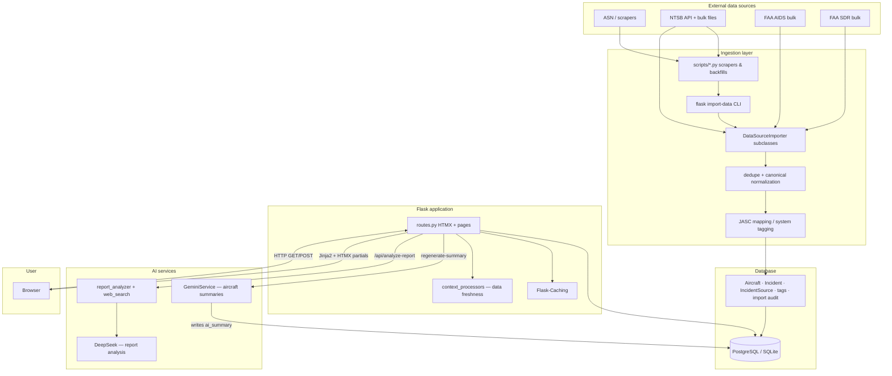

# Master Context Document

**Project**: Aircraft Safety Tracker  
**Date**: 2026-05-16  
**Purpose**: Regular health check — project snapshot for onboarding and planning

---

## 1. Architecture Overview

### What it does

Aircraft Safety Tracker is a proof-of-concept Flask web app that aggregates aviation safety incidents from multiple public sources (ASN, NTSB, FAA AIDS, FAA SDR), normalizes and deduplicates them into a shared Postgres/SQLite schema, and presents searchable aircraft profiles with incident history, charts, and AI-generated safety summaries. Users browse by aircraft model, filter incidents, request missing data, and can trigger report analysis via API.

### Tech stack

| Layer | Technology |
|-------|------------|
| **Backend** | Python 3.8+, Flask 3 (application factory), Flask-SQLAlchemy, Flask-Migrate (Alembic), Flask-Caching, Flask-WTF |
| **Database** | PostgreSQL (production) / SQLite (dev) via SQLAlchemy ORM |
| **Frontend** | Jinja2 templates, HTMX, Tailwind CSS, minimal `app/static/js/main.js` |
| **AI** | Google Gemini (`app/services/gemini.py`) for aircraft summaries; DeepSeek + report analyzer + web search services for incident report analysis |
| **Ingestion** | Custom pipeline under `app/ingestion/` — importers, bulk loaders, NTSB API client, dedupe, JASC normalization, CLI |
| **Scraping / batch** | `scripts/` — httpx, BeautifulSoup scrapers, ASN catalog sync, backfills |
| **Testing** | pytest (~6.5k lines in `tests/`), ruff, mypy |
| **Deploy** | Gunicorn, Procfile, `.vercel/project.json` present |

### Component breakdown

1. **Web app** (`run.py`, `app/`) — HTTP routes, templates, context processors for data-freshness footer.
2. **Domain models** (`app/models.py`) — Aircraft, AircraftVariant, Incident, IncidentSource, SystemTag, ReportAnalysis, import/dedupe/validation audit tables.
3. **Ingestion layer** (`app/ingestion/`) — Pluggable `DataSourceImporter` subclasses; Flask CLI `flask import-data`; bulk import for NTSB/FAA dumps.
4. **Services** (`app/services/`) — Gemini summaries, DeepSeek, report analyzer, web search.
5. **Ops scripts** (`scripts/`) — One-off migrations, scrapers, link validation, summary batch jobs.
6. **Data** (`data/raw/*.json`, SQLite at `data/aircraft_safety.db`) — Seed fixtures and sync state.

### Communication patterns

- **Browser ↔ Flask**: Server-rendered HTML + HTMX partials (`/search`, `/incidents/page`, summary polling).
- **Flask ↔ DB**: SQLAlchemy ORM; some raw SQL for SQLite dev drift fixes in `create_app`.
- **Ingestion ↔ DB**: Importers upsert via shared base class; `ImportLog` / `ImportState` track runs.
- **Flask ↔ external APIs**: NTSB API client, Gemini/DeepSeek for AI, httpx for URL validation and scraping.
- **Background-ish work**: Summary jobs processed inline on request (`SummaryGenerationJob`); dev-only threaded ASN catalog sync in `run.py`.

### Design patterns

- **Application factory** (`create_app` in `app/__init__.py`)
- **Blueprint** for routes (`app/routes.py`)
- **Service layer** for LLM calls
- **Template method / ABC** for importers (`DataSourceImporter`)
- **Multi-source incident model** — one `Incident`, many `IncidentSource` rows with source priority (NTSB > FAA_AIDS > FAA_SDR > ASN)
- **Cached derived data** — `Aircraft.ai_summary` with job queue guardrails

### Constraints & non-obvious decisions

- **Source priority** drives display ordering and canonical fields (`SOURCE_PRIORITY_ORDER` in routes).
- **Dynamic relationships** on `Incident.sources` / `system_tags` — cannot use `joinedload`; bulk queries required.
- **SQLite dev drift**: `create_app` may ALTER TABLE for missing columns if migrations lag locally.
- **`AUTO_SEED` / `AUTO_ASN_CATALOG_SYNC`**: Dev-only boot behaviors in `run.py` — must not run in production.
- **Production SECRET_KEY**: Enforced ≥32 chars in `ProductionConfig`.
- **README vs code**: README emphasizes Gemini; `requirements.txt` lists `openai` but not `google-generativeai` (Gemini is optional-import with graceful disable).

### Repo hygiene notes (2026-05-16)

- `AGENTS.md` exists but **tech stack section is still placeholder**.
- Skills duplicated across `skills/`, `.claude/skills/gstack/`, `.trae/skills/` — no `.cursor/skills/` yet.
- `context-distillation` skill lives globally at `~/.cursor/skills/context-distillation/`.
- Strong test coverage; `learnings_from_errors.md` documents recurring pitfalls (Alembic drift, dynamic relationship eager load, orphaned incidents).

---

## 2. Data Flow Diagram

---

## 3. File Map

### Entry & config

| File Path | Responsibility |
|-----------|----------------|
| ⭐ `run.py` | App entrypoint; dev AUTO_SEED, optional ASN catalog sync thread, shell context |
| ⭐ `config.py` | Dev/production/testing config; DB URI, cache, API keys, data freshness defaults |
| `requirements.txt` | Python dependencies (Flask stack; openai listed; Gemini optional) |
| `pyproject.toml` | Ruff + mypy config |
| ⭐ `AGENTS.md` | CTO/agent SOP, workflow, available skills (tech stack TBD) |

### Application core

| File Path | Responsibility |
|-----------|----------------|
| ⭐ `app/__init__.py` | Application factory, db/migrate/cache init, blueprint registration, SQLite drift patch |
| ⭐ `app/models.py` | All SQLAlchemy models (aircraft, incidents, sources, import/dedupe/validation audit) |
| ⭐ `app/routes.py` | All HTTP routes — search, aircraft detail, incidents, CSV export, AI summary jobs, APIs |
| `app/forms.py` | WTForms for user data requests |
| `app/context_processors.py` | Injects import-state freshness into all templates (footer) |
| `app/static/js/main.js` | Client-side helpers for HTMX/UI |

### Services

| File Path | Responsibility |
|-----------|----------------|
| ⭐ `app/services/gemini.py` | Gemini API wrapper for aircraft safety summaries |
| `app/services/deepseek.py` | DeepSeek client for LLM calls |
| `app/services/report_analyzer.py` | Parses/analyzes incident PDF reports |
| `app/services/web_search.py` | Web search helper for report enrichment |

### Ingestion

| File Path | Responsibility |
|-----------|----------------|
| ⭐ `app/ingestion/importers/base.py` | Abstract importer, aircraft resolution, URL validation, import stats |
| ⭐ `app/ingestion/importers/ntsb_importer.py` | NTSB record parse + upsert |
| `app/ingestion/importers/faa_aids_importer.py` | FAA AIDS import |
| `app/ingestion/importers/faa_sdr_importer.py` | FAA SDR import |
| `app/ingestion/cli.py` | Flask CLI commands for import, link deactivation, schema checks |
| `app/ingestion/dedupe.py` | Cross-source incident deduplication logic |
| `app/ingestion/canonical.py` | Canonical field normalization |
| `app/ingestion/clients/ntsb.py` | NTSB REST API client |
| `app/ingestion/bulk/*.py` | Bulk file parsers for NTSB/FAA datasets |
| `app/ingestion/normalization/jasc.py` | JASC code → system tag mapping |
| `app/ingestion/system_tagging.py` | Applies system tags to incidents |
| `app/ingestion/seed/jasc_seed.py` | Default JASC mapping seed data |

### Templates (`app/templates/`)

| File Path | Responsibility |
|-----------|----------------|
| `base.html` | Layout shell, nav, footer freshness |
| `index.html` | Home + aircraft search |
| `aircraft.html` | Aircraft detail, incidents, summary card |
| `incidents_database.html` | Global incident browser |
| `components/*.html` | HTMX partials — search results, incident lists, charts, summary polling |

### Scripts (batch / maintenance)

| File Path | Responsibility |
|-----------|----------------|
| ⭐ `scripts/import_data.py` | Loads `data/raw/*.json` into DB (dev seed path) |
| `scripts/asn_sync.py` | ASN catalog discovery sync |
| `scripts/generate_summaries.py` | Batch AI summary generation |
| `scripts/validate_incident_links.py` | Weekly link validation job |
| `scripts/deduplicate.py` | Standalone dedupe runs |
| `scripts/scrape_*.py` | Source-specific scrapers (NTSB, FAA, Boeing, Airbus) |
| `scripts/backfill_*.py` | One-off data repairs (URLs, aircraft IDs) |
| `scripts/batch_import_ntsb.py` | NTSB bulk import orchestration |

### Database

| File Path | Responsibility |
|-----------|----------------|
| `migrations/versions/*.py` | Alembic schema migrations (20+ revisions) |
| `data/aircraft_safety.db` | Local SQLite database (dev) |
| `data/raw/*.json` | Fixture / scraped raw incident JSON |

### Tests & docs

| File Path | Responsibility |
|-----------|----------------|
| `tests/` | pytest suite — routes, importers, dedupe, security, AI services (~40 files) |
| `tests/conftest.py` | Shared fixtures and app test config |
| `learnings_from_errors.md` | Running log of bugs, causes, fixes, prevention |
| `README.md` | Product overview, setup, architecture (partially stale vs current stack) |
| `Prioritized Remediation Plan-2026-04-04.md` | Planned fixes backlog |
| `NTSB_Data_Quality_Report.md` | Data quality findings |

### Agent / workflow (non-runtime)

| File Path | Responsibility |
|-----------|----------------|
| `skills/*/SKILL.md` | Project-local agent skills (browse, qa, ship, review, etc.) |
| `.claude/skills/gstack/` | Vendored gstack skills + browser tooling |
| `context-distillation-repo-brief-skill.md` | Draft source for context-distillation skill |

---

## 4. Health Check Summary

*Skipped Bug Report, Code Snippets, and Error Log sections (no active bug).*

### Consistency check

| Area | Status | Notes |
|------|--------|-------|
| Architecture vs file map | ✅ Aligned | Modular monolith: routes → services → ingestion → DB |
| README vs code | ⚠️ Drift | README says Gemini in requirements; `requirements.txt` has openai, Gemini optional-import |
| AGENTS.md | ⚠️ Incomplete | Tech stack placeholders unfilled |
| Migrations | ✅ Active | Many recent migrations for sources, dedupe, link validation |
| Tests | ✅ Strong | Broad coverage across ingestion and routes |
| Skills layout | ⚠️ Fragmented | 3 duplicate skill locations; Cursor convention not adopted yet |

### Risks spotted from structure + learnings

1. **Alembic/SQLite drift** — manual `alembic_version` fixes needed in dev; risk on branch switches.
2. **Orphan incidents** — historically fixed via `resolve_aircraft`; importer changes need regression tests.
3. **AI summary without incidents** — guardrails added; cached `ai_summary` can still confuse if data deleted.
4. **Dynamic relationship eager loading** — easy to reintroduce `joinedload` bugs on export routes.
5. **Dev boot side effects** — `AUTO_SEED` and ASN sync thread must stay out of production.

### Suggested next actions

1. Fill in `AGENTS.md` tech stack section (actual: Flask, HTMX, Tailwind, Postgres/SQLite, Gemini/DeepSeek).
2. When ready to standardize on Cursor: migrate `skills/*` → `.cursor/skills/*`.
3. Add `google-generativeai` to `requirements.txt` if Gemini is a core (not optional) feature.
4. Keep running context distillation after major refactors; diff `context/context-*.md` over time.

---

*Generated via context-distillation skill — health check mode.*
