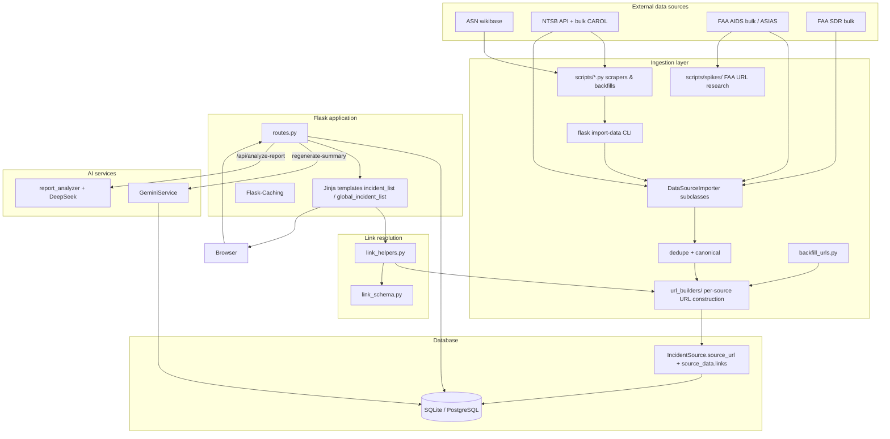

# Master Context Document

**Project**: Aircraft Safety Tracker  
**Date**: 2026-05-24  
**Purpose**: Regular health check + post-sprint snapshot (link enrichment, FAA URL spike, NTSB UX fixes)

---

## 1. Architecture Overview

### What it does

Aircraft Safety Tracker is a Flask web app that aggregates aviation safety incidents from ASN, NTSB, FAA AIDS, and FAA SDR, normalizes and deduplicates them into a shared SQLite/Postgres schema (~242k incidents), and presents searchable aircraft profiles with incident history, charts, and AI-generated safety summaries. Users browse by aircraft model, filter incidents globally, request missing data, and can trigger report analysis via API. A major ongoing initiative is **multi-source outbound link enrichment** — resolving per-incident URLs to official investigation pages.

### Tech stack

| Layer | Technology |
|-------|------------|
| **Backend** | Python 3.8+, Flask 3 (application factory), Flask-SQLAlchemy, Flask-Migrate (Alembic), Flask-Caching, Flask-WTF |
| **Database** | PostgreSQL (production) / SQLite (dev) — local DB `data/aircraft_safety.db` (~2.6 GB) |
| **Frontend** | Jinja2 templates, HTMX partials, Tailwind CSS, `app/static/js/main.js` |
| **AI** | Google Gemini (`app/services/gemini.py`) for aircraft summaries; DeepSeek + report analyzer + web search for incident report analysis |
| **Ingestion** | `app/ingestion/` — importers, bulk loaders, NTSB API client, dedupe, JASC normalization, URL builders, backfill, CLI |
| **Scraping / batch** | `scripts/` — httpx, BeautifulSoup scrapers, ASN catalog sync, link validation, spike research |
| **Testing** | pytest (~40 test files), ruff, mypy |
| **Deploy** | Gunicorn, Procfile, Vercel config present |

### Component breakdown

1. **Web app** (`run.py`, `app/`) — HTTP routes, templates, Jinja globals for link resolution.
2. **Domain models** (`app/models.py`) — Aircraft, Incident, IncidentSource (multi-source), SystemTag, ReportAnalysis, import/dedupe/validation audit tables.
3. **Link resolution layer** (`app/link_helpers.py`, `app/ingestion/url_builders/`, `app/ingestion/link_schema.py`) — builds and resolves outbound URLs per source; filters placeholder/dead links; handles NTSB CAROL vs docket vs foreign-led cases.
4. **Ingestion layer** (`app/ingestion/`) — Pluggable `DataSourceImporter` subclasses; Flask CLI `flask import-data`; bulk import for NTSB/FAA dumps; `backfill_urls.py` module (CLI wiring incomplete).
5. **Services** (`app/services/`) — Gemini summaries, DeepSeek, report analyzer, web search.
6. **Ops scripts** (`scripts/`, `scripts/spikes/`) — Scrapers, backfills, link validation, FAA AIDS URL spike research.
7. **Planning** (`Planning/`, `JOURNAL.md`) — PRDs, task lists, spike reports, engineering journal.

### Communication patterns

- **Browser ↔ Flask**: Server-rendered HTML + HTMX partials (`/search`, `/incidents/page`, summary polling).
- **Flask ↔ DB**: SQLAlchemy ORM; SQLite dev drift patches in `create_app`.
- **Ingestion ↔ DB**: Importers upsert via shared base class; `ImportLog` / `ImportState` track runs.
- **Templates ↔ link helpers**: Jinja globals (`resolve_source_href`, `resolve_ntsb_href`, `incident_has_foreign_led_ntsb`) registered in `app/__init__.py`.
- **Flask ↔ external APIs**: NTSB API, Gemini/DeepSeek, httpx for URL validation and ASIAS probing.
- **Background-ish work**: Summary jobs inline on request; dev-only threaded ASN catalog sync in `run.py`.

### Design patterns

- **Application factory** (`create_app`)
- **Blueprint** routes
- **Service layer** for LLM calls
- **Template method / ABC** for importers (`DataSourceImporter`)
- **Multi-source incident model** — one `Incident`, many `IncidentSource` rows; display priority NTSB > FAA_AIDS > FAA_SDR > ASN > MEDIA
- **URL builder strategy** — per-source builders in `url_builders/` consumed by `link_helpers.py` and backfill
- **Soft deactivation** — `IncidentSource.is_active=False` for broken NTSB links; UI still shows inactive WA rows with FAQ when appropriate

### Constraints & non-obvious decisions

- **Source priority** drives display ordering (`SOURCE_PRIORITY_ORDER` in routes).
- **Dynamic relationships** on `Incident.sources` — avoid `joinedload`; use bulk queries.
- **NTSB CAROL is a JS SPA** — HTTP 200 often returns empty shell; link validation skips CAROL HTTP checks.
- **`factualNarrative` in bulk JSON ≠ public CAROL page** — especially `cm_agency: "Other"` (foreign-led, accredited rep only).
- **FAA AIDS bulk has no URL columns** — only `c5`/`source_record_id`; ASIAS Apex URL pattern validated at 100% on 500-row sample (spike GO, Phase 2 pending).
- **Incident-level link coverage ~32%** — ~157k FAA_AIDS rows lack URLs; largest gap.
- **SQLite locks** — one writer at a time on `data/aircraft_safety.db`.
- **Exact FAA↔NTSB merge: 0 pairs** — no automatic cross-source linking via record ID.
- **Dev boot side effects** — `AUTO_SEED`, `AUTO_ASN_CATALOG_SYNC` must not run in production.
- **Branch**: `v2-(first-round-of-feedback-from-RJ)` with uncommitted link/spike work at last session end.

---

## 2. Data Flow Diagram



---

## 3. File Map

### Entry & config

| File Path | Responsibility |
|-----------|----------------|
| ⭐ `run.py` | App entrypoint; dev AUTO_SEED, optional ASN catalog sync thread, port 5001 default |
| ⭐ `config.py` | Dev/production/testing config; DB URI, cache, API keys, data freshness defaults |
| `requirements.txt` | Python dependencies (Flask stack; openai listed; Gemini optional-import) |
| `pyproject.toml` | Ruff + mypy config |
| ⭐ `AGENTS.md` | CTO/agent SOP, workflow, skills (tech stack section still placeholder) |
| ⭐ `JOURNAL.md` | Engineering log — detailed 2026-05-23 session entry (link work, spike, blockers) |

### Application core

| File Path | Responsibility |
|-----------|----------------|
| ⭐ `app/__init__.py` | Application factory; registers Jinja globals for link helpers + foreign-led NTSB detection |
| ⭐ `app/models.py` | SQLAlchemy models — Aircraft, Incident, IncidentSource (JSON source_data), SystemTag, audit tables |
| ⭐ `app/routes.py` | HTTP routes — search, aircraft detail, global incidents, CSV export, AI summary jobs, APIs |
| ⭐ `app/link_helpers.py` | Central URL resolution for templates — `resolve_source_href`, `resolve_ntsb_href`, foreign-led checks |
| `app/forms.py` | WTForms for user data requests |
| `app/context_processors.py` | Injects import-state freshness into templates |
| `app/static/js/main.js` | Client-side HTMX/UI helpers |

### Link & URL layer (new / active work)

| File Path | Responsibility |
|-----------|----------------|
| ⭐ `app/ingestion/link_schema.py` | Link role contract, placeholder URL blocking, `source_data.links[]` helpers |
| ⭐ `app/ingestion/url_builders/ntsb.py` | CAROL/docket/brief URL building; `carol_detail_has_public_content()`; foreign-led skip |
| `app/ingestion/url_builders/faa_aids.py` | FAA AIDS URLs — **catalog-only today**; Phase 2 will add ASIAS direct URL |
| `app/ingestion/url_builders/asn.py` | ASN wikibase URL builder |
| `app/ingestion/url_builders/faa_sdr.py` | FAA SDR URL builder |
| ⭐ `app/ingestion/backfill_urls.py` | Batch backfill source_url/links on IncidentSource (module exists; CLI not wired) |
| `app/ingestion/linking/incident_linker.py` | Cross-source incident linking (FAA↔NTSB merge logic) |

### Services

| File Path | Responsibility |
|-----------|----------------|
| ⭐ `app/services/gemini.py` | Gemini API wrapper for aircraft safety summaries |
| `app/services/deepseek.py` | DeepSeek client |
| `app/services/report_analyzer.py` | Incident PDF report analysis |
| `app/services/web_search.py` | Web search for linkless incident enrichment |

### Ingestion

| File Path | Responsibility |
|-----------|----------------|
| ⭐ `app/ingestion/importers/base.py` | Abstract importer, aircraft resolution, URL validation |
| ⭐ `app/ingestion/importers/ntsb_importer.py` | NTSB record parse + upsert |
| ⭐ `app/ingestion/importers/faa_aids_importer.py` | FAA AIDS import (`c5` → source_record_id) |
| `app/ingestion/importers/faa_sdr_importer.py` | FAA SDR import |
| ⭐ `app/ingestion/cli.py` | Flask CLI — import, mark WA inactive, validate NTSB links, enrich WA (backfill CLI missing) |
| `app/ingestion/dedupe.py` | Cross-source deduplication |
| `app/ingestion/canonical.py` | Canonical field normalization |
| `app/ingestion/clients/ntsb.py` | NTSB REST API client |
| `app/ingestion/bulk/*.py` | Bulk parsers for NTSB/FAA datasets |
| `app/ingestion/normalization/jasc.py` | JASC → system tag mapping |
| `app/ingestion/system_tagging.py` | Applies system tags to incidents |

### Templates

| File Path | Responsibility |
|-----------|----------------|
| `base.html` | Layout shell, nav, footer |
| `aircraft.html` | Aircraft detail + incidents |
| `incidents_database.html` | Global incident browser |
| ⭐ `app/templates/components/incident_list.html` | Aircraft incident table — uses link helpers, WA/foreign-led FAQ |
| ⚠️ `app/templates/components/global_incident_list.html` | Global list — **still uses raw source_url** (not aligned with link helpers) |
| `components/*.html` | HTMX partials — search, charts, summary polling |

### Scripts & spike research

| File Path | Responsibility |
|-----------|----------------|
| ⭐ `scripts/validate_incident_links.py` | Weekly link validation; skips CAROL HTTP validation |
| `scripts/import_data.py` | Dev seed from `data/raw/*.json` |
| `scripts/asn_sync.py` | ASN catalog discovery sync |
| `scripts/backfill_ntsb_source_urls.py` | NTSB URL backfill batch job |
| `scripts/scrape_*.py` | Source-specific scrapers |
| ⭐ `scripts/spikes/faa_aids_spike_lib.py` | FAA URL patterns, HTTP probe, ASIAS resolver |
| `scripts/spikes/faa_aids_url_*.py` | Spike inventory, sample export, validate, stability scripts |
| `scripts/spikes/README.md` | Spike usage, rate limits, DB lock warning |

### Planning & artifacts

| File Path | Responsibility |
|-----------|----------------|
| ⭐ `Planning/spike-reports/0001-faa-aids-url-spike-report.md` | FAA URL spike — **GO** decision; pending product sign-off |
| `Planning/tasks/tasks-0001-prd-faa-aids-per-record-url-spike.md` | Spike task list (6.6 sign-off pending) |
| `Planning/tasks/0001-prd-faa-aids-per-record-url-spike.md` | Spike PRD |
| `Planning/spike-reports/artifacts/` | Inventory JSON, validation summary, stability results |
| `context/context-2026-05-16.md` | Previous health-check snapshot |
| `context-distillation-repo-brief-skill.md` | Context distillation skill reference (project copy) |

### Database & tests

| File Path | Responsibility |
|-----------|----------------|
| `migrations/versions/*.py` | Alembic schema migrations (20+ revisions) |
| `data/aircraft_safety.db` | Local SQLite (~242k incidents, ~2.6 GB) |
| ⭐ `tests/test_link_helpers.py` | Link resolution tests — **8/8 pass** |
| `tests/test_source_links.py` | Template integration tests — **2 known failures** (stale expectations) |
| `tests/` | ~40 test files total — routes, importers, dedupe, security, AI |

---

## 4. Project State & Open Work (2026-05-23 session)

*Health-check mode — no active bug report. Current engineering state for handoff.*

### Completed recently

| Work item | Status |
|-----------|--------|
| ASN URL backfill | Done — 1796/1796 |
| NTSB `links[]` refresh | Done — ~75k active rows |
| FAA AIDS URL spike | **GO** — 100% ASIAS direct URL on 500-row sample |
| Boeing 707/747 link UX | Fixed — `incident_list.html` + `link_helpers.py` |
| Foreign-led NTSB (Bishkek DCA17RA058) | Fixed — skip CAROL/docket when `cm_agency=Other` |
| `tests/test_link_helpers.py` | 8/8 pass |

### Blocked / in progress

| Item | State |
|------|-------|
| FAA Phase 2 implementation | **Blocked** on spike report product sign-off (task 6.6) |
| ~157,342 FAA_AIDS URL backfill | Not started — would lift coverage ~32% → ~97% |
| `global_incident_list.html` link helpers | Not updated |
| `flask import-data backfill-source-urls` | Module exists; **CLI not wired** in `cli.py` |
| In-app narrative for foreign-led cases | Discussed; not implemented |
| Uncommitted changes | link_helpers, ntsb url builder, incident_list, spike scripts, Planning docs |

### Known test failures (non-blocking)

- `test_aircraft_incident_list_renders_media_source_with_generic_link_style` — expects "MEDIA" label; template shows "Press ↗"
- `test_aircraft_incident_list_shows_wa_faq_note_for_inactive_ntsb_only` — fixture `WPR24LA123` not WA-coded

### DB coverage snapshot

| Source | Active rows | With resolvable URL |
|--------|-------------|---------------------|
| NTSB | ~75k | Most (CAROL/docket when public) |
| FAA_AIDS | 157,342 | **1** |
| ASN | ~1.8k | Backfilled |
| **Incident-level** | ~242k total | **~32%** have ≥1 active link |

### Winning FAA URL (Phase 2 — not yet in app)

```
https://www.asias.faa.gov/apex/f?p=100:12:::NO::P12_AIDS_RPRT_NBR:{source_record_id}
```

---

## 5. Health Check Summary

### Consistency check

| Area | Status | Notes |
|------|--------|-------|
| Architecture vs file map | ✅ Aligned | Link layer now first-class between ingestion and templates |
| Link UX parity | ⚠️ Split | `incident_list.html` uses helpers; `global_incident_list.html` does not |
| FAA spike vs code | ⚠️ Gap | Spike GO but `faa_aids.py` still catalog-only |
| CLI vs modules | ⚠️ Gap | `backfill_urls.py` exists; no CLI command registered |
| Tests | ⚠️ Mostly green | link_helpers solid; 2 stale template tests |
| JOURNAL vs context | ✅ Current | JOURNAL 2026-05-23 entry matches this snapshot |
| AGENTS.md | ⚠️ Incomplete | Tech stack placeholders unfilled |

### Risks

1. **Dead outbound links** — CAROL SPA shells, foreign-led NTSB, preliminary WA records; mitigated by `carol_detail_has_public_content()` + `cm_agency` check but heuristic not perfect.
2. **FAA coverage gap** — 68% of incidents linkless until Phase 2 backfill ships.
3. **SQLite single-writer** — parallel imports/validation cause lock errors.
4. **Uncommitted sprint work** — link fixes + spike artifacts not on branch yet.
5. **ASIAS stability** — re-run `faa_aids_url_stability.py` ≥24h before production backfill.

### Recommended next actions (priority order)

1. Product sign-off on `Planning/spike-reports/0001-faa-aids-url-spike-report.md` → implement ASIAS URL in `faa_aids.py`, wire CLI, backfill ~157k rows.
2. Align `global_incident_list.html` with link helpers; fix 2 stale `test_source_links.py` tests.
3. Optional: in-app `factualNarrative` display for foreign-led NTSB when no public URL.
4. Commit uncommitted link/spike work to `v2-(first-round-of-feedback-from-RJ)`.
5. Fill `AGENTS.md` tech stack section.

---

## 6. Claude Handoff Prompt (health check)

```
I'm giving you a compressed context document about Aircraft Safety Tracker.
Please review it and tell me:
1. Whether the architecture and file map look consistent with each other
2. Any components or patterns that seem overly complex or worth simplifying
3. Any obvious gaps or risks you can spot from the documented structure
4. Suggested improvements to the documentation itself for next time

Then execute the top 3 recommended next actions if I confirm.
```

---

*Generated via context-distillation skill — health check mode. Supersedes `context/context-2026-05-16.md` for link-enrichment sprint state.*
