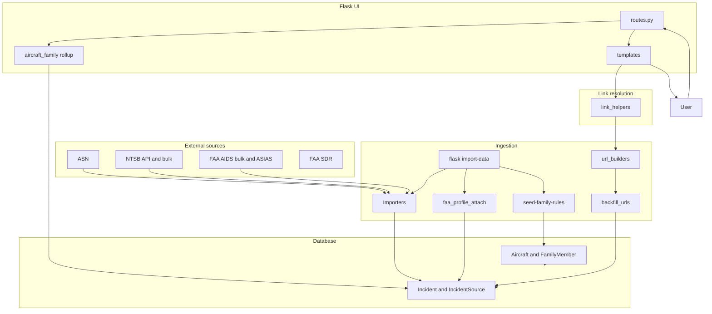

# Master Context Document

**Project**: Aircraft Safety Tracker  
**Date**: 2026-05-24  
**Purpose**: Regular health check (context-distillation) — post link-enrichment v1, FAA profile attach, taxonomy rollup

---

## 1. Architecture Overview

### What it does

Aircraft Safety Tracker is a Flask web app that aggregates aviation safety incidents from ASN, NTSB, FAA AIDS, and FAA SDR into a shared SQLite/Postgres schema (~242k incidents). Users search aircraft by model, browse family rollup pages (Boeing/Airbus), filter global incidents, and open outbound links to official sources (ASN wikibase, NTSB CAROL/docket, FAA ASIAS). AI-generated aircraft summaries and optional report analysis use Gemini and DeepSeek.

### Tech stack

| Layer | Technology |
|-------|------------|
| Backend | Python 3.8+, Flask 3, SQLAlchemy, Flask-Migrate, Flask-Caching, Flask-WTF |
| Database | PostgreSQL (prod) / SQLite (dev) — `data/aircraft_safety.db` (~2.6 GB) |
| Frontend | Jinja2, HTMX, Tailwind CSS |
| AI | Gemini (summaries), DeepSeek + report analyzer + web search |
| Ingestion | `app/ingestion/` — importers, bulk loaders, dedupe, URL builders, backfill, CLI |
| Testing | pytest, ruff, mypy |
| Deploy | Gunicorn, Procfile |

### Component breakdown

1. **Web app** (`run.py`, `app/routes.py`) — search with family canonicalization, aircraft detail with **family incident rollup**, global incidents, CSV export, summary jobs.
2. **Domain** (`app/models.py`) — Aircraft, `AircraftFamilyMember`, Incident, IncidentSource (multi-source URLs + `source_data` JSON), audit tables.
3. **Link layer** (`app/link_helpers.py`, `app/ingestion/url_builders/`, `link_schema.py`) — per-source URL construction, placeholder filtering, foreign-led NTSB handling.
4. **Family rollup** (`app/services/aircraft_family.py`) — query-time aggregation of incidents across mapped variant profiles (no incident migration).
5. **Ingestion** — `DataSourceImporter` subclasses, bulk import, `backfill_urls`, `faa_profile_attach`, `incident_linker`.
6. **Planning** — PRDs 0001–0004, spike reports, `JOURNAL.md`.

### Communication patterns

- Browser ↔ Flask: server-rendered HTML + HTMX partials.
- Templates ↔ link helpers via Jinja globals registered in `app/__init__.py`.
- Ingestion ↔ DB: CLI `flask import-data` (import, attach FAA profiles, seed family rules, NTSB validation).
- External: NTSB API, ASIAS/FAA HTTP (spike + validation), Gemini/DeepSeek.

### Design patterns

- Application factory, blueprint routes, importer ABC.
- **One Incident, many IncidentSource** — display priority NTSB > FAA_AIDS > FAA_SDR > ASN > MEDIA.
- **URL builders** per source; `source_data.links[]` for NTSB multi-link.
- **Soft deactivation** — `IncidentSource.is_active=False` for broken links.
- **Family rollup at query time** — canonical family page shows union of member `aircraft_id` incidents.

### Constraints and decisions

- `Incident.sources` is **dynamic** — no `joinedload`; bulk queries in routes.
- **NTSB CAROL** is often a JS SPA — validation skips naive HTTP body checks on CAROL.
- **Foreign-led NTSB** (`cm_agency=Other`) — no public CAROL/docket; UI shows FAQ, not dead links.
- **FAA ASIAS direct URL** — `P12_AIDS_RPRT_NBR:{source_record_id}`; backfilled for all FAA_AIDS rows (May 2026).
- **Exact FAA↔NTSB dedupe merge: 0 pairs** — profile attach uses `resolve_aircraft()` not cross-source ID match.
- **Branch policy**: active work on `v2-(first-round-of-feedback-from-RJ)`; `main` remains ASN-only baseline ([`context/context-main-branch-asn-links-2026-05-18.md`](context-main-branch-asn-links-2026-05-18.md)).
- **SQLite**: one writer at a time on local DB.

---

## 2. Data Flow Diagram



---

## 3. File Map

### Entry and config

| File Path | Responsibility |
|-----------|----------------|
| ⭐ `run.py` | Dev server entry; port 5001; optional AUTO_SEED / ASN catalog sync |
| ⭐ `config.py` | Environment configs, DB URI, API keys |
| ⭐ `AGENTS.md` | Agent SOP (tech stack section still placeholder) |
| ⭐ `JOURNAL.md` | Engineering log — authoritative recent outcomes |

### Application core

| File Path | Responsibility |
|-----------|----------------|
| ⭐ `app/__init__.py` | Factory; Jinja link globals; registers `import_data` CLI |
| ⭐ `app/models.py` | ORM including `AircraftFamilyMember` |
| ⭐ `app/routes.py` | All HTTP routes; family rollup in aircraft detail/search |
| ⭐ `app/link_helpers.py` | `resolve_source_href(s)`, NTSB/foreign-led helpers |
| `app/context_processors.py` | Import freshness footer |
| `app/forms.py` | Request-data form |

### Family rollup (PRD 0004)

| File Path | Responsibility |
|-----------|----------------|
| ⭐ `app/services/aircraft_family.py` | Member ID expansion, rollup eligibility, canonical family resolution |
| ⭐ `app/ingestion/family_rules_seed.py` | Seeds `aircraft_family_member` from CSV rules |
| `data/aircraft_family_members.csv` | 751 Boeing/Airbus family→variant mappings |

### Link and URL layer

| File Path | Responsibility |
|-----------|----------------|
| ⭐ `app/ingestion/link_schema.py` | Link roles, placeholder hosts, `links[]` in JSON |
| ⭐ `app/ingestion/url_builders/faa_aids.py` | ASIAS `P12_AIDS_RPRT_NBR` primary + catalog secondary |
| ⭐ `app/ingestion/url_builders/ntsb.py` | CAROL/docket/brief; skips foreign-led / empty public content |
| `app/ingestion/url_builders/asn.py` | ASN wikibase URLs |
| `app/ingestion/url_builders/faa_sdr.py` | FAA SDR URLs |
| ⭐ `app/ingestion/backfill_urls.py` | `refresh_source_links()` batch URL refresh |
| `app/ingestion/linking/faa_profile_attach.py` | Attach orphan FAA Boeing/Airbus incidents to variant profiles |

### Ingestion

| File Path | Responsibility |
|-----------|----------------|
| ⭐ `app/ingestion/importers/base.py` | Shared importer utilities, aircraft resolution |
| ⭐ `app/ingestion/importers/faa_aids_importer.py` | FAA AIDS bulk upsert |
| ⭐ `app/ingestion/importers/ntsb_importer.py` | NTSB parse/upsert + URL validation |
| `app/ingestion/importers/faa_sdr_importer.py` | FAA SDR |
| ⭐ `app/ingestion/cli.py` | `import-data`, `attach-faa-boeing-airbus`, `seed-family-rules`, NTSB maintenance |
| `app/ingestion/dedupe.py` | Cross-source dedupe scoring |
| `app/ingestion/linking/incident_linker.py` | Reparent sources on high-confidence merge |
| `app/ingestion/bulk/*.py` | NTSB/FAA bulk file loaders |

### Templates

| File Path | Responsibility |
|-----------|----------------|
| ⭐ `app/templates/components/incident_list.html` | Aircraft incidents — link helpers, foreign-led FAQ |
| ⚠️ `app/templates/components/global_incident_list.html` | Global list — **does not** use `resolve_source_href` yet |
| `app/templates/aircraft.html` | Detail page; rollup stats, family parent banner |
| `incidents_database.html` | Global incident browser |

### Scripts and planning

| File Path | Responsibility |
|-----------|----------------|
| `scripts/validate_incident_links.py` | Weekly link validation job |
| `scripts/spikes/faa_aids_url_*.py` | FAA URL spike (GO; implemented in builders) |
| `Planning/spike-reports/0001-faa-aids-url-spike-report.md` | Spike evidence and Phase 2 spec |
| `context/context-main-branch-asn-links-2026-05-18.md` | `main` branch ASN-only link baseline for comparison |

### Tests

| File Path | Responsibility |
|-----------|----------------|
| ⭐ `tests/test_link_helpers.py` | Link resolution unit tests |
| `tests/test_source_links.py` | Template tests (some expectations stale) |
| `tests/` | Routes, importers, dedupe, bulk (~40 files) |

---

## 4. Relevant Code Snippets

### `app/ingestion/url_builders/faa_aids.py` — ASIAS per-record URL (shipped)

```python
def build_faa_aids_primary_url(source_record_id: str) -> str:
    rid = quote(str(source_record_id).strip(), safe="")
    return f"{ASIAS_AIDS_QUERY_BASE}P12_AIDS_RPRT_NBR:{rid}"
```

### `app/services/aircraft_family.py` — rollup member IDs

```python
def get_family_member_ids(aircraft_id: int) -> List[int]:
    if not is_canonical_family(aircraft_id):
        return [aircraft_id]
    rows = AircraftFamilyMember.query.filter_by(family_aircraft_id=aircraft_id).all()
    ids = {aircraft_id}
    ids.update(row.member_aircraft_id for row in rows)
    return sorted(ids)
```

### `app/link_helpers.py` — template-facing resolution

```python
def resolve_source_hrefs(source: IncidentSource) -> List[Tuple[str, str, str]]:
    if not source or not source.is_active:
        return []
    for link in build_links_for_source(source):
        url = sanitize_url(link.get("url"))
        if url and url not in seen:
            out.append((url, role, label))
    return out
```

---

## 5. Project State and Health Check (2026-05-24)

### Shipped recently (see `JOURNAL.md`)

| Initiative | Outcome |
|------------|---------|
| **Link enrichment v1** (PRD 0002) | FAA ASIAS URLs in builders; `refresh_source_links('FAA_AIDS')` — 157,342 rows; incident-level URL coverage **~97%** |
| **FAA profile attach** (PRD 0003) | 5,877 orphan FAA Boeing/Airbus incidents attached to variant profiles via `resolve_aircraft()` |
| **Taxonomy rollup** (PRD 0004) | `aircraft_family_member` + seed CLI; family pages aggregate member incidents (e.g. 737-300: 50 → 676 incidents) |
| **NTSB UX** | Foreign-led skip, CAROL vs docket preference, `incident_list.html` uses link helpers |

### Open / deferred

| Item | Notes |
|------|-------|
| `global_incident_list.html` | Still raw `source_url` — parity with `incident_list.html` pending |
| Unmapped Boeing/Airbus variants | PRD 0004 Phase 2 — expand family CSV |
| `main` cutover | v2 not merged to portfolio `main` |
| Stale template tests | MEDIA label / WA FAQ fixture mismatches in `test_source_links.py` |
| Option C hybrid | See [`context-main-branch-asn-links-2026-05-18.md`](context-main-branch-asn-links-2026-05-18.md) — ASN trust layer + multi-source |

### Coverage snapshot (post backfill, per JOURNAL)

| Metric | Value |
|--------|-------|
| FAA_AIDS rows with URL | 157,342 / 157,342 |
| Incident-level with ≥1 active URL | ~97% (~234k / ~242k) |
| FAA↔NTSB exact merge pairs | 0 |

### Consistency check

| Area | Status |
|------|--------|
| Architecture vs file map | Aligned — family + link layers are first-class |
| Spike vs `faa_aids.py` | Aligned — ASIAS pattern implemented |
| Template link parity | Split — aircraft list yes, global list no |
| JOURNAL vs this doc | Aligned for 2026-05-24 entries |
| `main` vs v2 | Documented in separate ASN baseline brief |

### Risks

1. **Wrong-incident attribution** — profile attach and dedupe are exact-match heavy; wrong airline/page clicks still possible on edge cases.
2. **NTSB empty public pages** — mitigated for foreign-led; WA/preliminary cases use inactive + FAQ.
3. **SQLite locks** — long backfills block other writers.
4. **ASIAS URL stability** — spike recommended 24h re-test before assuming permanence.
5. **Family rollup gaps** — unmapped variant pages show only own `aircraft_id` incidents.

### Recommended next actions

1. Align `global_incident_list.html` with `resolve_source_href` / `resolve_source_hrefs`.
2. Expand family mappings (PRD 0004 Phase 2) for remaining Boeing/Airbus FAA variant pages.
3. Fix or update stale `tests/test_source_links.py` expectations.
4. Fill `AGENTS.md` tech stack; keep `JOURNAL.md` updated after each sprint.
5. When ready: plan v2 → `main` cutover with migration notes (ASN `asn_url` vs `IncidentSource`).

---

## 6. Claude Handoff Prompt (health check)

```
I'm giving you a compressed context document about Aircraft Safety Tracker (v2 branch).
Please review it and tell me:
1. Whether the architecture and file map look consistent with each other
2. Any components or patterns that seem overly complex or worth simplifying
3. Any obvious gaps or risks you can spot from the documented structure
4. Suggested improvements to the documentation itself for next time
```

---

*Generated via context-distillation skill — health-check mode (no bug report). Supersedes earlier 2026-05-24 draft in this file that predated link backfill and family rollup. See also `context/context-2026-05-16.md` and `context/context-main-branch-asn-links-2026-05-18.md`.*
