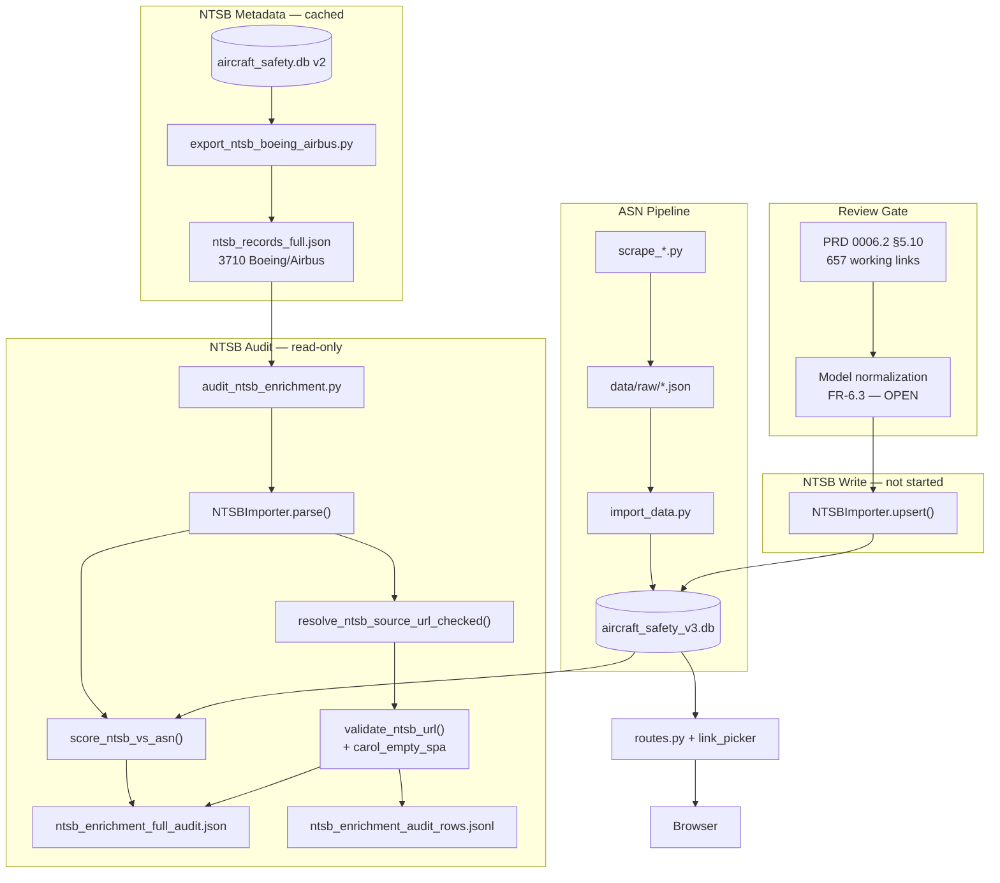

# Master Context Document
**Project**: Aircraft Safety Tracker — `v3-boeing-airbus-links`  
**Date**: 2026-05-30 (v1)  
**Purpose**: Regular health check — post FR-12 re-audit, pre-pilot / pre–0006.3 import gate

---

## 1. Architecture Overview

Aircraft Safety Tracker is a **Flask monolith** that aggregates **Boeing and Airbus** aviation incident data into SQLite (dev) or PostgreSQL (prod), and serves searchable aircraft profiles with filterable incident histories and optional AI summaries. On **v3**, each incident row exposes **one “Details” link** (ASN first, then NTSB via `IncidentSource`) — no multi-badge UI.

**Tech stack:** Python 3.8+, Flask 3, SQLAlchemy, Jinja2 + HTMX + Tailwind, DeepSeek (summaries), httpx/urllib (NTSB link checks), pytest (**46 tests**), Gunicorn deploy.

**Components:**

1. **ASN pipeline** — `scrape_boeing.py` / `scrape_airbus.py` → JSON → `import_data.py` → `Aircraft` + `Incident.asn_url`
2. **NTSB enrichment (audit-only on v3 DB)** — v2 `source_data` export → parse → ASN dedupe → link viability → JSON summary + JSONL. **No NTSB writes to v3 yet** — gated on product review (PRD 0006.2 §5.10)
3. **Link layer** — `resolve_ntsb_source_url_checked()` at audit/import; `pick_primary_href()` at render
4. **Web app** — search, aircraft detail, HTMX filters, background AI summary

**Locked v3 decisions:**

- Branch from `origin/main`; dev DB = `data/aircraft_safety_v3.db` (fresh ASN scrape, **not** v2 SQLite)
- ASN on `Incident.asn_url` only; NTSB on `IncidentSource.source_url`
- `source_data` = metadata only; no `links[]` blob
- NTSB link viability = **body check** (unreleased docket phrase + CAROL empty SPA shell)
- Import candidates = **`viable_with_working_link` only** (657 rows after FR-12 re-audit)

**Data provenance (NTSB metadata):** Bulk JSON (`data/raw/ntsb_records_full.json`) is exported from v2 `IncidentSource.source_data` (CAROL-style `cm_*` fields). Original v2 import used NTSB structured export/API — not scraped from docket HTML. Docket pages often omit make/model on the summary; bulk JSON is frequently **richer** than the public docket landing page.

---

## 2. Data Flow Diagram



---

## 3. File Map

| File Path | Responsibility |
|-----------|----------------|
| ⭐ `run.py` | Flask entry point |
| ⭐ `app/models.py` | `Aircraft`, `Incident`, `IncidentSource` |
| ⭐ `app/routes.py` | HTTP routes, HTMX, AI summary thread |
| ⭐ `app/link_picker.py` | Single Details URL: ASN → NTSB → FAA |
| ⭐ `app/ingestion/importers/base.py` | Boeing/Airbus gate; **auto-create** `Aircraft` on import |
| ⭐ `app/ingestion/importers/ntsb_importer.py` | Parse/upsert NTSB → Incident + IncidentSource |
| ⭐ `app/ingestion/url_builders/ntsb.py` | `resolve_ntsb_source_url_checked()` CAROL → docket fallback |
| ⭐ `app/ingestion/url_builders/ntsb_viability.py` | Body checks: unreleased docket + `carol_empty_spa` |
| ⭐ `app/ingestion/dedupe/ntsb_asn.py` | ASN dedupe scoring (≥2 strong signals) |
| ⭐ `app/ingestion/audit_export.py` | JSONL export, bucket validation, `#` comment headers |
| ⭐ `scripts/audit_ntsb_enrichment.py` | Full audit CLI `--check-links --export-rows` |
| `scripts/export_ntsb_boeing_airbus.py` | v2 DB → `ntsb_records_full.json` |
| `scripts/verify_ntsb_working_link_sample.py` | 1-in-10 field QA on working-link bucket |
| ⭐ `data/raw/ntsb_records_full.json` | NTSB structured export (gitignored; 3,710 records) |
| ⭐ `data/logs/ntsb_enrichment_audit_rows.jsonl` | Product review artifact — **657 working** + 3,053 other |
| `data/logs/ntsb_enrichment_full_audit.json` | Summary counts + samples |
| `.gstack/qa-reports/qa-report-ntsb-working-link-field-check-2026-05-30_v2.md` | Post-FR-12 field QA (66-row sample) |
| ⭐ `Planning/tasks/0006-prd-0006.2-ntsb-enrichment-v3-audit-export.md` | Export PRD + FR-12 |
| `LEARNINGS.md` | Engineering lessons (§1–24) |
| `JOURNAL.md` | Chronological log (stale vs current branch) |

---

## 4. Bug Reports

> Harvested from project history as of 2026-05-30 (v1). **28** unique issues (**4 open**, **22 fixed/mitigated**, **2 environmental**).

### Bug 4.1 — NTSB make/model normalization missing before import
- **Status:** open
- **Summary:** Naive import would auto-create ~250+ `Aircraft` rows from 279 distinct NTSB `make_model` strings; 632/657 working rows have `unknown_aircraft=true` vs 97-row v3 catalog.
- **Expected behaviour:** NTSB incidents attach to canonical family aircraft (e.g. `Boeing 737-800`), not raw NTSB spellings (`BOEING 737-7H4`, `BOEING A75N1(PT17)`).
- **Actual behaviour:** `resolve_boeing_airbus_aircraft_id()` exact-match or **creates new** `Aircraft.model_name` string.
- **Error messages / stack traces:** None — logic issue, not runtime crash.
- **Steps to reproduce:** Import any working-link row with `unknown_aircraft=true`; observe new thin aircraft page.
- **Environment:** v3 branch; `data/aircraft_safety_v3.db` (97 aircraft).
- **What was already tried:** Audit includes unknown-aircraft rows (FR-6.1); FR-6.3 normalization explicitly deferred.
- **Suspected area of code:** `app/ingestion/importers/base.py`, Task 6.0 import path
- **Relevant recent changes:** Product spot-check 2026-05-31; user confirmed links OK but Stearman/variant strings new to deployed app.
- **Source:** Conversation 2026-05-31; PRD 0006.1 FR-6.3

### Bug 4.2 — CAROL detail URLs pass viability on empty SPA shell
- **Status:** fixed (FR-12, 2026-05-31)
- **Summary:** CAROL `investigations/detail/{mkey}` returned HTTP 200 with empty React shell; counted as working link pre-FR-12.
- **Expected behaviour:** Reject blank CAROL; fall back to docket when viable.
- **Actual behaviour:** Pre-fix: 679 working links included ~22 false CAROL positives; post-fix: **657 working**, **0 CAROL** in working bucket.
- **Error messages / stack traces:** `<main id="root"></main>` — no investigation text in static fetch.
- **Steps to reproduce:** `validate_ntsb_url()` on CAROL URL with empty SPA body before FR-12.
- **Environment:** `carol.ntsb.gov`; headless and manual browser QA.
- **What was already tried:** `is_carol_empty_spa_shell()` + `resolve_ntsb_source_url_checked()`; full re-audit ~36 min.
- **Suspected area of code:** `app/ingestion/url_builders/ntsb_viability.py`, `ntsb.py`
- **Source:** QA report Section H; `.gstack/qa-reports/qa-report-ntsb-working-link-field-check-2026-05-30.md`

### Bug 4.3 — NTSB docket HTTP 200 with unreleased body
- **Status:** mitigated (link gate)
- **Summary:** 2,992/3,649 viable NTSB rows have no public docket (`docket_not_released`).
- **Expected behaviour:** Exclude from import; no dead-end Details link.
- **Actual behaviour:** Audit classifies as `viable_with_broken_link`; mostly `cm_agency=Other` (1,695) and `DirectorBrief` (1,120).
- **Error messages / stack traces:** `The docket for this investigation has not been released`
- **Suspected area of code:** `validate_ntsb_url()` in `ntsb_viability.py`
- **Source:** LEARNINGS §11; full audit 2026-05-31

### Bug 4.4 — Raw DeepSeek errors leak into AI summary UI
- **Status:** open
- **Summary:** Invalid API key / connection errors rendered in `ai_summary` card.
- **Error messages / stack traces:** `Authentication Fails, Your api key: ... is invalid`; `Connection error.`
- **Suspected area of code:** `app/routes.py` `generate_summary_background()`; `app/services/deepseek.py`
- **Source:** LEARNINGS §6, §7, §18

### Bug 4.5 — ASN aggregate family pages show 0 incidents
- **Status:** mitigated (import skip)
- **Summary:** Global `asn_url` dedupe leaves “(all series)” / “ family” aircraft rows empty.
- **Suspected area of code:** `scripts/import_data.py`
- **Source:** LEARNINGS §10

### Bug 4.6 — NTSB dedupe false positive when both fatalities are zero
- **Status:** fixed
- **Summary:** `0/0` fatalities counted as strong signal → incorrect ASN-covered.
- **Error messages / stack traces:** `assert decision.asn_covered is False` (got True) in tests.
- **Suspected area of code:** `app/ingestion/dedupe/ntsb_asn.py` lines 81–83
- **Source:** LEARNINGS §23

### Bug 4.7 — JSONL export `#` comment lines break naive JSON parse
- **Status:** fixed
- **Summary:** Export file starts with `#` legend rows; `json.loads` on every line fails.
- **Error messages / stack traces:** `JSONDecodeError: Expecting value: line 1 column 1`
- **Suspected area of code:** `app/ingestion/audit_export.py`; consumers must skip `#`
- **Source:** LEARNINGS §24

### Bug 4.8 — pytest cannot import `scripts.audit_ntsb_enrichment` as package
- **Status:** fixed
- **Error messages / stack traces:** `ModuleNotFoundError: No module named 'scripts.audit_ntsb_enrichment'`
- **Suspected area of code:** `tests/test_ntsb_audit_export.py` — use `importlib.util.spec_from_file_location`
- **Source:** LEARNINGS §22

### Bug 4.9 — Wrong v3 ASN baseline from v2 SQLite bridge
- **Status:** fixed
- **Summary:** PRD 0005 bridge produced incomplete ASN data; reverted; rebuilt via scrape/import.
- **Source:** LEARNINGS §9; commits reverted `7653e58`–`d98d16d`

### Bug 4.10 — NTSB resolver preferred docket over public CAROL
- **Status:** fixed (FR-8); partially superseded by FR-12 (CAROL often blank SPA → docket anyway)
- **Source:** LEARNINGS §12; commit `6f41ec9`

### Bug 4.11 — NTSB PDF endpoint returns JSON error with HTTP 200
- **Status:** mitigated
- **Error messages / stack traces:** `{"Error":"The case with MKey 0 does not exist.","ErrorCode":0}`
- **Source:** LEARNINGS §13

### Bug 4.12 — SQLite database locked during bulk write
- **Status:** mitigated (operational)
- **Error messages / stack traces:** `database is locked (5)`
- **Source:** LEARNINGS §19

### Bug 4.13 — Cursor sandbox blocks git index.lock on Portfolio parent repo
- **Status:** mitigated
- **Error messages / stack traces:** `Unable to create '.../Portfolio/.git/index.lock': Operation not permitted`
- **Source:** LEARNINGS §21

### Bug 4.14 — ASN headless Playwright fails anti-bot parsing
- **Status:** mitigated
- **Summary:** Use gstack browse for ASN QA; generic Playwright insufficient.
- **Source:** LEARNINGS §17

### Bug 4.15 — Empty SQLite DB misleading search UX
- **Status:** open (low)
- **Summary:** “No aircraft found” when DB has 0 rows vs no query match.
- **Source:** LEARNINGS §15

### Bug 4.16 — Flask import / port collision dev ergonomics
- **Status:** mitigated
- **Error messages / stack traces:** `Could not import 'run'.`; `Port 5001 is in use`
- **Source:** LEARNINGS §4, §5

### Bug 4.17 — GitHub SSH port 22 timeout
- **Status:** environmental
- **Error messages / stack traces:** `ssh: connect to host github.com port 22: Operation timed out`
- **Source:** LEARNINGS §20

*(Additional fixed items §1–3, §8, §14, §16 in LEARNINGS — PostgreSQL pg_trgm, Railway, pytest-asyncio warnings.)*

---

## 5. Relevant Code Snippets

### Bug 4.1 — Auto-create aircraft on exact string match (fragmentation risk)

```python
# app/ingestion/importers/base.py — import path creates new Aircraft rows
def resolve_boeing_airbus_aircraft_id(make_model: Optional[str]) -> Optional[int]:
    model_name = normalize_make_model(make_model or "")
    aircraft = Aircraft.query.filter_by(model_name=model_name).first()
    if aircraft:
        return aircraft.id
    manufacturer = "Boeing" if model_name.lower().startswith("boeing") else "Airbus"
    aircraft = Aircraft(manufacturer=manufacturer, model_name=model_name)
    db.session.add(aircraft)
    db.session.flush()
    return aircraft.id
```

### Bug 4.2 — CAROL empty SPA rejection (FR-12)

```python
# app/ingestion/url_builders/ntsb_viability.py
def is_carol_empty_spa_shell(body: str) -> bool:
    if 'id="root"' in body.lower() and not any(m in body.lower() for m in CAROL_CONTENT_MARKERS):
        return True
    ...

if "carol.ntsb.gov/investigations/detail" in lower_url:
    if is_carol_empty_spa_shell(body):
        return False, status, "carol_empty_spa"
```

### Bug 4.2 — Docket fallback when CAROL fails

```python
# app/ingestion/url_builders/ntsb.py
for candidate in (carol_url, docket_url):
    viable, _, reason = validate_ntsb_url(candidate, fetcher=fetcher)
    if viable:
        return candidate, None
return None, last_reason
```

### Bug 4.3 — Unreleased docket phrase gate

```python
# app/ingestion/url_builders/ntsb_viability.py
if "data.ntsb.gov/docket" in lower_url:
    if UNRELEASED_DOCKET_PHRASE in lower_body:
        return False, status, "docket_not_released"
```

### Bug 4.6 — Fatalities 0/0 dedupe edge case

```python
# app/ingestion/dedupe/ntsb_asn.py
if ntsb_fatalities is not None and asn_fatalities is not None:
    fatalities_close = abs(int(ntsb_fatalities) - int(asn_fatalities)) <= fatalities_delta_threshold
# Use None in tests when fatalities should not contribute
```

---

## 6. Error Log Summary

### NTSB link audit / viability
- `The docket for this investigation has not been released` — **2,992** broken rows (expected; foreign-led / DirectorBrief)
- `carol_empty_spa` — post-FR-12; moved ~22 rows out of working bucket

### JSONL / audit tooling
- `json.decoder.JSONDecodeError: Expecting value: line 1 column 1` — caused by `#` comment header lines (fixed in consumers)

### pytest / import
- `ModuleNotFoundError: No module named 'scripts.audit_ntsb_enrichment'` — fixed via importlib loader
- `PytestDeprecationWarning: asyncio_default_fixture_loop_scope unset` — Python 3.8 env noise

### DeepSeek / network
- `AuthenticationError: Error code: 401` — invalid `DEEPSEEK_API_KEY`
- `httpx.ProxyError: 403 Forbidden` — proxy blocks outbound API

### SQLite / git / SSH
- `database is locked (5)` — concurrent read during bulk write
- `Unable to create '.../index.lock': Operation not permitted` — Cursor sandbox
- `ssh: connect to host github.com port 22: Operation timed out`

### Playwright / QA setup
- Playwright Chromium CDN download failures — user resolved via `.gstack/qa-venv/` local install

---

## 7. Current State & Branch Delta

| Item | Value |
|------|-------|
| Branch | `v3-boeing-airbus-links` |
| Dev DB | `data/aircraft_safety_v3.db` (~97 aircraft, ~6k ASN incidents, **0 NTSB imports**) |
| Tests | **46 passed** (`PYTHONPATH=. pytest -q`) |
| Latest local commits | `e67271d` audit export; FR-12 changes may be uncommitted |

### NTSB audit funnel (FR-12 re-audit, 2026-05-31)

```
3,710 parsed (Boeing/Airbus in bulk JSON)
  − 61 ASN duplicates
  = 3,649 viable unique
    → 657 working links  ← IMPORT CANDIDATES (was 679 pre-FR-12)
    → 2,992 broken (all docket_not_released)
```

**Working-link quality (product spot-check + automated sample):**
- Docket URLs verified correct in manual review
- Make/model often in JSONL but **not** on docket HTML summary — intentional value-add from bulk `cm_vehicles`
- **632/657** working rows: `unknown_aircraft=true` (audit lookup-only)
- **279** distinct `make_model` strings in working set → normalization required before import

### PRD status

| PRD / Task | Status |
|------------|--------|
| 0005.1 ASN baseline | ✅ Complete |
| 0006.1 Tasks 1.0–5.6 | ✅ Complete |
| 0006.2 Tasks 5.7–5.11 | ✅ Export + FR-12 re-audit |
| 0006.2 §5.10 review gate | 🟡 Product spot-check in progress |
| 0006.1 Task 6.0 write import | ⏸ Blocked on normalization + gate sign-off |

### NTSB data lineage (answers “where did make/model come from?”)

```
NTSB structured export (v2 import era, cm_* fields)
  → data/aircraft_safety.db IncidentSource.source_data
  → export_ntsb_boeing_airbus.py
  → data/raw/ntsb_records_full.json
  → audit / JSONL make_model column
```

Official NTSB sources (for future refresh): [developer.ntsb.gov API](https://developer.ntsb.gov/api/aviation/v1/), [app.ntsb.gov/avdata/](https://app.ntsb.gov/avdata/), [Data_Stats.aspx](https://www.ntsb.gov/safety/data/pages/Data_Stats.aspx). **Not** scraped from docket HTML at audit time.

---

## 8. Known Risks & Open Items

| Risk | Severity | Notes |
|------|----------|-------|
| Import without model normalization | **High** | ~250 junk aircraft pages; Stearman/helicopter noise |
| Unknown-aircraft weak dedupe | **High** | 632/657 working rows skipped aircraft-scoped ASN dedupe in audit |
| 82% link failure rate on viable set | Expected | NTSB policy — not bad bulk JSON |
| CAROL blank SPA | Low post-FR-12 | 0 CAROL URLs in working bucket |
| JOURNAL.md stale | Low | Still says “Step 4 NTSB bulk next” |
| LEARNINGS missing FR-12 entry | Low | Add §25 for `carol_empty_spa` |
| Uncommitted FR-12 code/docs | Medium | Verify git status before Task 6.0 |

### Recommended next steps (CTO)

1. **Approve 657 working links** for import (links OK per product review)
2. **Build NTSB → canonical aircraft map** (279 strings → ~97 families) — block Task 6.0 without this
3. **Pilot import** — 25 rows with known `aircraft_id` first, then normalized bulk
4. Update `JOURNAL.md` + LEARNINGS §25 after Task 6.0 planning locked

---

## References

- **Superseded by:** `context/context-2026-05-30_v2.md` (latest — post-pilot, backup, recovery tiers)
- QA: `.gstack/qa-reports/qa-report-ntsb-working-link-field-check-2026-05-30_v2.md`
- PRD: `Planning/tasks/0006-prd-0006.2-ntsb-enrichment-v3-audit-export.md`
- v2 debrief: `Planning/branch-debrief-v2.md`
