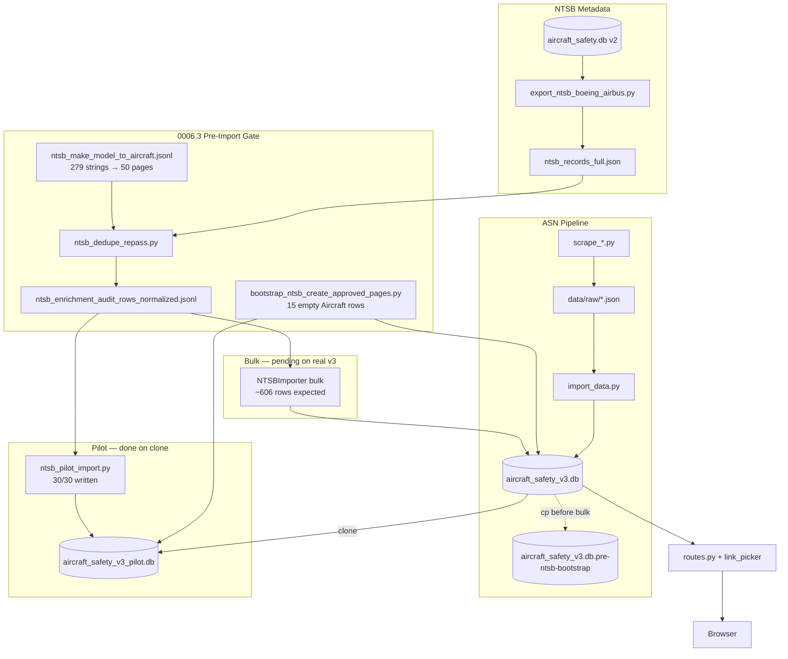

# Master Context Document
**Project**: Aircraft Safety Tracker — `v3-boeing-airbus-links`  
**Date**: 2026-05-30 (v2 — **latest**)  
**Purpose**: Regular health check — PRD 0006.3 pilot complete, real v3 backed up, bulk import (5.21) next

---

## 1. Architecture Overview

Aircraft Safety Tracker is a **Flask monolith** that aggregates **Boeing and Airbus** aviation incident data into SQLite (dev) or PostgreSQL (prod), and serves searchable aircraft profiles with filterable incident histories and optional AI summaries. On **v3**, each incident row exposes **one “Details” link** (ASN first, then NTSB via `IncidentSource`) — no multi-badge UI.

**Tech stack:** Python 3.8+, Flask 3, SQLAlchemy, Jinja2 + HTMX + Tailwind, DeepSeek/Gemini (summaries), httpx (NTSB link checks), pytest (**58 tests**), Gunicorn deploy.

**Components:**

1. **ASN pipeline** — `scrape_boeing.py` / `scrape_airbus.py` → JSON → `import_data.py` → `Aircraft` + `Incident.asn_url` in `data/aircraft_safety_v3.db`
2. **NTSB enrichment** — v2 `source_data` export → parse → ASN dedupe → link viability → JSONL audit; **mapping-gated import** via `NTSBImporter(mapping=...)` + `data/config/ntsb_make_model_to_aircraft.jsonl`
3. **Pre-import gate (0006.3)** — family rollup proposal → canonical mapping (279 strings → 50 pages) → dedupe re-pass → bootstrap empty `create_approved` pages → pilot/bulk import
4. **Link layer** — `resolve_ntsb_source_url_checked()` at audit/import; `pick_primary_href()` at render
5. **Web app** — search, aircraft detail, HTMX filters, background AI summary

**Locked v3 decisions:**

- Branch: `v3-boeing-airbus-links` from `origin/main`; dev DB = `data/aircraft_safety_v3.db` (fresh ASN scrape, **not** v2 SQLite)
- ASN on `Incident.asn_url` only; NTSB on `IncidentSource.source_url`
- Bulk import **fail-closed** without mapping file; no silent `Aircraft` auto-create (except explicit `create_approved` bootstrap)
- Import candidates = `dedupe_repasse_status=import` after mapping + dedupe re-pass (396 pre-bootstrap; ~606 post-bootstrap on pilot)

---

## 2. Data Flow Diagram



---

## 3. File Map

| File Path | Responsibility |
|-----------|----------------|
| ⭐ `run.py` | Flask entry point |
| ⭐ `config.py` | `DATABASE_URL` → `SQLALCHEMY_DATABASE_URI` (dev default `data/aircraft_safety.db`) |
| ⭐ `app/models.py` | `Aircraft`, `Incident`, `IncidentSource` |
| ⭐ `app/routes.py` | HTTP routes, HTMX, AI summary thread |
| ⭐ `app/link_picker.py` | Single Details URL: ASN → NTSB → FAA |
| ⭐ `app/ingestion/ntsb_mapping.py` | Load mapping JSONL; `bootstrap_create_approved_pages()` (FR-20.0) |
| ⭐ `app/ingestion/importers/ntsb_importer.py` | Mapping-gated parse/upsert; honors `_audit_source_url` from audit rows |
| ⭐ `app/ingestion/importers/base.py` | Boeing/Airbus gate; legacy auto-create when mapping omitted |
| ⭐ `app/ingestion/ntsb_dedupe_repass.py` | Dedupe re-pass + normalized JSONL writer |
| ⭐ `app/ingestion/dedupe/ntsb_asn.py` | ASN dedupe scoring (≥2 strong signals) |
| ⭐ `app/ingestion/url_builders/ntsb.py` | `resolve_ntsb_source_url_checked()` CAROL → docket fallback |
| ⭐ `app/ingestion/url_builders/ntsb_viability.py` | Body checks: unreleased docket + `carol_empty_spa` |
| ⭐ `scripts/ntsb_pilot_import.py` | Pilot workflow: clone → select → bootstrap → import → verify |
| ⭐ `scripts/bootstrap_ntsb_create_approved_pages.py` | Create 15 approved empty catalog pages |
| ⭐ `scripts/ntsb_dedupe_repass.py` | Dedupe re-pass CLI on 657 working rows |
| ⭐ `scripts/build_ntsb_make_model_mapping.py` | Build approved mapping from rollup draft |
| ⭐ `data/config/ntsb_make_model_to_aircraft.jsonl` | **Committed** mapping gate (279 strings, 50 targets) |
| ⭐ `data/aircraft_safety_v3.db` | Real v3 ASN baseline — **0 NTSB imports** (bulk pending) |
| ⭐ `data/aircraft_safety_v3.db.pre-ntsb-bootstrap` | **Backup** before real-v3 bootstrap/bulk (2026-05-30) |
| `data/aircraft_safety_v3_pilot.db` | Throwaway pilot clone — 30 NTSB incidents imported |
| `data/logs/ntsb_pilot_import_report.json` | Pilot verify report (30/30, 0 issues) |
| `data/logs/ntsb_pre_import_summary.json` | Pre-bootstrap counts (396 import candidates) |
| `Planning/tasks/0006-prd-0006.3-ntsb-model-normalization-pre-import.md` | PRD with FR-20.0.6 backup requirement |
| `Planning/tasks/tasks-0006-prd-0006.3-ntsb-model-normalization-pre-import.md` | Task tracker (5.20 ✅, 5.21.0 ✅) |
| `LEARNINGS.md` | Engineering lessons (§1–37) |
| `JOURNAL.md` | Chronological log |

---

## 4. Bug Reports

> Harvested from project history as of 2026-05-30 (v2). **32** unique issues (**3 open**, **27 fixed/mitigated**, **2 environmental**).

### Bug 4.1 — NTSB make/model catalog bloat on naive import
- **Status:** mitigated (mapping gate + bootstrap shipped; bulk on real v3 pending)
- **Summary:** 632/657 working rows had `unknown_aircraft=true`; 279 distinct strings vs 97 catalog rows; naive import auto-created thin pages.
- **Expected behaviour:** Map to ~50 canonical pages via `ntsb_make_model_to_aircraft.jsonl`; fail closed on unmapped.
- **Actual behaviour (pre-fix):** `resolve_boeing_airbus_aircraft_id()` created new `Aircraft` on exact miss.
- **What was already tried:** PRD 0006.3 mapping (100% coverage), `NTSBImporter(mapping=...)`, pilot 30/30 on clone.
- **Suspected area of code:** `app/ingestion/ntsb_mapping.py`, `ntsb_importer.py`
- **Source:** LEARNINGS §28, §37; pilot import 2026-05-30

### Bug 4.2 — CAROL detail URLs pass viability on empty SPA shell
- **Status:** fixed (FR-12)
- **Error messages / stack traces:** `<main id="root"></main>` — no investigation text
- **Actual behaviour:** Working bucket **679 → 657**; **0 CAROL** URLs in working set post-FR-12
- **Source:** LEARNINGS §25; QA report Section H

### Bug 4.3 — NTSB docket HTTP 200 with unreleased body
- **Status:** mitigated (link gate)
- **Error messages / stack traces:** `The docket for this investigation has not been released`
- **Source:** LEARNINGS §11

### Bug 4.4 — Raw DeepSeek errors leak into AI summary UI
- **Status:** open
- **Error messages / stack traces:** `Authentication Fails, Your api key: ... is invalid`; `Connection error.`
- **Source:** LEARNINGS §6, §7

### Bug 4.5 — ASN aggregate family pages show 0 incidents
- **Status:** mitigated (import skip in `import_data.py`)
- **Source:** LEARNINGS §10

### Bug 4.6 — NTSB dedupe false positive when both fatalities are zero
- **Status:** fixed
- **Source:** LEARNINGS §23

### Bug 4.7 — JSONL export `#` comment lines break naive JSON parse
- **Status:** fixed
- **Error messages / stack traces:** `JSONDecodeError: Expecting value: line 1 column 1`
- **Source:** LEARNINGS §24

### Bug 4.8 — pytest cannot import `scripts.audit_ntsb_enrichment` as package
- **Status:** fixed
- **Error messages / stack traces:** `ModuleNotFoundError: No module named 'scripts.audit_ntsb_enrichment'`
- **Source:** LEARNINGS §22

### Bug 4.9 — Wrong v3 ASN baseline from v2 SQLite bridge
- **Status:** fixed (PRD 0005.1 rebuild)
- **Source:** LEARNINGS §9

### Bug 4.10 — NTSB resolver CAROL vs docket priority
- **Status:** fixed (FR-8); FR-12 docket-only working bucket
- **Source:** LEARNINGS §12

### Bug 4.11 — SQLite database locked during bulk write
- **Status:** mitigated (operational)
- **Error messages / stack traces:** `database is locked (5)`
- **Source:** LEARNINGS §19

### Bug 4.12 — Git gstack symlink breaks git operations
- **Status:** open (operational)
- **Error messages / stack traces:** `error: expected submodule path 'Aircraft Safety Tracker/.claude/skills/gstack' not to be a symbolic link`
- **Source:** LEARNINGS §30

### Bug 4.13 — Cursor sandbox blocks git index.lock
- **Status:** mitigated
- **Error messages / stack traces:** `Unable to create '.../Portfolio/.git/index.lock': Operation not permitted`
- **Source:** LEARNINGS §21

### Bug 4.14 — `NTSBImporter(mapping=Path(...))` AttributeError
- **Status:** fixed
- **Error messages / stack traces:** `AttributeError: 'PosixPath' object has no attribute 'get'`
- **Source:** LEARNINGS §29

### Bug 4.15 — Family-page dedupe does not cross variant pages
- **Status:** open (accepted design)
- **Summary:** Generic `Boeing 737` page won't dedupe against ASN on `Boeing 737-300`; ~606 import candidates post-bootstrap vs 396 pre-bootstrap
- **Source:** LEARNINGS §35; PRD FR-20.0.5

### Bug 4.16 — Audit test mock wrong module after FR-12
- **Status:** fixed
- **Error messages / stack traces:** `assert report["viable_with_working_link"] == 1` → `assert 0 == 1`
- **Source:** LEARNINGS §27

### Bug 4.17 — Bare `python3` missing Flask
- **Status:** mitigated
- **Error messages / stack traces:** `ModuleNotFoundError: No module named 'flask'`
- **Source:** LEARNINGS §31

### Bug 4.18 — Empty SQLite DB misleading search UX
- **Status:** open (low)
- **Source:** LEARNINGS §15

### Bug 4.19 — Playwright Chromium CDN download fails in sandbox
- **Status:** mitigated
- **Error messages / stack traces:** `Error: Download failed: server closed connection`
- **Source:** LEARNINGS §26

### Bug 4.20 — GitHub SSH port 22 timeout
- **Status:** environmental
- **Error messages / stack traces:** `ssh: connect to host github.com port 22: Operation timed out`
- **Source:** LEARNINGS §20

*(Additional fixed: Flask cwd/port, pytest-asyncio warnings, NTSB PDF JSON 200, ASN Playwright anti-bot — LEARNINGS §4–§8, §13, §17.)*

---

## 5. Relevant Code Snippets

### Bug 4.1 — Mapping gate (fail closed)

```python
# app/ingestion/importers/ntsb_importer.py — bulk mode requires mapping
def _resolve_aircraft_id(self, make_model: str) -> Optional[int]:
    if self._mapping is None:
        return resolve_boeing_airbus_aircraft_id(make_model)  # legacy auto-create
    return resolve_aircraft_id_from_ntsb_mapping(make_model, self._mapping)
```

### Bug 4.1 — Bootstrap empty catalog pages (not at first incident insert)

```python
# app/ingestion/ntsb_mapping.py — FR-20.0
def bootstrap_create_approved_pages(mapping, *, dry_run=False):
    for model_name in sorted(iter_create_approved_targets(mapping)):
        if _lookup_by_model_name(model_name) is not None:
            continue  # idempotent
        aircraft = Aircraft(manufacturer=..., model_name=model_name)
        db.session.add(aircraft)
```

### Pilot import — audit URL honored (not re-resolved CAROL)

```python
# app/ingestion/importers/ntsb_importer.py
audit_url = raw_record.get("_audit_source_url") or raw_record.get("ntsb_url")
if audit_url:
    source_url = audit_url  # use validated docket from audit row
```

### Bug 4.2 — CAROL empty SPA rejection

```python
# app/ingestion/url_builders/ntsb_viability.py
if "carol.ntsb.gov/investigations/detail" in lower_url:
    if is_carol_empty_spa_shell(body):
        return False, status, "carol_empty_spa"
```

### Bug 4.6 — Fatalities 0/0 dedupe edge case

```python
# app/ingestion/dedupe/ntsb_asn.py — use None when fatalities should not score
if ntsb_fatalities is not None and asn_fatalities is not None:
    fatalities_close = abs(int(ntsb_fatalities) - int(asn_fatalities)) <= threshold
```

---

## 6. Error Log Summary

### NTSB link audit / viability
- `The docket for this investigation has not been released` — **2,992** broken rows (expected)
- `carol_empty_spa` — post-FR-12; working bucket now docket-only (**657** rows)

### Import / tooling
- `AttributeError: 'PosixPath' object has no attribute 'get'` — fixed (mapping Path load)
- `ValueError: .../mapping.jsonl: no mapping entries` — empty JSONL rejected at load

### JSONL / audit
- `JSONDecodeError: Expecting value: line 1 column 1` — skip `#` comment header lines

### pytest / Python 3.8
- `PytestDeprecationWarning: asyncio_default_fixture_loop_scope unset`
- `ModuleNotFoundError: No module named 'flask'` — wrong interpreter for ad-hoc scripts

### Git / sandbox
- `error: expected submodule path '.../gstack' not to be a symbolic link`
- `Unable to create '.../index.lock': Operation not permitted`

### DeepSeek / network
- `AuthenticationError: Error code: 401`
- `httpx.ProxyError: 403 Forbidden`

### SQLite
- `database is locked (5)` — concurrent access during bulk write

---

## 7. Current State & Branch Delta

| Item | Value |
|------|-------|
| Branch | `v3-boeing-airbus-links` |
| Real v3 DB | `data/aircraft_safety_v3.db` — **97 aircraft**, **5,523 incidents**, **0 NTSB** |
| Backup | `data/aircraft_safety_v3.db.pre-ntsb-bootstrap` — identical snapshot (2026-05-30) |
| Pilot DB | `data/aircraft_safety_v3_pilot.db` — 30 NTSB incidents, 15 bootstrapped pages |
| Tests | **58 passed** (`PYTHONPATH=. pytest -q`) |

### NTSB import funnel (post-0006.3 gate)

```
657 working links (FR-12)
  − 51 ASN-covered (dedupe re-pass)
  − 210 skip_pending_create (pre-bootstrap)
  = 396 import candidates (pre-bootstrap on v3)

After bootstrap on pilot clone:
  = 606 import candidates (210 formerly pending now importable)
```

### PRD 0006.3 task status

| Task | Status |
|------|--------|
| 5.12–5.18 Catalog, mapping, dedupe re-pass | ✅ |
| 5.19 Pre-import review gate | ✅ |
| 5.20 Pilot import (30/30, verify 0 issues) | ✅ |
| 5.21.0 Backup real v3 DB | ✅ |
| 5.21.1–5.21.6 Bootstrap + bulk on real v3 | ⏳ Pending |
| 5.22 Post-import duplicate audit | ⏳ Blocked on 5.21 |
| 6.0–7.0 Bulk CLI wiring, Make/Model column, QA | ⏳ Blocked on 5.21 |

---

## 8. Known Risks, Recovery Tiers & Open Items

### Recovery tiers (DB vs code vs nuclear)

| Tier | What it restores | How | When |
|------|------------------|-----|------|
| **1 — File backup** | **Database state only** | `cp data/aircraft_safety_v3.db.pre-ntsb-bootstrap data/aircraft_safety_v3.db` or set `DATABASE_URL` to backup path | Bootstrap or bulk import goes wrong on real v3 |
| **2 — Branch code unchanged** | N/A (code stays on branch) | Rollback does **not** revert git | Always true for Tier 1 |
| **3 — ASN-only UI behaviour** | Incident **data** as before NTSB work | With backup DB + 0 NTSB rows: UI behaves like ASN-only for incident data | After Tier 1 restore |
| **4 — Nuclear rebuild** | Fresh ASN baseline from scrape JSON | `scrape_boeing.py` → `scrape_airbus.py` → `import_data.py` (PRD 0005.1) | Backup lost/corrupt; need full data reset (~minutes) |

> **Critical nuance:** Rollback restores **database state**, not **branch code**. You remain on `v3-boeing-airbus-links` with link-picker / importer / mapping-gate code in place. With **0 NTSB rows imported** (backup restored), the UI should behave like **ASN-only for incident data** — no NTSB Details links, no new family pages, no Make/Model column data until bulk import lands (Task 6.8 UI may still exist on branch but shows empty for NTSB-specific fields). If you need a full reset beyond the DB, PRD **0005.1** rebuild from scrape JSON is the nuclear option (~minutes).

**Backup verified (2026-05-30):**
```bash
cp data/aircraft_safety_v3.db data/aircraft_safety_v3.db.pre-ntsb-bootstrap
# sqlite3 backup: 97 aircraft, 5523 incidents, 0 NTSB incident_source rows
```

**Restore commands:**
```bash
# Option A — swap files
mv data/aircraft_safety_v3.db data/aircraft_safety_v3.db.work-in-progress
mv data/aircraft_safety_v3.db.pre-ntsb-bootstrap data/aircraft_safety_v3.db

# Option B — point app at backup (.env)
DATABASE_URL=sqlite:////absolute/path/to/data/aircraft_safety_v3.db.pre-ntsb-bootstrap
```

### Risk table

| Risk | Severity | Notes |
|------|----------|-------|
| Bulk import without backup | **High** | Mitigated — 5.21.0 complete |
| Confusing DB rollback with code rollback | **Medium** | Documented above — branch code persists |
| Family-page dedupe gaps | **Medium** | Accepted; NTSB family pages won't match ASN variant dedupe |
| Git gstack symlink blocks commits | **Medium** | LEARNINGS §30; agent commits may fail |
| Legacy importer without mapping | **Medium** | Still auto-creates if `mapping=` omitted — require CLI flag |
| SQLite single-writer during ~600-row bulk | **Low** | Serialize writes; no concurrent Flask during import |

### Recommended next steps

1. **5.21.1** Bootstrap 15 pages on real v3 (`bootstrap_ntsb_create_approved_pages.py`)
2. **5.21.2** Dedupe re-pass on real v3; confirm ~606 import candidates
3. **5.21.3** Bulk import from normalized JSONL subset
4. **5.22** Post-import duplicate audit before merge to main

---

## References

- Prior snapshot: `context/context-2026-05-30.md` (v1 — pre-pilot, FR-12 gate)
- Review gate: `Planning/reviews/ntsb-pre-import-review-gate-2026-05-30.md`
- PRD: `Planning/tasks/0006-prd-0006.3-ntsb-model-normalization-pre-import.md` (FR-20.0.6 backup)
- QA: `.gstack/qa-reports/qa-report-ntsb-working-link-field-check-2026-05-30_v2.md`
