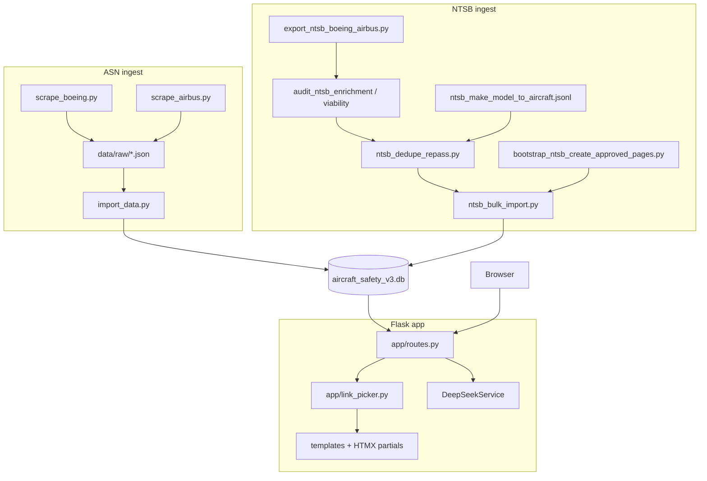

# Master Context Document

**Project**: Aircraft Safety Tracker (`v3-boeing-airbus-links`)  
**Date**: 2026-06-01  
**Purpose**: Regular health check — architecture snapshot, bug inventory, and handoff context for Task 6.0 UI / ongoing v3 work

---

## 1. Architecture Overview

Aircraft Safety Tracker is a **Flask monolith** that presents Boeing and Airbus aircraft safety profiles: searchable models, filterable incident tables, one outbound **Details** link per incident, and optional AI-generated summaries. Data lives in **SQLite** locally (`data/aircraft_safety_v3.db` on v3) or **PostgreSQL** in production, via SQLAlchemy and Alembic migrations.

**Tech stack:** Python 3.8+ (local 3.8.8), Flask 3, Flask-SQLAlchemy, Flask-Migrate, Flask-Caching, Jinja2, HTMX, Tailwind (CDN in dev), DeepSeek OpenAI-compatible API (summaries), httpx/BeautifulSoup (scraping), pytest (**63 tests** per JOURNAL), Gunicorn + Railway deploy.

**High-level components:**

1. **ASN ingestion** — `scripts/scrape_boeing.py`, `scripts/scrape_airbus.py` → `data/raw/*.json` → `scripts/import_data.py` writes `Aircraft`, `Incident` (with `asn_url`), skips aggregate “family / (all series)” rows to avoid global `asn_url` dedupe empty pages.
2. **NTSB enrichment (v3 branch)** — Export from legacy v2 DB → parse → link viability audit (`validate_ntsb_url`, CAROL→docket fallback) → JSONL buckets → **mapping-gated** `NTSBImporter` using `data/config/ntsb_make_model_to_aircraft.jsonl` → dedupe re-pass vs ASN → bootstrap empty catalog pages → pilot/bulk import scripts.
3. **Link resolution** — Import-time: `resolve_ntsb_source_url_checked()` in `app/ingestion/url_builders/ntsb.py`. Render-time: `pick_primary_href()` in `app/link_picker.py` (ASN on `Incident`, then `IncidentSource` NTSB/FAA).
4. **Web UI** — `app/routes.py`: home, ILIKE search grouped by series, aircraft detail + HTMX incident filters, feedback form, background DeepSeek summary thread.

**Design patterns:** Application factory (`create_app`), blueprint routing, service layer for LLM, batch-loading `IncidentSource` to avoid N+1, ingestion importers with shared Boeing/Airbus gate in `app/ingestion/importers/base.py`.

**Constraints / decisions:**

- Branch `v3-boeing-airbus-links` forked from `origin/main`; portfolio piece on `main` stays untouched.
- **Never** use v2 SQLite as v3 ASN truth — rebuild via scrape + import (PRD 0005.1).
- `IncidentSource.source_data` is metadata only — not used for link picking at render time.
- NTSB bulk import requires mapping file; post-import audit + remediation for dupes.
- Dev server often on **5003** when 5001 is busy; run Flask from **Aircraft Safety Tracker/** not parent `Portfolio/`.

---

## 2. Data Flow Diagram



---

## 3. File Map

| File Path | Responsibility |
|-----------|----------------|
| ⭐ `run.py` | Flask entry; shell context for models |
| ⭐ `config.py` | Dev/prod/test config; `DATABASE_URL`, `DEEPSEEK_API_KEY` |
| ⭐ `app/__init__.py` | App factory; registers blueprint + Jinja globals (`pick_primary_href`, `display_make_model`, `is_foreign_led_ntsb`) |
| ⭐ `app/models.py` | `Aircraft`, `Incident`, `IncidentSource`, `AircraftVariant`, `SystemTag`, `ReportAnalysis`, `Request` |
| ⭐ `app/routes.py` | All HTTP routes, HTMX incident filters, AI summary background thread |
| ⭐ `app/link_picker.py` | Single Details URL priority: ASN → NTSB → FAA |
| ⭐ `app/ingestion/link_schema.py` | Reject placeholder/catalog URLs at import |
| ⭐ `app/ingestion/url_builders/ntsb.py` | NTSB URL resolver; CAROL vs docket; foreign-led detection |
| ⭐ `app/ingestion/url_builders/ntsb_viability.py` | HTTP body checks (`not released`, `carol_empty_spa`) |
| ⭐ `app/ingestion/importers/ntsb_importer.py` | Mapping-gated NTSB incident + `IncidentSource` upsert |
| ⭐ `app/ingestion/importers/base.py` | Boeing/Airbus make/model gate; aircraft ID resolve (auto-create if unmapped) |
| ⭐ `app/ingestion/ntsb_mapping.py` | Load mapping JSONL; bootstrap `create_approved` catalog pages |
| ⭐ `app/ingestion/dedupe/ntsb_asn.py` | ASN↔NTSB dedupe scoring (`fatalities_like_import`) |
| ⭐ `app/ingestion/ntsb_dedupe_repass.py` | Batch dedupe re-pass over audit JSONL |
| ⭐ `app/ingestion/ntsb_post_import_audit.py` | Post-import duplicate/orphan audits + remediation |
| ⭐ `app/templates/components/incident_list.html` | Incident table + `pick_primary_href` macro |
| ⭐ `scripts/import_data.py` | ASN JSON → SQLite/Postgres |
| ⭐ `scripts/ntsb_bulk_import.py` | Bulk NTSB write to v3 with mapping |
| ⭐ `scripts/verify_asn_checkset.py` | Throttled ASN link QA via gstack browse |
| `app/services/deepseek.py` | DeepSeek chat completions for summaries |
| `app/forms.py` | WTForms for feedback request |
| `tests/test_link_picker.py` | Primary href + display_make_model |
| `tests/test_ntsb_*.py` | NTSB importer, dedupe, viability, bulk import |
| `LEARNINGS.md` | Tribal knowledge + resolved errors (39+ entries) |
| `JOURNAL.md` | Chronological engineering log |
| `Planning/sessions/2026-05-27_exhaustive_local_QA_127.0.0.1_5003.md` | Local QA + ASN 200-link addendum + `/qa` skill review |

---

## 4. Bug Reports

> Harvested from project history as of 2026-06-01. **15** unique issues (**6** open/product, **9** fixed or mitigated in code/docs).

### Bug 4.1 — DeepSeek / AI summary errors shown to users

- **Status:** open (partial hardening)
- **Summary:** Regenerate summary can persist raw API error text in `aircraft.ai_summary` and render it in the UI.
- **Expected behaviour:** Generic “summary unavailable” message; no API key fragments or stack-derived strings.
- **Actual behaviour:** Strings like `Failed to generate summary: Error generating summary: ...` or auth errors when `DEEPSEEK_API_KEY` is invalid or proxy blocks requests.
- **Error messages / stack traces:** `openai.AuthenticationError: Error code: 401`; `httpx.ProxyError: 403 Forbidden`; `Error generating summary: {str(e)}` from `DeepSeekService`.
- **Steps to reproduce:** Open aircraft page → Regenerate summary without valid key or behind blocking proxy.
- **Environment:** Local dev `http://127.0.0.1:5003/`; `.env` / Railway `DEEPSEEK_API_KEY`.
- **What was already tried:** LEARNINGS §6–7, §18; QA P0 in session report §7.
- **Suspected area of code:** `app/routes.py` (`generate_summary_background`), `app/services/deepseek.py`, `app/templates/components/summary_card.html`
- **Relevant recent changes:** DeepSeek replaced Gemini for summaries on v3 branch.
- **Source:** LEARNINGS §6, §7, §18; `Planning/sessions/2026-05-27_exhaustive_local_QA_127.0.0.1_5003.md` §6–7

### Bug 4.2 — Feedback form empty submit UX unclear

- **Status:** open
- **Summary:** `/qa` reported no visible validation when submitting empty feedback form.
- **Expected behaviour:** Clear inline validation (WTForms `DataRequired` on aircraft model).
- **Actual behaviour:** QA skill run (2026-05-27) saw no visible change after empty submit (`feedback-request-before.png` → `after.png`).
- **Error messages / stack traces:** None observed in QA.
- **Steps to reproduce:** `/feedback/request` → leave fields empty → Request Data.
- **Environment:** Local `http://127.0.0.1:5003/`
- **What was already tried:** Form defines `DataRequired()` in `app/forms.py` — may be HTMX/CSRF or client-only issue; needs re-verify.
- **Suspected area of code:** `app/routes.py` `request_data()`, `app/forms.py`, `app/templates/request_data.html`
- **Source:** `Planning/sessions/2026-05-27_exhaustive_local_QA_127.0.0.1_5003.md` QA skill ISSUE-002

### Bug 4.3 — Task 6.0 enrichment UI not shipped

- **Status:** open
- **Summary:** Post-bulk NTSB import, UI still lacks enrichment-mode display (Make/Model column exists in template but full Task 6.0 behaviour pending).
- **Expected behaviour:** Enrichment-aware incident list per plan (PRD 0006 / Step 1 plan).
- **Actual behaviour:** NTSB rows in DB; `display_make_model()` only for NTSB sources; broader enrichment UX not complete.
- **Steps to reproduce:** N/A — tracking gap.
- **Suspected area of code:** `app/templates/components/incident_list.html`, `app/routes.py`, plan `.cursor/plans/2405_new_branch_plan_676fa222.plan.md`
- **Source:** JOURNAL.md Current state; plan §5 Step 1

### Bug 4.4 — Search is aircraft-only (operator/airline queries fail)

- **Status:** open (product gap)
- **Summary:** Users cannot search by airline/operator name.
- **Expected behaviour:** Either operator search or clear UX that search is model-only.
- **Actual behaviour:** `/search?q=Kenya Airways` returns no results; home placeholder implies model search only.
- **Steps to reproduce:** Search “Kenya Airways” or “Air Canada” on home.
- **Suspected area of code:** `app/routes.py` `search()` — ILIKE on `Aircraft.model_name` only
- **Source:** QA session §5; LEARNINGS §15

### Bug 4.5 — Tailwind loaded from CDN in dev

- **Status:** open (low)
- **Summary:** Console warns against `cdn.tailwindcss.com` in production.
- **Expected behaviour:** Built Tailwind assets for production.
- **Actual behaviour:** Repeated console warning on all pages.
- **Source:** QA session §6A, QA skill ISSUE-001

### Bug 4.6 — Git fails when `.claude/skills/gstack` is submodule symlink

- **Status:** mitigated (procedure documented)
- **Summary:** `git status` errors when gstack path is symlink vs gitlink submodule.
- **Error messages / stack traces:** `error: expected submodule path 'Aircraft Safety Tracker/.claude/skills/gstack' not to be a symbolic link`
- **Fix:** `git update-index --force-remove` + re-add as `120000` symlink to `.claude/gstack` (JOURNAL 2026-05-30).
- **Source:** LEARNINGS §30, §39; JOURNAL.md

### Bug 4.7 — Wrong v3 baseline from v2 SQLite (historical)

- **Status:** fixed
- **Summary:** Bridging v3 from `aircraft_safety.db` caused missing incidents and empty aircraft pages.
- **Fix:** PRD 0005.1 full ASN rescrape + import into fresh `aircraft_safety_v3.db` (2026-05-27).
- **Source:** LEARNINGS §9; JOURNAL 2026-05-27

### Bug 4.8 — NTSB “working” links that are not public (HTTP 200 empty body)

- **Status:** fixed
- **Summary:** Docket pages and CAROL SPA shells returned 200 without usable content.
- **Fix:** `validate_ntsb_url()`, `is_carol_empty_spa_shell()`, FR-12 CAROL→docket fallback; working bucket 679→657 docket-only.
- **Source:** LEARNINGS §11, §25, §34

### Bug 4.9 — NTSB resolver preferred docket over CAROL incorrectly

- **Status:** fixed
- **Summary:** Sparse docket shown when CAROL had public content.
- **Fix:** FR-8 — CAROL wins when `carol_detail_has_public_content()` (commit noted in JOURNAL).
- **Source:** LEARNINGS §12; JOURNAL 2026-05-27

### Bug 4.10 — Dedupe missed duplicates when audit fatalities were null

- **Status:** fixed
- **Summary:** Pre-import dedupe scored null fatalities as “unknown”; import wrote `0`; post-import audit found dupes.
- **Fix:** `fatalities_like_import()` in `ntsb_asn.py`; remediated 3 incidents on v3.
- **Source:** LEARNINGS §38; JOURNAL 2026-05-30

### Bug 4.11 — NTSB import without mapping auto-created catalog bloat

- **Status:** mitigated (mapping gate shipped)
- **Summary:** `resolve_boeing_airbus_aircraft_id()` auto-created `Aircraft` on miss.
- **Fix:** `NTSBImporter(mapping=...)` fail-closed; bulk requires `ntsb_make_model_to_aircraft.jsonl`.
- **Source:** LEARNINGS §28, §37

### Bug 4.12 — ASN bulk verification fails on generic Playwright

- **Status:** mitigated
- **Summary:** Standalone Playwright could not parse ASN Date/Operator; gstack browse succeeded (194/200 strict).
- **Fix:** `scripts/verify_asn_checkset.py` with browse binary + throttling.
- **Source:** LEARNINGS §17; QA addendum completed 2026-05-28

### Bug 4.13 — Flask import error from wrong working directory

- **Status:** mitigated (documented)
- **Error messages / stack traces:** `Error: Could not import 'run'.`
- **Fix:** `cd "Aircraft Safety Tracker" && flask run` (LEARNINGS §4).
- **Source:** LEARNINGS §4

### Bug 4.14 — SQLite “database is locked” during long writes

- **Status:** mitigated
- **Error messages / stack traces:** `database is locked (5)`
- **Fix:** Serialize writers; wait for backfill to finish (LEARNINGS §19).
- **Source:** LEARNINGS §19

### Bug 4.15 — Post-import NTSB/ASN duplicates (remediated subset)

- **Status:** fixed (known 3 remediated)
- **Summary:** 3 duplicate incident pairs after bulk import (`ATL02LA075`, `FTW96LA269`, `SEA02FA060`).
- **Fix:** `audit_post_ntsb_import.py --remediate`; dedupe scoring aligned with import fatalities.
- **Source:** JOURNAL 2026-05-30; LEARNINGS §38

---

## 5. Relevant Code Snippets

### Bug 4.1 — AI summary error persisted to DB

```python
# app/routes.py — background task writes error strings into ai_summary
        summary = ai_service.generate_aircraft_summary(aircraft_data)
        
        if "AI summary unavailable" not in summary and "Error" not in summary:
            aircraft.ai_summary = summary
        else:
            aircraft.ai_summary = f"Failed to generate summary: {summary}"
```

```python
# app/services/deepseek.py — returns exception text to caller
        except Exception as e:
            logger.error(f"DeepSeek API error: {e}", exc_info=True)
            return f"Error generating summary: {str(e)}"
```

### Bug 4.2 — Form validators exist server-side

```python
# app/forms.py — server-side required field
class RequestDataForm(FlaskForm):
    aircraft_model = StringField('Aircraft Model', validators=[DataRequired()])
```

### Bug 4.3 — Details link selection at render time

```python
# app/link_picker.py — ASN first, then IncidentSource by priority
def pick_primary_href(incident, sources=None):
    if incident.asn_url and _valid_url(incident.asn_url):
        return incident.asn_url.strip()
    # ... NTSB, FAA_AIDS, FAA_SDR from active IncidentSource rows
```

```html
<!-- app/templates/components/incident_list.html -->


    <a href="{{ href }}" target="_blank" ...>Details &nearr;</a>
```

### Bug 4.10 — Dedupe fatalities aligned with import

```python
# app/ingestion/dedupe/ntsb_asn.py
def fatalities_like_import(value: Optional[int]) -> int:
    """Match NTSBImporter insert: null/unknown → 0 in DB (see LEARNINGS §38)."""
    if value is None:
        return 0
    return int(value)
```

### Bug 4.8 — NTSB URL viability body check

```python
# app/ingestion/url_builders/ntsb_viability.py (conceptual)
# Rejects docket "has not been released" and CAROL empty SPA shells
# Used by resolve_ntsb_source_url_checked() before storing source_url
```

---

## 6. Error Log Summary

### A) DeepSeek / OpenAI client

- `AuthenticationError: Error code: 401` — invalid or missing `DEEPSEEK_API_KEY`
- `httpx.ProxyError: 403 Forbidden` → `APIConnectionError: Connection error`
- User-visible: `Failed to generate summary: Error generating summary: ...`

### B) Flask / environment

- `Error: Could not import 'run'.` — Flask started from `Portfolio/` root instead of app subdirectory
- `Address already in use` / port **5001** in use — use **5003** or kill listener

### C) Database / tooling

- `sqlite3.OperationalError: database is locked` — concurrent read during long FAA/NTSB backfill
- `json.decoder.JSONDecodeError` on NTSB JSONL — lines starting with `#` comment headers (skip before `json.loads`)
- `ModuleNotFoundError: No module named 'flask'` — bare `python3` vs pytest/conda env
- `ModuleNotFoundError: No module named 'scripts.audit_ntsb_enrichment'` — import script via `importlib` in tests

### D) Git / agent sandbox

- `Unable to create '.../Portfolio/.git/index.lock': Operation not permitted` — Cursor sandbox; retry with full permissions
- `expected submodule path '.../gstack' not to be a symbolic link` — gstack path type mismatch

### E) Playwright / QA tooling

- `Failed to get CPU information (ERR_SYSTEM_ERROR)` — Playwright host detection in sandbox
- `Download failed: server closed connection` — `playwright install chromium` CDN failures
- `bunx: command not found` — use `~/.bun/bin/bunx` or run `.claude/gstack/setup`

### F) Test / runtime warnings

- `PytestDeprecationWarning: asyncio_default_fixture_loop_scope unset`
- `FutureWarning: non-supported Python version (3.8.8)`

---

## 7. Current State & Branch Delta

| Metric | Value (per JOURNAL 2026-05-30) |
|--------|--------------------------------|
| Branch | `v3-boeing-airbus-links` from `origin/main` |
| Tests | **63** pytest green |
| Real v3 DB | `data/aircraft_safety_v3.db` — **112** aircraft, **6,126** incidents, **603** NTSB sources |
| ASN | All incidents have `asn_url`; aggregate family rows skipped at import |
| NTSB | Bulk import complete; 3 dupes remediated; mapping + dedupe + bootstrap in place |
| UI | Single Details link via `pick_primary_href`; Make/Model column for NTSB metadata |
| Next | Task **6.0** enrichment UI + harden AI summary UX |

**Deployed `main` vs v3:** `main` serves portfolio with simpler incident list (ASN-only template). v3 adds `IncidentSource`, link picker, NTSB pipeline, and stricter import gates.

---

## 8. Known Risks

1. **README drift** — Still mentions Gemini/pg_trgm prominently; runtime uses DeepSeek and ILIKE search on v3 dev paths.
2. **Family-level NTSB dedupe** — Rows mapped to generic `Boeing 737` page do not dedupe against ASN on variant pages (accepted scope).
3. **Operator alias mismatches on ASN QA** — Strict string match flags FedEx vs FedEx Express, etc. (6/200 exceptions in browse verification).
4. **Single SQLite writer** — Do not run bulk import + manual sqlite3 + Flask against same DB concurrently.
5. **Production Tailwind CDN** — Not production-ready without asset pipeline.
6. **Enrichment without UI** — 603 NTSB sources in DB; users may not see full multi-source story until Task 6.0 ships.

---

*End of master context document. Prior snapshots: `context/context-2026-05-30_v2.md`, `context/context-main-deployed-2026-05-25.md`.*
