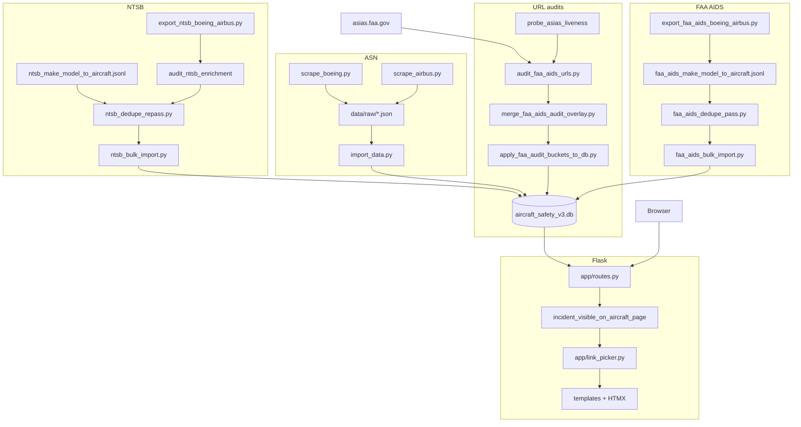

# Master Context Document

**Project**: Aircraft Safety Tracker (`v5-incorporating-asn-ntsb-faa-links`)  
**Date**: 2026-06-02  
**Purpose**: Regular health check — post FAA page-18 brief migration (PRD 0007.2 / 0009), architecture snapshot, full bug inventory

---

## 1. Architecture Overview

Aircraft Safety Tracker is a **Flask monolith** that presents Boeing and Airbus aircraft safety profiles: searchable models, filterable incident tables, one outbound **Details** link per incident, and optional AI-generated summaries. Data lives in **SQLite** locally (`data/aircraft_safety_v3.db`) or **PostgreSQL** in production, via SQLAlchemy and Alembic.

**Tech stack:** Python 3.8+ (local 3.8.8), Flask 3, Flask-SQLAlchemy, Flask-Migrate, Flask-Caching, Jinja2, HTMX, Tailwind (CDN), DeepSeek API (summaries), httpx + BeautifulSoup (scraping/audits), pytest, Gunicorn + Railway deploy, gstack `browse` for QA.

**High-level components:**

1. **ASN ingestion** — `scripts/scrape_boeing.py` / `scrape_airbus.py` → `data/raw/*.json` → `scripts/import_data.py` → `Incident.asn_url` (skips aggregate family rows).
2. **NTSB enrichment** — export → viability audit → `ntsb_make_model_to_aircraft.jsonl` mapping → dedupe re-pass → bootstrap → `ntsb_bulk_import.py`; render/import via `url_builders/ntsb.py` + `NTSBImporter`.
3. **FAA AIDS enrichment** — export from v2 or ASIAS → catalog/mapping → dedupe → bootstrap → bulk import (**6,466** sources); URLs are **ASIAS page 18** brief reports (`AP_BRIEF_RPT_VAR`); viability via `faa_aids_viability.py` + `audit_faa_aids_urls.py`.
4. **Link resolution** — Import-time URL builders; render-time `pick_primary_href()` (ASN → NTSB → FAA_AIDS); `is_active` on `IncidentSource` gates dead/overlap rows.
5. **Portable URL audit (PRD 0008)** — `url_audit/` package + `scripts/audit_urls.py`; FAA-specific rules in `.cursor/skills/audit-urls/references/faa-asias.md`.
6. **Web UI** — `app/routes.py`: search, aircraft detail + HTMX filters, `_visible_incidents()` hides linkless FAA-only rows; background DeepSeek summary thread.

**Communication:** Synchronous HTTP (Flask routes), direct SQLAlchemy DB access, threaded HTTP audits (`ThreadPoolExecutor`), no message queues.

**Design patterns:** Application factory, blueprint routing, batch `_load_sources_by_incident_id()` (no N+1 on dynamic relations), mapping-gated importers, JSONL audit buckets + overlay merge, ask-before-write DB scripts.

**Constraints / decisions:**

- Branch `v5-incorporating-asn-ntsb-faa-links` in parent **Portfolio** monorepo; run Flask/pytest from **Aircraft Safety Tracker/** cwd.
- **ASIAS is the only public per-record FAA AIDS URL source**; liveness probe required before bulk audit (homepage 503 → false mass `is_active=False`).
- **Brief (page 18) is product default**; page 12 search URLs are legacy; DB write-back activates only `working_brief_report`.
- **FR-0 overlap:** 246 FAA rows duplicate ASN/NTSB baseline → `is_active=False`; UI + overlap audit must run before bucket apply.
- SQLite single-writer: no concurrent reads/writes during long backfills.
- Dev port often **5003** when 5001 busy.

---

## 2. Data Flow Diagram



---

## 3. File Map

### App core

| File Path | Responsibility |
|-----------|----------------|
| ⭐ `run.py` | Flask entry point |
| ⭐ `config.py` | Dev/prod/test config; `DATABASE_URL`, reads `.env` for `DEEPSEEK_API_KEY` |
| ⭐ `app/__init__.py` | App factory; Jinja globals (`pick_primary_href`, `display_make_model`) |
| ⭐ `app/models.py` | `Aircraft`, `Incident`, `IncidentSource` (`source_record_id`, `is_active`) |
| ⭐ `app/routes.py` | Routes; batch source load; `_visible_incidents()` PRD 0009 filter |
| ⭐ `app/link_picker.py` | ASN → NTSB → FAA primary href; placeholder/catalog rejection |
| ⭐ `app/ingestion/link_schema.py` | Reject placeholder/catalog URLs at import |
| `app/forms.py` | Feedback request WTForms |
| `app/services/deepseek.py` | DeepSeek summaries; safe user-facing errors (§18) |

### NTSB

| File Path | Responsibility |
|-----------|----------------|
| ⭐ `app/ingestion/url_builders/ntsb.py` | NTSB URL resolver; CAROL vs docket; `resolve_ntsb_source_url_checked()` |
| ⭐ `app/ingestion/url_builders/ntsb_viability.py` | Body checks (`not released`, `carol_empty_spa`) |
| ⭐ `app/ingestion/importers/ntsb_importer.py` | Mapping-gated NTSB upsert |
| ⭐ `app/ingestion/dedupe/ntsb_asn.py` | ASN↔NTSB dedupe scoring; `fatalities_like_import()` |
| ⭐ `app/ingestion/ntsb_dedupe_repass.py` | Batch dedupe re-pass over audit JSONL |
| ⭐ `app/ingestion/ntsb_mapping.py` | Load `ntsb_make_model_to_aircraft.jsonl` |
| ⭐ `app/ingestion/ntsb_variant_resolution.py` | 737/787/EC130 series page resolution |
| `app/ingestion/ntsb_post_import_audit.py` | Post-import duplicate/orphan audits |
| `scripts/ntsb_bulk_import.py` | Bulk NTSB write with `--mapping` |
| `scripts/remediate_ntsb_variant_mapping.py` | Move incidents off family rollup pages |

### FAA AIDS

| File Path | Responsibility |
|-----------|----------------|
| ⭐ `app/ingestion/url_builders/faa_aids.py` | Page 12 search + page 18 brief URL builders |
| ⭐ `app/ingestion/url_builders/faa_aids_viability.py` | ASIAS liveness, buckets, `validate_faa_aids_url_extended()` |
| ⭐ `app/ingestion/importers/faa_aids_importer.py` | FAA row parse + import (brief URL at import) |
| ⭐ `app/ingestion/faa_baseline_overlap.py` | FR-0 overlap scoring; `incident_visible_on_aircraft_page()` |
| ⭐ `app/ingestion/faa_aids_post_import_audit.py` | `faa_asn_duplicate` / `faa_ntsb_duplicate` checks |
| ⭐ `app/ingestion/faa_aids_dedupe.py` | FAA vs ASN/NTSB dedupe pass |
| ⭐ `app/ingestion/faa_aids_mapping.py` | FAA make/model mapping load |
| ⭐ `app/ingestion/faa_variant_resolution.py` | Catalog-only aircraft ID resolution |
| ⭐ `scripts/audit_faa_aids_urls.py` | ThreadPool FAA URL audit CLI |
| ⭐ `scripts/merge_faa_aids_audit_overlay.py` | Overlay merge + gap-fill JSONL |
| ⭐ `scripts/migrate_faa_aids_urls_to_brief.py` | Page 12 → 18 migration gated on audit |
| ⭐ `scripts/apply_faa_audit_buckets_to_db.py` | Set `is_active` from audit buckets |
| ⭐ `scripts/audit_faa_baseline_overlap.py` | Overlap audit + `--apply` deactivate |
| ⭐ `scripts/export_faa_aids_app_link_audit.py` | App-link export from merged audit |
| ⭐ `scripts/run_faa_brief_retry4_when_live.py` | Cron: probe ASIAS, run deferred retry batch |
| `scripts/smoke_faa_aids_ui.py` | HTTP smoke for brief URL shape on local pages |
| `scripts/export_faa_aids_spotcheck_manifest.py` | CSV/JSONL manifest for manual app spot-checks |

### Portable audit + ASN

| File Path | Responsibility |
|-----------|----------------|
| ⭐ `url_audit/engine.py` | Generic URL audit engine (PRD 0008) |
| ⭐ `url_audit/merge.py` | Retry failure merge into base JSONL |
| `scripts/audit_urls.py` | Portable audit CLI entry |
| ⭐ `scripts/import_data.py` | ASN JSON → DB |
| `scripts/verify_asn_checkset.py` | Throttled ASN link QA via gstack browse |

### Docs / context

| File Path | Responsibility |
|-----------|----------------|
| ⭐ `LEARNINGS.md` | 50+ resolved error patterns + proactive prevention |
| ⭐ `JOURNAL.md` | Chronological engineering log |
| `context/context-2026-06-01.md` | Prior health-check snapshot |
| `.cursor/skills/audit-urls/SKILL.md` | Bulk URL audit workflow (v1.2 + FAA reference) |

---

## 4. Bug Reports

> Harvested from project history as of 2026-06-02. **55** unique issues (**3** open, **52** fixed or mitigated). Full numbered fixes: `LEARNINGS.md` §1–§50 (+ FAA §42 duplicate entry for retry5).

### LEARNINGS index (fixed/mitigated unless noted)

| § | Theme | Status |
|---|--------|--------|
| 1–3 | Postgres pg_trgm, Railway, client tabs | docs |
| 4–8 | Flask cwd, port, DeepSeek 401/proxy, Python 3.8 warnings | fixed/mitigated |
| 9–10 | v2 ASN bridge; family row dedupe | fixed |
| 11–13 | NTSB unreleased docket; CAROL priority; PDF JSON 200 | fixed |
| 14–17 | Gemini mock; empty DB UX; Playwright setup; ASN anti-bot | fixed/mitigated |
| 18 | DeepSeek error text in UI | **fixed** |
| 19 | SQLite locked during bulk write | mitigated (ops) |
| 20–21 | GitHub SSH timeout; Cursor `index.lock` | mitigated |
| 22–27 | NTSB test import path; dedupe test 0/0; JSONL `#` lines; CAROL SPA; Playwright CDN; mock patch site | fixed |
| 28–38 | NTSB catalog bloat; Path mapping; gstack symlink; python3 vs pytest; py3.8 annotations; empty mapping; FR-12 timing; family dedupe; docket HTML QA; mapping gate; null fatalities dedupe | fixed/mitigated |
| 39–41 | gstack submodule symlink fix; `.env` for API key; example.com placeholders | fixed/mitigated |
| 42 | NTSB variant remediation + FAA retry5 (duplicate § number) | fixed |
| 43–50 | ORM joinedload dynamic; DetachedInstance; UNIQUE source_record_id; browse sandbox; browse path; stale @e refs; feedback validation UX; stale ASN 404 | fixed/mitigated |

### Bug 4.1 — PRD 0009 Gate C manual browser sign-off pending

- **Status:** open
- **Summary:** Automated gates passed; product has not signed off manual 5–10 brief URL checks in browser.
- **Expected behaviour:** Human confirms page-18 brief pages render in real browser; review doc signed.
- **Actual behaviour:** Task **5.3** unchecked in `tasks-0009-prd-faa-aids-link-app-integration.md`.
- **Steps to reproduce:** Open rows from `data/logs/faa_aids_gate_spotcheck_urls_2026-06-03.jsonl` or `faa_aids_spotcheck_manifest_sample50.jsonl` in browser.
- **Environment:** Local Flask + live ASIAS.
- **What was already tried:** `smoke_faa_aids_ui.py`, post-import audit, 10/10 gate spot-check URLs in automation.
- **Suspected area of code:** N/A (process)
- **Relevant recent changes:** PRD 0009 ship path 2026-06-03.
- **Source:** `Planning/tasks/tasks-0009-*.md` §5.3; `Planning/reviews/faa-aids-app-link-review-gate-2026-06-03.md`

### Bug 4.2 — `test_parse_valid_boeing_row` expects page-12 URL fragment

- **Status:** open
- **Summary:** Importer now builds page-18 brief URLs; unit test still asserts `P12_AIDS_RPRT_NBR` in `source_url`.
- **Expected behaviour:** Test matches `build_faa_aids_brief_report_url()` / `AP_BRIEF_RPT_VAR`.
- **Actual behaviour:**
  ```
  AssertionError: assert 'P12_AIDS_RPRT_NBR' in 'https://www.asias.faa.gov/apex/f?p=100:18:::NO::AP_BRIEF_RPT_VAR:20050316X00394'
  ```
- **Steps to reproduce:** `PYTHONPATH=. pytest tests/test_faa_aids_importer.py::test_parse_valid_boeing_row`
- **Environment:** Python 3.8.8, local pytest
- **What was already tried:** Importer switched to brief template (PRD 0007.2).
- **Suspected area of code:** `tests/test_faa_aids_importer.py` line ~54
- **Source:** pytest 2026-06-02 health check (**152 passed, 1 failed**)

### Bug 4.3 — DeepSeek summary unavailable without valid API key

- **Status:** mitigated
- **Summary:** Missing/invalid `DEEPSEEK_API_KEY` breaks regenerate-summary.
- **Expected behaviour:** Generic user message; no raw API errors in UI.
- **Actual behaviour:** Was raw 401 text in card (§18 fixed); still no summary without key.
- **Error messages:** `openai.AuthenticationError: Error code: 401`
- **Fix:** `.env` + restart Flask; `SUMMARY_UNAVAILABLE_USER_MESSAGE` in `deepseek.py`
- **Source:** LEARNINGS §6, §18, §40

### Bug 4.4 — ASIAS global outage / CDN 503 masquerading as dead records

- **Status:** mitigated
- **Summary:** Bulk audit during Akamai outage soft-deactivated all FAA links.
- **Expected behaviour:** Skip or defer DB write-back when `probe_asias_liveness()` is false.
- **Actual behaviour:** Mass `not_working` / `asias_cdn_error` when homepage not 2xx.
- **Error messages:** Akamai CDN error page; `asias_cdn_error`, `http_503`
- **Fix:** Liveness guard in `faa_aids_viability.py`; deferred `run_faa_brief_retry4_when_live.py`
- **Source:** LEARNINGS proactive §12–13; JOURNAL 2026-06-01; Bug context 2026-06-01 §4.12

### Bug 4.5 — FAA audit merge kept stale timeout rows over later successes

- **Status:** fixed
- **Summary:** Overlay merge from complete retry JSONL files left 22 rows inactive despite later `working_brief_report`.
- **Expected behaviour:** Newer audit row wins per `source_record_id`.
- **Actual behaviour:** Merged JSONL retained earlier `not_working` timestamps.
- **Fix:** `merge_faa_aids_audit_overlay.py merge` from `merged_pre_retry4` + retry4/gap/retry5 files
- **Source:** JOURNAL 2026-06-03; conversation handoff

### Bug 4.6 — 49 `not_working` under aggressive concurrency (infra flake)

- **Status:** fixed
- **Summary:** retry4 at concurrency 6 / 15s timeout yielded 503/403/timeouts; not bad AIDS IDs.
- **Expected behaviour:** Gentle retry recovers transient failures.
- **Actual behaviour:** 49 rows `not_working` with liveness true.
- **Error messages:** `asias_cdn_error`, `http_403`, `asias_backend_timeout`
- **Fix:** retry5 `--concurrency 3 --timeout 25 --jitter-min-ms 500 --jitter-max-ms 1500` → **49/49** brief
- **Source:** LEARNINGS §42 (FAA retry5); JOURNAL 2026-06-03

### Bug 4.7 — FR-0 overlap re-activated if bucket apply skips overlap guard

- **Status:** mitigated
- **Summary:** `apply_faa_audit_buckets_to_db.py` without `--overlap-audit` can set `is_active=True` on baseline-covered FAA rows.
- **Expected behaviour:** 13 ASN-dup overlap rows stay inactive (~6453 active brief = 6466 − 13).
- **Fix:** Always `--overlap-audit` or re-run `audit_faa_baseline_overlap.py --apply`
- **Source:** LEARNINGS proactive §15; JOURNAL 2026-06-03

### Bug 4.8 — Tail row `20090520857189A` stale `working_search_prefill`

- **Status:** fixed
- **Summary:** Last row stuck on page-12 classification until single-row re-audit + migrate.
- **Fix:** Patch audit + `migrate_faa_aids_urls_to_brief.py` → **6466/6466 (100%)** brief gate
- **Source:** JOURNAL 2026-06-03

### Bug 4.9 — Stale ASN wikibase 404 in DB

- **Status:** open (data hygiene)
- **Summary:** At least one ASN URL 404s live while still stored (e.g. wikibase/197625).
- **Expected behaviour:** Periodic re-validation or manual clear.
- **Source:** LEARNINGS §50; QA addendum 2026-05-27

### Bug 4.10 — Feedback form empty-submit UX unclear in headless QA

- **Status:** mitigated
- **Summary:** browse QA did not consistently show server validation message.
- **Source:** LEARNINGS §49; manual verify `request_data.html`

*(Remaining LEARNINGS §1–41 entries are fixed in code or documented ops playbooks — see index table; prior snapshot `context-2026-06-01.md` §4.1–4.15 for narrative duplicates.)*

---

## 5. Relevant Code Snippets

> Snippets for open bugs + instructive FAA gates (5 bugs). Other §4 entries: see `LEARNINGS.md` and prior `context-2026-06-01.md` §5.

### `tests/test_faa_aids_importer.py` — stale assertion (Bug 4.2)

```python
def test_parse_valid_boeing_row():
    parsed = FAAAIDSImporter.parse(_valid_row())
    assert parsed is not None
    assert parsed["source_record_id"] == "20050316X00394"
    assert "P12_AIDS_RPRT_NBR" in parsed["source_url"]  # should assert AP_BRIEF_RPT_VAR / page 18
```

### `app/ingestion/url_builders/faa_aids.py` — brief URL is canonical (Bug 4.2)

```python
ASIAS_AIDS_BRIEF_REPORT_TEMPLATE = (
    "https://www.asias.faa.gov/apex/f?p=100:18:::NO::AP_BRIEF_RPT_VAR:{report_id}"
)

def build_faa_aids_brief_report_url(source_record_id: Optional[str]) -> Optional[str]:
    encoded = _encode_report_id(source_record_id)
    ...
```

### `app/routes.py` + `faa_baseline_overlap.py` — hide linkless FAA-only rows (PRD 0009)

```python
def _visible_incidents(incidents, sources_by_incident):
    return [
        inc
        for inc in incidents
        if incident_visible_on_aircraft_page(inc, sources_by_incident.get(inc.id, []))
    ]

def incident_visible_on_aircraft_page(incident, sources=None):
    srcs = list(sources) if sources is not None else list(incident.sources or [])
    if pick_primary_href(incident, srcs):
        return True
    active = [s for s in srcs if s.is_active is not False]
    if not active:
        return True
    names = {(s.source_name or "").upper() for s in active}
    if names <= {"FAA_AIDS"}:
        return False
    return True
```

### `app/ingestion/url_builders/faa_aids_viability.py` — liveness before bulk audit (Bug 4.4)

```python
ASIAS_LIVENESS_URL = "https://www.asias.faa.gov/"
BUCKET_BRIEF_REPORT = "working_brief_report"
BUCKET_SEARCH_PREFILL = "working_search_prefill"
BUCKET_NOT_WORKING = "not_working"
RETRYABLE_REASONS = frozenset({
    "asias_cdn_error", "asias_backend_timeout", "http_503", "http_504", "fetch_error",
})
```

### `app/link_picker.py` — active sources only for Details (overlap + audit)

```python
def _active_sources(sources: Iterable[IncidentSource]) -> List[IncidentSource]:
    return [s for s in sources if s.is_active is not False]

def pick_primary_href(incident, sources=None):
    if incident.asn_url and _valid_url(incident.asn_url):
        return incident.asn_url.strip()
    ...
```

---

## 6. Error Log Summary

### FAA / ASIAS HTTP (grouped)

| Reason | Typical HTTP | Meaning |
|--------|--------------|---------|
| `asias_cdn_error` | 503 | Akamai/CDN or backend overload — often transient under bulk load |
| `http_403` | 403 | Rate limit / WAF under aggressive concurrency |
| `asias_backend_timeout` | — | Per-record timeout (15s too low for tail batch) |
| Homepage non-2xx | 503 | **Do not run audit or apply buckets** — false mass deactivate |

First occurrence pattern (2026-06-03 retry4): 23 `not_working` after 345 brief at concurrency 6. retry5 gentle: **0** failures on same 49 IDs.

### pytest (2026-06-02)

```
FAILED tests/test_faa_aids_importer.py::test_parse_valid_boeing_row
AssertionError: assert 'P12_AIDS_RPRT_NBR' in 'https://www.asias.faa.gov/apex/f?p=100:18:::NO::AP_BRIEF_RPT_VAR:20050316X00394'
```

Suite otherwise: **152 passed**, 1 failed; `PytestDeprecationWarning` for `asyncio_default_fixture_loop_scope` unset.

### Git / agent environment

```
fatal: Unable to create '.../Portfolio/.git/index.lock': Operation not permitted
error: expected submodule path '.../.claude/skills/gstack' not to be a symbolic link
```

### SQLite

```
Error: stepping, database is locked (5)
```

During long FAA/NTSB backfill — expected if second writer opens DB.

### DeepSeek (mitigated in UI)

```
openai.AuthenticationError: Error code: 401 - Authentication Fails...
httpx.ProxyError: 403 Forbidden
```

### Playwright / browse (QA)

```
error: Failed to get CPU information
code: "ERR_SYSTEM_ERROR"
```

Fix: run browse with full permissions or local terminal (LEARNINGS §46).

---

## 7. Current State & Branch Delta

| Item | Value |
|------|--------|
| Branch | `v5-incorporating-asn-ntsb-faa-links` (**4 commits** ahead of origin) |
| Latest commit | `1caf989` — FAA brief migration, app link gates, ASIAS audit tooling |
| pytest | **152 passed, 1 failed** (`test_faa_aids_importer`) |
| v3 DB (FAA) | **6453** active FAA brief URLs (6466 audit − **13** FR-0 overlap); page-18 URLs |
| FAA audit gate | **6466/6466** `working_brief_report` in merged JSONL (2026-06-03) |
| PRD 0007.2 | **Complete** — gate review `Planning/reviews/faa-aids-brief-migration-gate-0007.2-2026-06-03.md` |
| PRD 0009 | Tasks 1–7 done; **5.3** manual Gate C open |
| Untracked | Large `data/logs/faa_aids_*.jsonl`, spot-check manifests, `export_faa_aids_spotcheck_manifest.py` |
| Prior context | `context-2026-06-01.md` (pre-brief-migration completion) |

**Delta since 2026-06-01 snapshot:** FAA URLs migrated page 12→18; portable `url_audit/` package; overlap + visibility gates; retry4/5 merge pipeline; `/audit-urls` skill v1.2; DB `is_active` from brief buckets.

---

## 8. Known Risks

1. **ASIAS availability** — Any future CDN outage + unguarded audit could mass-deactivate links; keep liveness + deferred retry cron.
2. **Bulk audit rate limits** — Default aggressive settings (16 workers, 15s) can reproduce 503 flakes; use gentle settings for tail retries (LEARNINGS proactive §16).
3. **Overlap guard regression** — Bucket apply without `--overlap-audit` re-shows duplicate FAA incidents.
4. **CI drift** — One failing importer test blocks clean `pytest -q` until assertion updated for page 18.
5. **Gate C** — Shipping without manual browser sign-off leaves product acceptance gap.
6. **Monorepo git** — Portfolio parent `.git` sandbox/symlink issues may block agent commits; large audit JSONLs should not be committed without explicit request.
7. **SQLite concurrency** — Parallel audits + Flask + import against same DB file risk `database is locked`.
8. **Stale external URLs** — ASN/FAA/NTSB pages change post-import; no periodic re-validation job in app.

---

## Handoff prompt (health check)

```
I'm giving you a compressed context document about my application.
It includes architecture, file map, ALL known bugs from project history, code snippets, and error logs.

Please review it and tell me:
1. Whether the architecture and file map look consistent with each other
2. Which open bugs in §4 are highest priority and why
3. Any components or patterns that seem overly complex or worth simplifying
4. Any obvious gaps or risks not already captured in the bug reports
5. Suggested improvements to the documentation itself for next time
```
