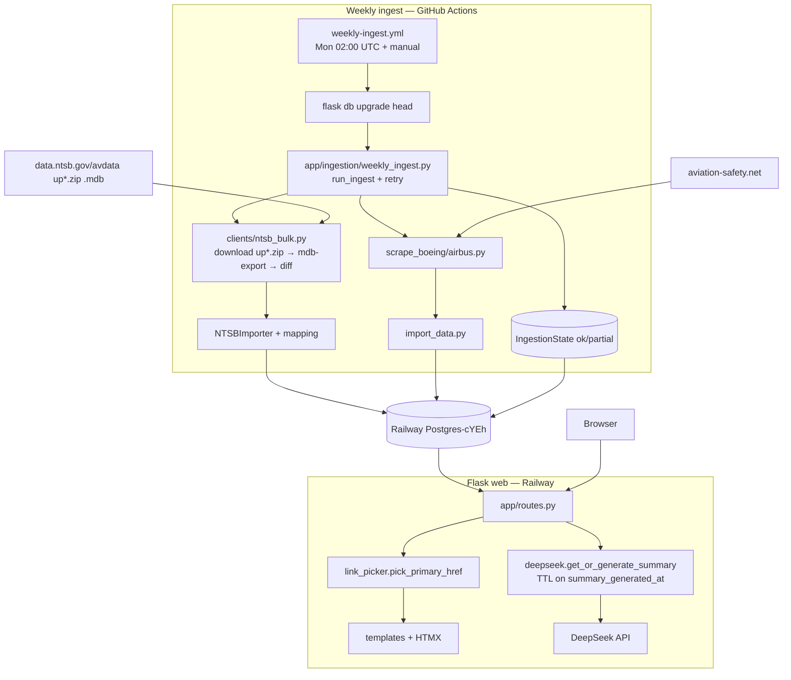

# Master Context Document

**Project**: Aircraft Safety Tracker (`v6-perpetual-hosting-hardening`)
**Date**: 2026-06-27
**Purpose**: Health check + handoff — PRD 0012 perpetual hosting hardening (AI summary TTL cache, weekly NTSB+ASN ingest via GitHub Actions), architecture snapshot, full bug inventory

---

## 1. Architecture Overview

Aircraft Safety Tracker is a **Flask monolith** presenting Boeing/Airbus aircraft safety profiles: searchable models, filterable incident tables, one outbound **Details** link per incident, and optional AI summaries. Data lives in **SQLite** locally (`data/aircraft_safety_v3.db`) or **PostgreSQL** in production (Railway `Postgres-cYEh`), via SQLAlchemy + Alembic.

**Tech stack:** Python 3.8 local / 3.12 CI / 3.13 Railway, Flask 3, Flask-SQLAlchemy, Flask-Migrate, Flask-Caching, Jinja2, HTMX, Tailwind (CDN), DeepSeek API (summaries), httpx + BeautifulSoup (scraping/audits), **mdbtools** (NTSB `.mdb` parsing), pytest, Gunicorn + Railway, GitHub Actions (weekly ingest), gstack `browse` for QA.

**High-level components:**

1. **ASN ingestion** — `scripts/scrape_boeing.py` / `scrape_airbus.py` → `data/raw/*.json` → `scripts/import_data.py` → `Incident.asn_url` (dedupe on `asn_url`).
2. **NTSB enrichment (historical)** — export → viability audit → `ntsb_make_model_to_aircraft.jsonl` mapping → dedupe re-pass → bootstrap → `ntsb_bulk_import.py`.
3. **NTSB incremental (NEW, PRD 0012)** — `app/ingestion/clients/ntsb_bulk.py`: download NTSB avdata weekly `up*.zip` (`.mdb`), `mdb-export` via mdbtools, filter Boeing/Airbus, diff vs DB `source_record_id`, feed existing `NTSBImporter`.
4. **FAA AIDS enrichment** — export → catalog/mapping → dedupe → bootstrap → bulk import (**6,466** sources); URLs are **ASIAS page 18** brief reports.
5. **Link resolution** — import-time URL builders; render-time `pick_primary_href()` (ASN → NTSB → FAA_AIDS); `is_active` gates dead/overlap rows.
6. **AI summary cache (NEW, PRD 0012)** — `app/services/deepseek.py` `get_or_generate_summary()`: TTL gate (`AI_SUMMARY_TTL_DAYS`, default 7) on `Aircraft.summary_generated_at`; fresh page loads skip the API; Regenerate force-bypasses; failures preserve cached text.
7. **Weekly ingest orchestrator (NEW, PRD 0012)** — `app/ingestion/weekly_ingest.py` `run_ingest()`: runs NTSB + ASN with 3× retry, upserts `IngestionState`; thin CLI `scripts/weekly_ingest.py`; scheduled by `.github/workflows/weekly-ingest.yml` → writes to Railway Postgres.
8. **Web UI** — `app/routes.py`: search, aircraft detail + HTMX filters, `_visible_incidents()` hides linkless FAA-only rows, HTMX-polled background summary generation.

**Communication:** Synchronous HTTP (Flask), direct SQLAlchemy, threaded HTTP audits, **GitHub Actions cron → Railway Postgres over the public proxy**, no message queues.

**Design patterns:** Application factory, blueprint routing, batch source load (no N+1), mapping-gated importers, JSONL audit buckets, ask-before-write scripts, **injectable source fns + retry helper** in the orchestrator, **pure transforms isolated from I/O** in `ntsb_bulk.py`.

**Constraints / decisions:**

- Branch `v6-perpetual-hosting-hardening` in parent **Portfolio** monorepo; run Flask/pytest from **Aircraft Safety Tracker/** cwd.
- **NTSB incremental = avdata `.mdb`, not the CAROL JSON API** (CAROL `Query/Main` is undocumented — rejects all column names; see Bug 4.1). mdbtools installs trivially on GitHub Actions, painfully on Railway → **ingest hosted on GitHub Actions**.
- **Weekly job is additive/idempotent** (NTSB upsert on `source_record_id`, ASN dedupe on `asn_url`); restore lever is re-running `push_v3_sqlite_to_postgres.py` from the golden `data/aircraft_safety_v3.db`.
- Prod stamped at Alembic `f6a7b8c9d0e1`; the 2 new migrations apply cleanly on deploy via updated `Procfile`.
- ASIAS is the only public per-record FAA URL source; brief (page 18) is product default.
- SQLite single-writer; dev port often **5003**.

---

## 2. Data Flow Diagram



---

## 3. File Map

### Perpetual hosting layer (PRD 0012 — NEW)

| File Path | Responsibility |
|-----------|----------------|
| ⭐ `app/services/deepseek.py` | DeepSeek summaries + `get_or_generate_summary()` TTL cache gate, `is_summary_fresh()`, `GENERATING_MARKER` |
| ⭐ `app/ingestion/clients/ntsb_bulk.py` | NTSB avdata `.mdb` adapter: `parse_latest_update_url`, `build_records`, `diff_new_records`, `fetch_new_ntsb_records` |
| ⭐ `app/ingestion/weekly_ingest.py` | `run_ingest()` orchestrator + `_run_with_retry()`; NTSB+ASN sources; `IngestionState` upsert |
| ⭐ `scripts/weekly_ingest.py` | Thin CLI entrypoint (Flask context, `FLASK_CONFIG=production`) for GitHub Actions |
| ⭐ `.github/workflows/weekly-ingest.yml` | (repo root) Weekly cron + manual dispatch: apt mdbtools → migrate → ingest → Railway Postgres |
| ⭐ `app/models.py` | + `Aircraft.summary_generated_at` (DateTime, nullable); + `IngestionState` (id, last_run_at, last_run_status) |
| `migrations/versions/a1b2c3d4e5f6_*.py` | Add `summary_generated_at` |
| `migrations/versions/b2c3d4e5f6a7_*.py` | Add `ingestion_state` table |
| ⭐ `Procfile` | `FLASK_APP=run.py flask db upgrade head && gunicorn run:app` |
| `scripts/push_v3_sqlite_to_postgres.py` | One-time/restore: batched v3 SQLite → Postgres (TRUNCATE + execute_batch; terminates other sessions) |

### App core

| File Path | Responsibility |
|-----------|----------------|
| ⭐ `run.py` | Flask entry; `create_app(FLASK_CONFIG or 'default')` |
| ⭐ `config.py` | Dev/prod/test config; `DATABASE_URL`; `.env` for `DEEPSEEK_API_KEY` |
| ⭐ `app/__init__.py` | App factory; Jinja globals incl. `is_summary_fresh`, `summary_generating_marker` |
| ⭐ `app/routes.py` | Routes; `generate_summary_background(force, prev…)`; `regenerate_summary(?force=true)`; `_visible_incidents()` |
| ⭐ `app/link_picker.py` | ASN → NTSB → FAA primary href |
| ⭐ `app/ingestion/importers/ntsb_importer.py` | Mapping-gated NTSB upsert (consumes `ntsb_bulk` records) |
| ⭐ `app/ingestion/importers/base.py` | `is_boeing_or_airbus_make_model`, aircraft id resolution |
| ⭐ `app/ingestion/ntsb_mapping.py` | Load `ntsb_make_model_to_aircraft.jsonl` (keys = UPPERCASE `MAKE MODEL`) |
| ⭐ `app/ingestion/url_builders/ntsb.py` | NTSB URL resolve; docket URL deterministic when no mkey |

*(FAA AIDS / portable url_audit / historical NTSB file map unchanged — see `context-2026-06-02.md` §3.)*

---

## 4. Bug Reports

> Harvested from project history as of 2026-06-27. **57 numbered LEARNINGS** (§1–§57) + this session's items. Open items below; prior fixed catalog in `LEARNINGS.md` and `context-2026-06-02.md` §4.

### Bug 4.1 — NTSB CAROL JSON API is undocumented/unusable (drove Approach B)
- **Status:** mitigated (avoided by design)
- **Summary:** `POST data.ntsb.gov/carol-main-public/api/Query/Main` is live and returns JSON but rejects every column name; no config/swagger to enumerate valid `TableColumn`s.
- **Error messages:** `{"Error":"TableColumn Event Date was not found within the configuration"}`; `{"Error":"The SortColumn value Event Date is invalid"}`; config endpoints all 404.
- **Resolution:** Use NTSB avdata weekly `.mdb` + diff instead (`ntsb_bulk.py`); host on GitHub Actions.
- **Source:** This session 2026-06-21; `docs/solutions/integration-issues/ntsb-incremental-bulk-mdb-not-carol-api.md`; LEARNINGS proactive (NTSB incremental bullet)

### Bug 4.2 — `mdb-export -D` does not normalize NTSB dates
- **Status:** fixed
- **Summary:** Even with `-D '%Y-%m-%d'`, `events.ev_date` exports as `MM/DD/YY 00:00:00`, so `NTSBImporter._parse_date` rejected every record (0/4 parsed).
- **Error/behaviour:** built records had `event_date='05/17/26 00:00:00'` → `parse()` returns None.
- **Fix:** `_normalize_event_date()` in `ntsb_bulk.py` (handles `%m/%d/%y`, `%m/%d/%Y`, ISO) → 4/4 parsed on real `up01JUN.mdb`.
- **Source:** This session 2026-06-21 (RED→GREEN via `tests/test_ntsb_bulk.py`)

### Bug 4.3 — DEPLOY ORDERING: web app reads `summary_generated_at` before migration applied
- **Status:** open (mitigated by Procfile; pending verification on deploy)
- **Summary:** If the v6 web service deploys without running migrations, `Aircraft.summary_generated_at` / `ingestion_state` won't exist → 500s.
- **Fix in place:** `Procfile` runs `flask db upgrade head` before gunicorn; prod confirmed at prior head `f6a7b8c9d0e1`, so only the 2 new migrations apply.
- **Verification owed:** Task 5.6 — redeploy from v6 + load `/aircraft/23`.
- **Source:** Prod DB query 2026-06-21; PRD 0012 Task 5

### Bug 4.4 — DeepSeek summary unavailable without valid API key
- **Status:** mitigated — generic `SUMMARY_UNAVAILABLE_USER_MESSAGE`; failure path now preserves cached summary (FR-2.5). **Source:** LEARNINGS §6, §18, §40, §54.

### Bug 4.5 — ASIAS global outage / CDN 503 masquerading as dead records
- **Status:** mitigated — liveness guard + deferred retry cron. **Source:** LEARNINGS §12–13; context 2026-06-01.

### Bug 4.6 — FR-0 overlap re-activated if bucket apply skips overlap guard
- **Status:** mitigated — always `--overlap-audit`. **Source:** LEARNINGS proactive §15.

### Bug 4.7 — Stale ASN wikibase 404 in DB
- **Status:** open (data hygiene) — at least one ASN URL 404s live while stored. **Source:** LEARNINGS §50.

### Bug 4.8 — Railway Postgres TRUNCATE deadlock during v3 push
- **Status:** fixed — `pg_terminate_backend` other sessions before TRUNCATE; batched `execute_batch`. **Source:** LEARNINGS §56.

### Bug 4.9 — Railway mise Python 3.13.1 attestation failure
- **Status:** fixed — `mise.toml` `python.github_attestations = false`. **Source:** LEARNINGS §57.

### Bug 4.10 — PRD 0009 Gate C manual browser sign-off (FAA brief)
- **Status:** open (process) — manual 5–10 brief URL checks not signed. **Source:** `tasks-0009` §5.3.

*(Prior `test_faa_aids_importer::test_parse_valid_boeing_row` page-12 assertion bug is now **fixed** — full suite 179 passed, 0 failed.)*

---

## 5. Relevant Code Snippets

### `app/services/deepseek.py` — TTL cache gate (Bug 4.3, FR-2)

```python
def is_summary_fresh(aircraft, *, now=None, ttl_days=None):
    if not _usable_cached_summary(aircraft):   # excludes GENERATING_MARKER + legacy errors
        return False
    if aircraft.summary_generated_at is None:
        return False
    now = now or datetime.utcnow()
    ttl_days = ttl_days if ttl_days is not None else _summary_ttl_days()
    return (now - aircraft.summary_generated_at) < timedelta(days=ttl_days)

def get_or_generate_summary(aircraft, *, force=False, ai_service=None, commit=True):
    from app import db
    if not force and is_summary_fresh(aircraft):
        return aircraft.ai_summary          # cache hit → no API call
    service = ai_service if ai_service is not None else DeepSeekService()
    try:
        summary = service.generate_aircraft_summary({...})
    except Exception:
        return aircraft.ai_summary          # failure → keep cache
    if summary == SUMMARY_UNAVAILABLE_USER_MESSAGE:
        cached = _usable_cached_summary(aircraft)
        return cached if cached else _store_unavailable(aircraft, commit)
    aircraft.ai_summary = summary
    aircraft.summary_generated_at = datetime.utcnow()
    if commit: db.session.commit()
    return summary
```

### `app/ingestion/clients/ntsb_bulk.py` — date normalize + Boeing/Airbus build (Bug 4.2)

```python
def _normalize_event_date(raw):
    text = (raw or "").strip()
    date_part = text.split(" ", 1)[0]               # drop "00:00:00"
    for fmt in ("%m/%d/%y", "%m/%d/%Y", "%Y-%m-%d", "%Y/%m/%d"):
        try: return datetime.strptime(date_part, fmt).strftime("%Y-%m-%d")
        except ValueError: continue
    return date_part

# make_model = f"{acft_make} {acft_model}"  e.g. "BOEING 737" — exact mapping key format
# diff_new_records keeps only ntsb_id not already in IncidentSource.source_record_id
```

### `app/ingestion/weekly_ingest.py` — retry + status (PRD FR-1)

```python
def _run_with_retry(fn, name, *, max_retries=3, delay=60, sleep=time.sleep):
    for attempt in range(1, max_retries + 1):
        try: return fn(), True
        except Exception:
            logger.exception("ingest source %s failed %d/%d", name, attempt, max_retries)
            if attempt < max_retries: sleep(delay)
    return None, False
# status = 'ok' if all sources ok else 'partial'; IngestionState.last_run_at always advances
```

### `.github/workflows/weekly-ingest.yml` — host (key steps)

```yaml
- run: sudo apt-get update && sudo apt-get install -y mdbtools
- run: pip install -r requirements.txt
- run: flask db upgrade head
- run: PYTHONPATH=. python scripts/weekly_ingest.py
# env: DATABASE_URL (public proxy), DEEPSEEK_API_KEY from secrets; FLASK_CONFIG=production
```

---

## 6. Error Log Summary

### NTSB CAROL probe (2026-06-21) — why approach A was rejected
```
{"Error":"TableColumn Mode was not found within the configuration"}
{"Error":"The SortColumn value Event Date is invalid"}
{"Error":"TableColumn Event Date was not found within the configuration"}
GET .../api/Query/{GetSearchTerms,GetColumns} , swagger/v1 → 404
```

### NTSB mdb-export date (fixed)
```
build_records → event_date='05/17/26 00:00:00' → NTSBImporter.parse() == None  (0/4)
after _normalize_event_date → '2026-05-17' → 4/4 parsed
```

### Prod DB state (read-only, 2026-06-21)
```
alembic_version = f6a7b8c9d0e1   summary_generated_at: absent   ingestion_state: absent
NTSB incident_source rows = 603
```

### pytest (2026-06-27)
```
179 passed, 1 warning  (PytestDeprecationWarning: asyncio_default_fixture_loop_scope unset)
```

### Prior recurring (mitigated) — see context-2026-06-02 §6
`asias_cdn_error`/503, `http_403`, SQLite `database is locked`, DeepSeek 401/ProxyError, browse `ERR_SYSTEM_ERROR`, git `index.lock` / gstack submodule symlink.

---

## 7. Current State & Branch Delta

| Item | Value |
|------|--------|
| Branch | `v6-perpetual-hosting-hardening` (pushed; tracks origin) |
| Commits ahead of v5 | 5 (`5c3324a`→`7013d69`) |
| pytest | **179 passed**, 0 failed (was 152/1-fail on 2026-06-02) |
| PRD 0012 Tasks 1–4 | **Complete** (schema, AI cache, NTSB bulk adapter, orchestrator) |
| PRD 0012 Task 5 | Workflow + Procfile built; **handoff pending** |
| Prod DB | Postgres-cYEh @ Alembic `f6a7b8c9d0e1`; needs the 2 new migrations on deploy |
| New tests | 22 (`test_v6_models` 4, `test_ai_summary_cache` 9, `test_ntsb_bulk` 4, `test_weekly_ingest` 5) |

**Pending handoff (manual):**
1. ✅ Push branch (done).
2. Add GitHub repo **secrets** `DATABASE_URL` (Railway public URL) + `DEEPSEEK_API_KEY`.
3. Trigger workflow (Actions → Run workflow); scheduled cron needs merge to **default branch**.
4. Redeploy Railway web from v6 (applies migrations via Procfile); verify `/aircraft/23` cached summary + `ingestion_state` row.

**Delta since 2026-06-02:** added AI summary TTL cache, `summary_generated_at` + `IngestionState` schema (2 migrations), NTSB incremental `.mdb` adapter, weekly orchestrator, GitHub Actions workflow; faa importer page-18 test fixed; v6 branch.

---

## 8. Known Risks

1. **Undocumented NTSB source** — avdata filenames/format could change; diff-on-id and "pick newest weekly file by date" reduce but don't eliminate breakage. mdbtools is an external system dep.
2. **First weekly run mutates prod** — additive + idempotent; restore = re-run `push_v3_sqlite_to_postgres.py` from golden v3 SQLite (verified intact: 153 aircraft / 12,592 incidents / 7,069 sources / id=23 → 238).
3. **Prod password exposed in chat** — rotate Railway Postgres password + update the secret after first green run.
4. **Scheduled runs only fire on the default branch** — cron won't run while work lives on `v6`; merge to main to activate.
5. **Deploy ordering** — web must run migrations before serving v6 code (Procfile handles it; verify on first deploy).
6. **mdbtools availability** — present on GitHub Actions via apt; do **not** assume on Railway/local without install (installed locally via brew for dev).
7. **Carried-over risks** — ASIAS availability, bulk-audit rate limits, FR-0 overlap guard, SQLite concurrency, stale external URLs (context-2026-06-02 §8).

---

## Handoff prompt (health check)

```
I'm giving you a compressed context document about my application.
It includes architecture, file map, ALL known bugs from project history, code snippets, and error logs.

Please review it and tell me:
1. Whether the architecture and file map look consistent with each other
2. Which open bugs in §4 are highest priority and why
3. Any components or patterns that seem overly complex or worth simplifying
4. Any obvious gaps or risks not already captured in the bug reports
5. Suggested improvements to the documentation itself for next time
```
