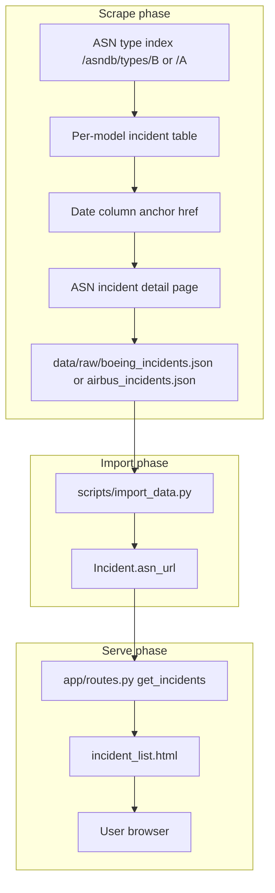
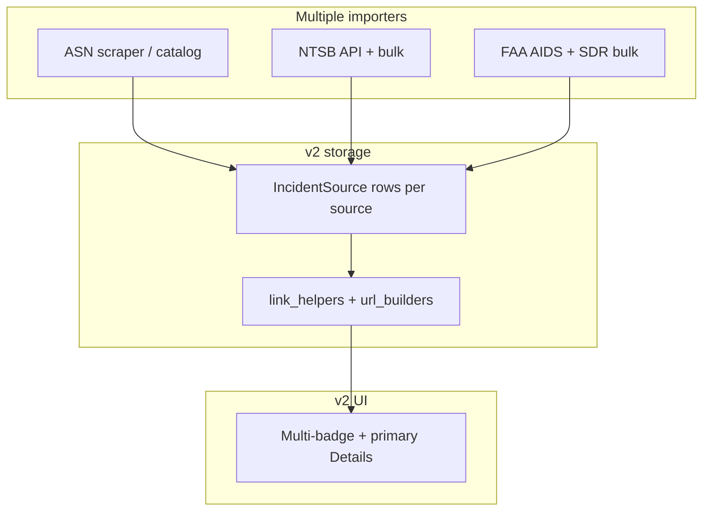

# Master Context Document — Main Branch ASN Links

**Project**: Aircraft Safety Tracker  
**Date**: 2026-05-18  
**Purpose**: Baseline snapshot of how **ASN links** work on git `main`, for comparison with v2 (`v2-(first-round-of-feedback-from-RJ)`) and reset-vs-fix planning  
**Source tree**: [main / Aircraft Safety Tracker](https://github.com/elessarrr/Portfolio/tree/main/Aircraft%20Safety%20Tracker)

---

## 1. Architecture Overview

### What it does (main branch)

Aircraft Safety Tracker on `main` is a Flask proof-of-concept that scrapes incident lists from the **Aviation Safety Network (ASN)**, imports them into SQLite/Postgres, and shows aircraft profiles with filterable incident history and AI summaries. **Outbound incident links are ASN-only**: each row stores one URL (`Incident.asn_url`) and the UI renders it verbatim. There is no NTSB.gov link pipeline on `main`; NTSB text may appear inside scraped ASN narratives only.

### Tech stack

| Layer | Technology |
|-------|------------|
| Backend | Python, Flask 3, SQLAlchemy, Flask-Migrate |
| Database | PostgreSQL (prod) / SQLite (dev) |
| Frontend | Jinja2, HTMX, Tailwind CSS |
| Ingestion | `scripts/scrape_*.py` + `scripts/import_data.py` (httpx, BeautifulSoup) |
| AI | DeepSeek / Gemini services (summaries; not link-related) |

### Link-related components (main only)

1. **Scrape** — `scripts/scraper_utils.py`, `scrape_boeing.py`, `scrape_airbus.py` → `data/raw/*_incidents.json`
2. **Import** — `scripts/import_data.py` → `Incident.asn_url` + aircraft stats
3. **Serve** — `app/templates/components/incident_list.html` → direct `href="{{ incident.asn_url }}"`

No `link_helpers.py`, no `url_builders/`, no weekly link validation, no `is_active` on sources in the import path.

### Non-obvious decisions

- **Dedupe key at import** is `asn_url`, not date+operator — stable because ASN URLs are unique per event page.
- **`IncidentSource` table exists** (migration `18bd2eb49ebb`) but is **never written** by `import_data.py` — schema placeholder for a future multi-source design; v2 later repurposed this table.
- **Naming trap**: “NTSB” in a scraped ASN narrative ≠ an NTSB.gov link stored in the DB.

---

## 2. Data Flow Diagram

### End-to-end ASN link pipeline (main)



### v2 overlay (current branch — for contrast)



---

## 3. File Map (link path only)

| File path | Responsibility |
|-----------|----------------|
| ⭐ `scripts/scraper_utils.py` | Fetches ASN pages; extracts `asn_url` from date-column links; scrapes detail narrative |
| ⭐ `scripts/scrape_boeing.py` | Orchestrates Boeing type-index scrape → JSON |
| ⭐ `scripts/scrape_airbus.py` | Same for Airbus |
| ⭐ `scripts/import_data.py` | Loads JSON; upserts `Incident` by `asn_url`; recalculates aircraft stats |
| ⭐ `app/models.py` | `Incident.asn_url` (used); `IncidentSource` (unused on main import) |
| ⭐ `app/templates/components/incident_list.html` | Renders single “Details” link from `incident.asn_url` |
| `app/routes.py` | Passes incidents to template; no link resolution |
| `app/__init__.py` | App factory; no link template globals on main |
| `data/raw/boeing_incidents.json` | Scraped payload including `asn_url` per row |
| `data/raw/airbus_incidents.json` | Same for Airbus |

### v2-only files (not on main)

| File path | Responsibility |
|-----------|----------------|
| ⭐ `app/link_helpers.py` | Resolves primary/multi URLs; filters placeholders; source priority |
| ⭐ `app/ingestion/url_builders/*.py` | Per-source URL construction (NTSB CAROL/docket, ASN wikibase, FAA) |
| `app/ingestion/importers/ntsb_importer.py` | NTSB parse/upsert + URL validation at import |
| `app/ingestion/importers/faa_aids_importer.py` | FAA AIDS bulk — often no `source_url` |
| `app/ingestion/dedupe.py` | Cross-source incident matching |
| `app/ingestion/linking/incident_linker.py` | Reparent sources when merging FAA orphans |
| `scripts/validate_incident_links.py` | Weekly validation; can set `is_active=0` |
| `scripts/migrate_asn_to_incident_source.py` | Backfill ASN from legacy `asn_url` |

---

## 4. Link Pipeline Deep Dive

### 4.1 Import (scrape → JSON)

1. **`get_model_links`** hits ASN type index (e.g. `https://aviation-safety.net/asndb/types/B` for Boeing).
2. **`scrape_model_incidents`** walks each model’s incident table:
   - Finds the row whose header includes “acc. date” and “operator”.
   - Reads the **first column** date cell’s `<a href>`.
   - `urljoin(BASE_URL, href)` → absolute ASN URL (`/wikibase/...` or `/database/record.php?id=...`).
   - Skips rows whose href is not a recognized incident path.
3. **`scrape_incident_details`** follows that URL for fatalities + narrative (NTSB agency names may appear in text here).
4. JSON row shape: `{ model_name, date, operator, location, category, fatalities, narrative, asn_url }`.

**Properties that make links trustworthy**

- URL is captured **at scrape time** from ASN’s own anchor — not synthesized later.
- One URL per incident row — no priority rules or merge ambiguity at serve time.

### 4.2 Manage (JSON → DB)

1. **`import_file`** loads `data/raw/boeing_incidents.json` and `airbus_incidents.json`.
2. For each item, find/create `Aircraft` by `model_name`.
3. **Dedupe / upsert**: `Incident.query.filter_by(asn_url=item.get('asn_url')).first()`
   - If exists → update date, fatalities, narrative, location, operator, category.
   - Else → insert new `Incident` with `asn_url=item.get('asn_url')`.
4. Recompute `aircraft.total_incidents`, `fatal_incidents`, `total_fatalities` from DB aggregates.
5. **Does not** create `IncidentSource` rows.

**Failure modes**

- Missing `asn_url` in JSON → incident imported without link → UI shows “N/A”.
- Re-import is idempotent on `asn_url`.

### 4.3 Serve (DB → browser)

1. `get_incidents` route loads incidents for an aircraft (filters optional).
2. Template loops incidents; in the Type column:

```jinja

  <a href="{{ incident.asn_url }}" target="_blank">Details ↗</a>

  N/A

```

3. No Python-side `resolve_*` — what you scraped is what you click.

**Why main “just works” for ASN**

- Single field, single hop, no `is_active`, no CAROL-vs-docket logic, no FAA rows without URLs polluting the primary link.

---

## 5. Relevant Code Snippets (git `main`)

### `app/models.py` — link field on Incident

```python
class Incident(db.Model):
    # ...
    asn_url = db.Column(db.String(256))
    sources = db.relationship('IncidentSource', backref='incident', lazy='dynamic')

class IncidentSource(db.Model):
    source_name = db.Column(db.String(64), index=True)  # 'ASN', 'FAA', 'NTSB'
    source_url = db.Column(db.String(512))
    # Not populated by main import_data.py
```

### `scripts/scraper_utils.py` — URL capture from date column

```python
link_elem = date_col.find('a')
if not link_elem:
    continue
incident_url = urljoin(BASE_URL, link_elem['href'])
# ...
incident = {
  # ...
  "asn_url": incident_url
}
```

### `scripts/import_data.py` — dedupe on asn_url

```python
existing = Incident.query.filter_by(
    asn_url=item.get('asn_url')
).first()
if existing:
    existing.date = date_obj
    # ... update fields
else:
    incident = Incident(
        aircraft_id=aircraft.id,
        asn_url=item.get('asn_url'),
        # ...
    )
```

### `app/templates/components/incident_list.html` — verbatim render

```jinja

  <a href="{{ incident.asn_url }}" target="_blank" class="text-primary hover:underline">Details ↗</a>

  N/A

```

### v2 reference — `app/link_helpers.py` (excerpt)

v2 adds resolution, placeholders, and multi-link output:

```python
def resolve_source_hrefs(source: IncidentSource) -> List[Tuple[str, str, str]]:
    if not source or not source.is_active:
        return []
    for link in build_links_for_source(source):
        url = sanitize_url(link.get("url"))
        # ...
```

---

## 6. v2 Comparison

| Concern | Main (`asn_url`) | v2 (`IncidentSource` + helpers) |
|---------|------------------|----------------------------------|
| **Storage** | One column on `Incident` | Per-source `source_url`, `report_url`, `source_record_id`, `source_data`, `is_active` |
| **ASN links** | Always on `Incident.asn_url` if scraped | Often on `IncidentSource` (`source_name='ASN'`); migration from legacy `asn_url` incomplete for some rows |
| **NTSB links** | Not stored (narrative text only) | CAROL / docket URLs; validation; ~7k marked inactive when broken |
| **FAA links** | Not imported | ~157k FAA_AIDS rows with **null** `source_url` (bulk file has no per-event URL) |
| **Import dedupe** | `asn_url` | Cross-source dedupe + merge (`dedupe.py`, `incident_linker.py`) — can attach wrong source to wrong incident |
| **Serve** | Direct template href | `resolve_source_href`, `resolve_primary_href`, multi-badge UI |
| **Typical failure** | Missing `asn_url` → “N/A” | No active sources; dead NTSB; wrong page after bad merge; placeholder `example.com` in test data |
| **Template size** | ~40 lines incident list | ~120+ lines with source badges, primary link, inactive NTSB messaging |

### v2 problem inventory (observed)

| Symptom | Likely cause | Fix layer |
|---------|----------------|-----------|
| No link / “No external link” | FAA_AIDS bulk: ~157k rows without `source_url` | Merge + URL backfill |
| example.com page | Test fixture rows in local DB | Data cleanup |
| Sparse NTSB page | Docket preferred over CAROL (partially fixed in v2) | `link_helpers` / url_builders |
| Dead NTSB | `is_active=0` after validation | Re-validation; better import URLs |
| Wrong airline / wrong incident | Dedupe merge or bad enrichment URL | Merge confidence + URL QA |
| Low-quality MEDIA | Search enrichment accepted portal homepages | Enrichment denylist |
| ASN missing on v2 row | `asn_url` not migrated to `IncidentSource` | `migrate_asn_to_incident_source` |

Debug audit (Boeing 707, `aircraft_id=41`): 3/5 incidents had **no active sources** — inactive NTSB only, no ASN fallback row.

---

## 7. Reset vs Fix Notes

### Three strategic options

**Option A — Fix forward on v2 (stay on current branch)**  
- Keep v2 schema, importers, bulk data, `link_helpers`.  
- Repair links in place: ASN fallback, backfill, dedupe quality, unified link schema.  
- **Pros:** Preserves multi-source investment; matches “all sources, all links.”  
- **Cons:** Many code paths; surgical fixes easy to get wrong.

**Option B — Reset from `main` (ASN-only baseline, rebuild later)**  
- Use `main` as app baseline: `Incident.asn_url`, ASN scrape/import, simple template.  
- Re-add NTSB/FAA/`IncidentSource` incrementally using main’s ASN pattern.  
- **Pros:** Fast trustworthy ASN UX; minimal link logic.  
- **Cons:** v2 DB/migrations need rework; multi-source is a second project.

**Option C — Hybrid (recommended for product goal)**  
- **Stay on v2** codebase/DB; **adopt main’s ASN pattern as the trust baseline** (scrape → store URL → render verbatim), then layer multi-source.  
- Not a git reset to `main`.  
- Phases: (1) ASN guaranteed per incident, (2) common link schema at import, (3) fix wrong-incident merges, (4) backfill FAA-only rows via cross-source URLs.  
- **Pros:** Best fit for “every crash, every real page, all sources welcome.”  
- **Cons:** Most work; must avoid repeating merge/enrichment mistakes.

### Recommendation

- **Default:** **Option C** for the stated product goal.  
- **Option B** only if you need a demo-quality ASN-only app in days.  
- **Option A alone** (patch v2 without copying main’s ASN simplicity) risks more patch-on-patch link logic.

### What to copy from main into v2 (Option C phase 1)

1. Treat **ASN `source_url`** exactly like **`asn_url`**: set at scrape/import, dedupe on URL, render without overloading NTSB priority when ASN is the only verified link.  
2. Run / complete **`migrate_asn_to_incident_source`** so legacy ASN URLs become active `IncidentSource` rows.  
3. Template rule: **never render `href=""`**; hide sources that fail `resolve_source_href`.  
4. Defer FAA badge links until `source_url` exists or a real FAA URL pattern is implemented.

### Follow-on work (out of this brief)

- Unified link schema (`source_data.links[]` + `url_builders`) for all sources.  
- Enrichment plan for ~157k FAA-only incidents (merge + ASN/NTSB lookup + validated MEDIA).  
- Metrics: `% incidents with ≥1 link`, `% with ≥2 sourced links`.

---

## Related documents

- [context-2026-05-16.md](context-2026-05-16.md) — full v2 health check  
- [learnings_from_errors.md](../learnings_from_errors.md) — link validation, enrichment pitfalls  
- Plan: `main_branch_link_brief` (Cursor plans) — execution spec for this file
