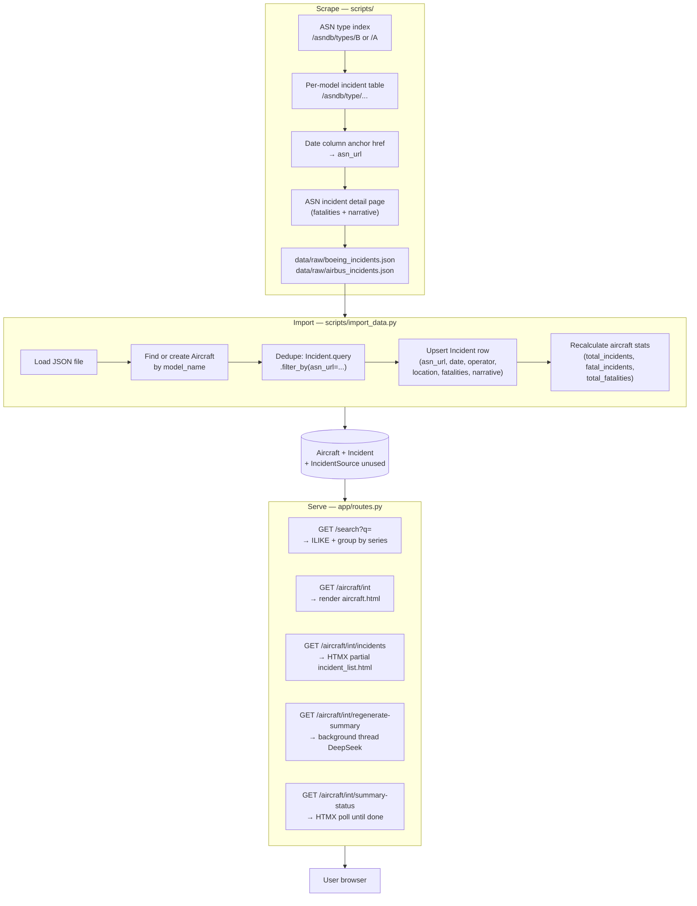

# Master Context Document
**Project**: Aircraft Safety Tracker — `main` (deployed)  
**Date**: 2026-05-25  
**Purpose**: Health check / new-branch baseline — full snapshot of the deployed `main` codebase for use as the starting point of the new multi-source branch

---

## 1. Architecture Overview

Aircraft Safety Tracker is a Flask web application that scrapes incident data from **Aviation Safety Network (ASN)** for Boeing and Airbus aircraft, stores it in a PostgreSQL (prod) / SQLite (dev) database, and presents filterable incident histories with AI-generated safety summaries per aircraft model. Users search by model name, browse incident tables with type/date filters, and click a single "Details" link per incident that opens the corresponding ASN event page. AI summaries are generated on demand via DeepSeek and cached on the `Aircraft` row; they can be regenerated in the background via an HTMX-polling endpoint.

**Tech stack:**

| Layer | Technology |
|-------|------------|
| Backend | Python, Flask 3, SQLAlchemy, Flask-Migrate, Flask-Caching |
| Database | PostgreSQL (prod) / SQLite (dev — `data/aircraft_safety.db`) |
| Frontend | Jinja2, HTMX, Tailwind CSS |
| Scraping | `httpx`, `BeautifulSoup` |
| AI | DeepSeek (`deepseek-chat`) via OpenAI-compatible SDK |
| Deploy | Gunicorn, Procfile, Heroku-style `DATABASE_URL` |

**Components:**

1. **Scrape** — `scripts/scraper_utils.py` + `scrape_boeing.py` + `scrape_airbus.py` → `data/raw/*.json`
2. **Import** — `scripts/import_data.py` → upserts `Aircraft` + `Incident` rows; recalculates stats
3. **Web app** — `app/routes.py` — search, aircraft detail, HTMX incident list, AI summary
4. **AI service** — `app/services/deepseek.py` — DeepSeek summary generation in background thread

**Key design decisions:**

- **Single link field:** `Incident.asn_url` is the only outbound URL. Templates render it verbatim or show "N/A".
- **Dedupe on `asn_url`:** `import_data.py` uses `Incident.query.filter_by(asn_url=...)` as the upsert key — no date+operator composite, just the URL.
- **`IncidentSource` exists but is unused:** migration `18bd2eb49ebb_add_v2_models.py` defines the table; `import_data.py` never writes to it.
- **Boeing and Airbus only:** scrapers explicitly target those two manufacturers; `import_data.py` hardcodes `'Boeing'` and `'Airbus'`.
- **Stats recalculated on every import:** not incremental — queries `COUNT`/`SUM` across all incidents for that `aircraft_id` after each upsert.

---

## 2. Data Flow Diagram



---

## 3. File Map

| File | Responsibility |
|------|----------------|
| ⭐ `scripts/scraper_utils.py` | ASN HTTP fetch + HTML parse: extracts `asn_url` from date-column `<a>` tag, narrative, fatalities for each incident row |
| ⭐ `scripts/import_data.py` | Loads scraped JSON; upserts `Aircraft` and `Incident` rows; dedupes on `asn_url`; recalculates aircraft stats |
| `scripts/scrape_boeing.py` | Orchestrates Boeing type-index scrape → writes `data/raw/boeing_incidents.json` |
| `scripts/scrape_airbus.py` | Same for Airbus → `data/raw/airbus_incidents.json` |
| `scripts/generate_summaries.py` | Batch AI summary generation (offline script, not web-triggered) |
| ⭐ `app/models.py` | `Aircraft`, `AircraftVariant`, `Incident` (with `asn_url`), `IncidentSource` (unused in import), `SystemTag`, `ReportAnalysis`, `Request` |
| ⭐ `app/routes.py` | All web routes: search (fuzzy group-by-series), aircraft detail, HTMX incident list, AI summary regenerate + poll |
| `app/__init__.py` | Flask application factory; initialises SQLAlchemy, Migrate, Cache; registers blueprint |
| `config.py` | `DevelopmentConfig` (SQLite), `ProductionConfig` (PostgreSQL via `DATABASE_URL`), `TestingConfig` |
| ⭐ `app/templates/components/incident_list.html` | Renders incident table; the only template that outputs a Details link via `{{ incident.asn_url }}` |
| `app/templates/aircraft.html` | Aircraft detail page: stats grid, AI summary card, HTMX incident list |
| `app/templates/index.html` | Homepage with HTMX search input |
| `app/templates/components/search_results.html` | HTMX partial: grouped search results |
| `app/templates/components/summary_card.html` | AI summary display block |
| `app/templates/components/summary_card_polling.html` | HTMX polling partial for in-progress summary generation |
| `app/templates/base.html` | Layout shell: Tailwind CDN, nav |
| `app/services/deepseek.py` | DeepSeek API wrapper (`deepseek-chat`); generates aircraft safety summaries from structured stats |
| `app/services/gemini.py` | Gemini wrapper (present but not actively used in routes — DeepSeek is primary) |
| `app/forms.py` | `RequestDataForm` for user aircraft-data requests |
| `tests/conftest.py` | pytest fixtures: in-memory SQLite app context |
| `tests/test_routes.py` | Route smoke tests |
| `tests/test_models.py` | Model unit tests |
| `tests/test_summary.py` | AI summary service tests |
| `migrations/versions/76d481f2c04c_initial_schema.py` | Base schema: `Aircraft`, `Incident`, `AircraftVariant` |
| `migrations/versions/18bd2eb49ebb_add_v2_models.py` | Adds `IncidentSource`, `SystemTag`, `ReportAnalysis`, `Request` — unused by importers |

---

## 4. Link Pipeline — Deep Dive

This is the section most relevant to the new branch. The entire link pipeline on `main` is four lines:

**Step 1 — Scrape (`scraper_utils.py` lines 134–170):**
```python
date_col = cols[0]
link_elem = date_col.find('a')
if not link_elem:
    continue
incident_url = urljoin(BASE_URL, link_elem['href'])
# ...
incident = { ..., "asn_url": incident_url }
```

**Step 2 — Import (`import_data.py` lines 88–109):**
```python
existing = Incident.query.filter_by(
    asn_url=item.get('asn_url')
).first()

if existing:
    existing.date = date_obj
    # ...  (update fields but NOT asn_url)
else:
    incident = Incident(
        aircraft_id=aircraft.id,
        asn_url=item.get('asn_url'),
        # ...
    )
```

**Step 3 — Serve (`incident_list.html` lines 24–28):**
```jinja

    <a href="{{ incident.asn_url }}" target="_blank"
       class="text-primary hover:underline">Details &nearr;</a>

    N/A

```

**There is no resolution logic, no fallback, no validation, no `link_helpers`.** The URL set at scrape time is the URL shown to the user — always.

**Why this is reliable:**
- ASN URLs are stable and unique per event page (`/database/record.php?id=...` or `/wikibase/...`).
- Deduplication is trivially correct: same URL = same incident.
- Template failure mode is only `asn_url IS NULL` → shows "N/A", never a broken `href`.

**`IncidentSource` on `main`:**
- Schema exists (migration `18bd2eb49ebb`). Fields: `incident_id`, `source_name`, `source_url`, `source_data` (JSON), `last_updated`.
- **Never written by `import_data.py`.** Zero rows in production for this table from `main` import path.
- `Incident.sources` relationship is defined (`lazy='dynamic'`) but unused in routes/templates.
- This is the extension point for NTSB and FAA rows in the new branch — the table is already there.

---

## 5. Relevant Code Snippets

### `app/models.py` — `Incident.asn_url` (the link field)
```python
class Incident(db.Model):
    id = db.Column(db.Integer, primary_key=True)
    aircraft_id = db.Column(db.Integer, db.ForeignKey('aircraft.id'))
    date = db.Column(db.Date, index=True)
    operator = db.Column(db.String(128))
    location = db.Column(db.String(128))
    fatalities = db.Column(db.Integer, default=0)
    description = db.Column(db.Text)
    asn_url = db.Column(db.String(256))   # <-- the only link field used in UI
    incident_type = db.Column(db.String(64))
    sources = db.relationship('IncidentSource', backref='incident', lazy='dynamic')
```

### `app/models.py` — `IncidentSource` (unused in main; extension point for new branch)
```python
class IncidentSource(db.Model):
    id = db.Column(db.Integer, primary_key=True)
    incident_id = db.Column(db.Integer, db.ForeignKey('incident.id'), nullable=False)
    source_name = db.Column(db.String(64), index=True)   # 'ASN', 'FAA', 'NTSB'
    source_url = db.Column(db.String(512))
    source_data = db.Column(db.JSON)
    last_updated = db.Column(db.DateTime, default=datetime.utcnow)
```

### `scripts/import_data.py` — dedupe key is `asn_url`
```python
existing = Incident.query.filter_by(
    asn_url=item.get('asn_url')
).first()
if existing:
    existing.date = date_obj
    existing.fatalities = fatalities
    # ... update other fields; asn_url not changed
else:
    incident = Incident(
        aircraft_id=aircraft.id,
        asn_url=item.get('asn_url'),
        ...
    )
    db.session.add(incident)
```

### `app/templates/components/incident_list.html` — verbatim render
```jinja

    <a href="{{ incident.asn_url }}" target="_blank"
       class="text-primary hover:underline">Details &nearr;</a>

    N/A

```

### `app/routes.py` — search grouping logic (series heuristic)
```python
# Group by series: "Boeing 737-800" → series "Boeing 737"
model_part = aircraft.model_name
if aircraft.manufacturer and model_part.lower().startswith(aircraft.manufacturer.lower()):
    model_part = model_part[len(aircraft.manufacturer):].strip()
words = model_part.split()
first_word = words[0]
if '-' in first_word:
    parts = first_word.split('-')
    prefix = parts[0]
    if len(prefix) > 2:
        base_model = prefix          # 737-800 → 737
    elif len(parts) >= 3:
        base_model = f"{parts[0]}-{parts[1]}"   # DC-10-30 → DC-10
    else:
        base_model = first_word      # DC-9 → DC-9
else:
    base_model = first_word
series_name = f"{aircraft.manufacturer} {base_model}"
```

### `app/services/deepseek.py` — summary prompt (data-grounded, no hallucination)
```python
prompt = f"""
Provide a concise, factual summary of the safety record of the
{aircraft_data['manufacturer']} {aircraft_data['model_name']},
based STRICTLY on the Key Data provided below.

Key Data:
- Years in service: {aircraft_data['years_in_service']}
- Total incidents: {aircraft_data['total_incidents']}
- Fatal incidents: {aircraft_data['fatal_incidents']}
- Total fatalities: {aircraft_data['total_fatalities']}

Do NOT cite external accident statistics or events not in these numbers.
Keep it under 200 words. Plain text only.
"""
```

---

## 6. Project State — Deployed `main`

| Area | Status |
|------|--------|
| ASN scrape + import | Working; Boeing and Airbus only |
| `Incident.asn_url` Details link | 100% reliable for scraped rows |
| `IncidentSource` table | Schema exists; 0 rows written by any importer |
| NTSB links | Not implemented |
| FAA AIDS links | Not implemented |
| AI summaries (DeepSeek) | Working; background thread + HTMX polling |
| Gemini service | Present in code; not actively used in routes |
| Search | ILIKE + fuzzy group-by-series; limit 20 |
| Test coverage | `test_routes.py`, `test_models.py`, `test_summary.py`, `test_gemini.py` |
| Deploy | Procfile (gunicorn); Heroku-style `DATABASE_URL` |

**Key constraint for new branch:** `IncidentSource` on `main` has **no** `source_record_id`, no `is_active`, no `report_url` columns — these were added in v2 migrations. The new branch will need to extend `IncidentSource` with those fields before NTSB/FAA importers can use it.

**Migrations to carry into new branch (on top of `main`):**
The v2 `IncidentSource` additions needed:
- `source_record_id VARCHAR` — unique incident key per source
- `is_active BOOLEAN DEFAULT TRUE` — for soft deactivation
- `report_url VARCHAR` — for NTSB PDF links

These do not exist on `main`. New Alembic migration required before any NTSB/FAA importer work begins.

---

## 7. Handoff prompt for new branch planning session

```
I'm giving you a compressed context document about my application's deployed `main` branch.
It contains the architecture, data flow, file map, link pipeline deep dive, and current state.

After reading, please:
1. Confirm in 2–3 sentences what this app does and how its link pipeline works
2. Identify the exact files and fields we need to touch to add NTSB as the second source
   (keeping ASN untouched in Incident.asn_url)
3. Note any schema gaps between main and the v2 IncidentSource we need to fill first

[PASTE THIS DOCUMENT]
```
