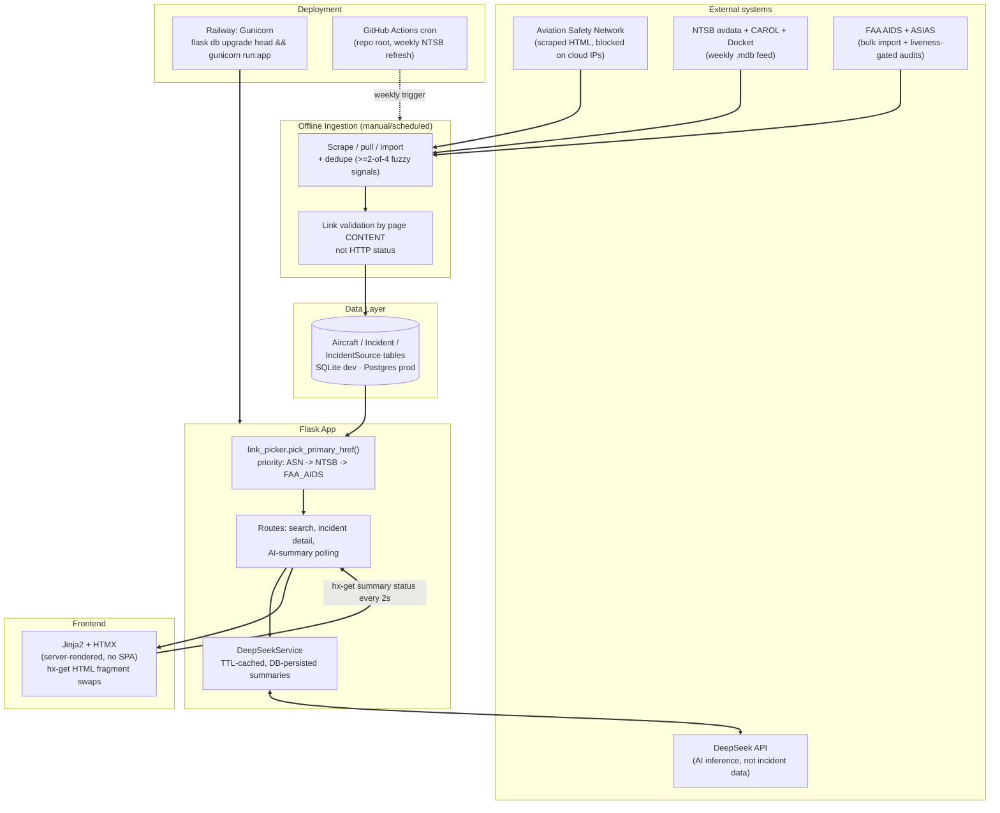
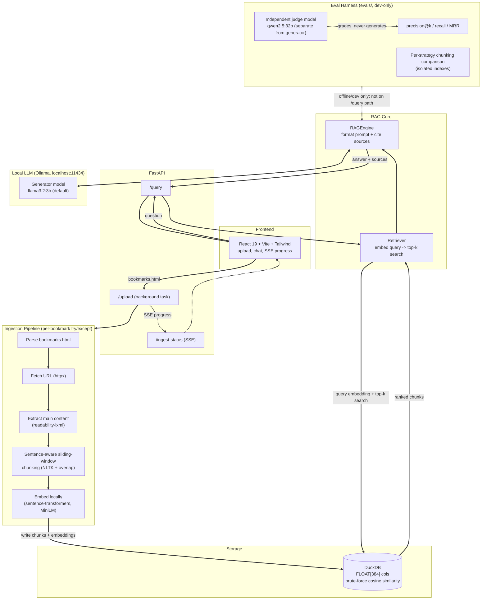
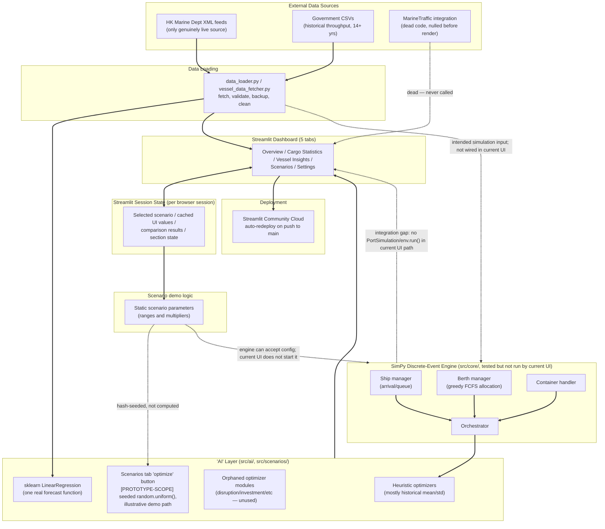

# OCBC AI Lab — Technical Interview Prep

### AI Product Builder (VP-level), 50-minute technical interview

Prepared from a full code read (not README summaries) of three personal projects, each cloned and read file-by-file. Citations reference real files/functions/lines found in the code.

**How to use this document:** Read each project's Sections 1–5 and 7 until you could reconstruct them without notes. Section 6 is your question-to-project router — skim it right before the interview. Section 8 is your "how I build" narrative — this is what makes you sound like one coherent engineer across three projects rather than three disconnected side quests. Each project's Section 1 now ends with a **Mermaid architecture diagram** — glance at that first for a visual anchor, then read the prose above it for the words to say out loud (diagrams render in Cursor's markdown preview, GitHub, or any Mermaid-aware viewer).

**Legend:** `[STRONG POINT]` = foreground this proactively. `[HONEST LIMIT]` = know the precise scope so you can explain it cleanly if asked. `[PROTOTYPE-SCOPE]` = a deliberate trade-off for a personal/demo build — defend it as intentional, not as unfinished homework.

---


# PROJECT 1: Aircraft Safety Tracker

*Flask app cross-referencing ASN, NTSB, and FAA AIDS incident data for 153 Boeing/Airbus aircraft models, with DeepSeek-generated safety summaries. Deployed on Railway.*

## Section 1: Architecture Map [READ THROUGH]

**What it does:** A Flask monolith that cross-references three independent government/industry aviation-incident databases for Boeing/Airbus aircraft models, links each incident to exactly one verified outbound source URL (never a broken one), and layers a DeepSeek-generated, TTL-cached safety summary on top.

**Plain-English flow:**

1. **Offline ingestion** (manual/scheduled scripts) scrape ASN, pull NTSB's weekly `.mdb` feed, and bulk-import FAA AIDS records — each resolving and validating one outbound URL per incident, deduplicating across sources, writing into `Aircraft` / `Incident` / `IncidentSource` tables (SQLite dev, Postgres prod).
2. **Flask app** reads that DB. `link_picker.pick_primary_href()` picks one "Details" URL per incident by source priority (ASN → NTSB → FAA_AIDS); rows with no honest link are hidden, not shown broken.
3. **Frontend** is server-rendered Jinja2 + HTMX — no SPA. Search, incident filtering, and AI-summary polling are all `hx-get` swaps of HTML fragments.
4. **Deployment**: Gunicorn on Railway, managed Postgres, migrations run automatically pre-boot (`Procfile`: `flask db upgrade head && gunicorn run:app`). Weekly NTSB refresh runs via GitHub Actions cron at the *monorepo* root (`.github/workflows/weekly-ingest.yml`), since Actions requires workflows there, not inside the project subfolder.

**External services:** Aviation Safety Network (scraped HTML), NTSB avdata + CAROL + Docket (three fallback URL sources per record), FAA ASIAS (per-record brief URLs, liveness-gated before bulk checks), DeepSeek (`deepseek-chat`, live AI summaries). Google Gemini code exists (`app/services/gemini.py`) but is dead — not wired into the running app.

**Deployment mechanics:** Railway builds with root directory set to the project subfolder; migrations run on every deploy before Gunicorn starts; freshness comes from the weekly cron, not from any live polling.

**Architecture diagram:**




## Section 2: Key Design Decisions and Rationale

**1. One verified link per incident, resolved by source priority, gated on a persisted** `is_active` **flag.** Government portals return HTTP 200 for pages that are functionally dead — unreleased NTSB dockets, empty CAROL SPA shells, FAA search-prefill pages. `link_picker.py` prefers the incident's validated ASN URL, then walks active `IncidentSource` rows by priority (`NTSB → FAA_AIDS → FAA_SDR → ASN`), rejects placeholder/catalog URLs, and returns `None` rather than a bad link. Alternative rejected: storing every source link as a blob and letting the UI show all of them — forbidden by an application-level schema contract (`assert_source_data_metadata_only()` raises when `source_data` contains a `links` key). [STRONG POINT] This is enforced in importer/application code and tests, not by a database `CHECK` constraint.

**2. Conservative (high-threshold) cross-source dedupe, not record merging.** Requires ≥2 of 4 fuzzy signals (date ±1 day, operator ratio ≥90, location ratio ≥85, fatalities ±1) before treating an NTSB/FAA row as already covered by ASN. Rationale, stated directly in the project's own docs: "a false positive is worse than a false negative" — users tolerate apparent duplicates; they can't recover a silently-merged, wrongly-collapsed incident. Full entity resolution across all three sources was explicitly declared out of scope.

**3. [PROTOTYPE-SCOPE] Weekly cron covers NTSB only — ASN is manual/local-only because** `aviation-safety.net` **blocks cloud IPs (HTTP 403).** The cron code has a real, working safeguard: it raises a `RuntimeError` if the ASN scrape count is 0, rather than silently reporting success. This is a genuine anti-bot constraint, not a design choice — a production version would need a licensed feed or a residential-proxy budget. [STRONG POINT] on the guard itself, [PROTOTYPE-SCOPE] on the underlying constraint.

**4. [PROTOTYPE-SCOPE] Two caching mechanisms exist; one is dead.** Flask-Caching is declared, imported, and `init_app()`'d — then never used anywhere else in the app. The actual AI-summary TTL cache is a hand-rolled DB column check instead. Works fine, but it's evidence the summary-caching feature was built without first checking what was already wired in.

**5. Safety-first mutation pattern: dry-run/apply gates and soft-deactivation for many high-risk remediation paths.** URL/baseline audits commonly report first and require `--apply` before writing; invalid or duplicate FAA sources are usually preserved with `is_active=False` rather than erased. Rationale: reversibility — a transient outage (e.g. an ASIAS CDN blip) should not mass-delete provenance. [STRONG POINT] on the pattern, but **not universal**: `remediate_incident_duplicates()` hard-deletes NTSB source + incident rows proven to duplicate an ASN incident, and some bootstrap/import scripts write without interactive confirmation. Do not say "never hard delete" or "every mutating script."

**6. [FIXED & MERGED as of 2026-07-18] Fuzzy search is now real.** Was an honest gap: docs claimed `pg_trgm` fuzzy search, but `/search` was plain `ILIKE '%query%'`. Now on `main` (`0a3ace3`): GIN trigram index migration + `_search_aircraft()` using `greatest(similarity, word_similarity) >= 0.2` OR ILIKE, ranked by similarity, with fail-soft ILIKE fallback. Empirically tuned (`boieng` → Boeing 737 verified on throwaway Postgres). **201 tests pass**; Postgres-gated typo test behind `AST_FUZZY_TEST_DATABASE_URL`. [STRONG POINT] — story is "found the docs/code mismatch while prepping, then closed it."

## Section 3: What Works and What Doesn't

**Working well:** URL viability classified by *body content*, not HTTP status, with three independently-built but conceptually consistent detectors (NTSB unreleased-docket text match, CAROL empty-SPA-shell heuristic, FAA three-tier CDN-error classifier) — each unit tested. [STRONG POINT] Liveness-gated bulk auditing (`probe_asias_liveness()` requires a 2xx on the homepage before running thousands of per-record checks, preventing a site outage from mass-deactivating good links) — backed by a documented real incident. [STRONG POINT] LLM error handling is textbook graceful degradation: distinct handling for auth vs. connection errors, raw exception text never reaches the user, and even *retroactively* hides old error strings that got persisted before the fix shipped. [STRONG POINT] PostgreSQL-side fuzzy search via `pg_trgm`, with a GIN trigram index available and a fail-soft `ILIKE` fallback (closed while prepping; use `EXPLAIN ANALYZE` before claiming the exact production query plan always uses the index). [STRONG POINT] **201 tests** pass cleanly (verified live; includes SECRET_KEY fail-closed + fuzzy-search tests).

**Incomplete/rough:** Gemini integration is fully built but dead code — `.env.example` still references its API key, not the one the app actually reads (this has already confused a real user, per the project's own learnings log). [HONEST LIMIT] A `SOURCE_PRIORITY` tuple references `FAA_SDR` as a link source, but no importer ever writes that source — a phantom reference, deliberate non-import per the docs but a latent trap for anyone reading the code cold. Background AI-summary regeneration uses an unmanaged `threading.Thread`, not a durable task queue. It **can** run multiple generations concurrently, but has no global concurrency limit, same-aircraft locking, durable job state, retry after worker death, or cross-worker coordination. [PROTOTYPE-SCOPE] Raw 6–20MB scrape JSON files are committed to git despite being regenerable.

**Error handling / hardcoded values:** The default/development config still has a public placeholder `SECRET_KEY` (fine for local). [FIXED as of 2026-07-18] Production now **fail-closes**: `create_app('production')` rejects `None`, empty, and known placeholders (`you-will-never-guess`, `.env.example`'s `your-secret-key-here`) — the old guard only checked the placeholder string and let `None` through. Residual risk: if a deploy forgets `FLASK_CONFIG=production`, `run.py` still falls through to development defaults with the forgeable key — so env selection must stay correct on Railway. The "no results" empty-state UI can't distinguish "empty database" (ingestion/deployment failure) from "no matches for your query" (valid user outcome), which can hide an operational failure behind a normal-looking message.

**Test coverage:** Strong on link picking, dedupe scoring, importers/mapping, the generic URL-audit engine, and the weekly cron orchestrator (all with injected fakes, no real network calls in tests). No coverage tooling/report is configured, so "201 tests" measures count/pass status—not how much production code they execute. Correction to the earlier review: ASN's listing-table parser **does** now have an inline HTML fixture in `test_asn_incremental.py`, covering known-URL skipping and row extraction. The remaining gap is dedicated fixture coverage for `scrape_incident_details()` (narrative/fatality extraction and changed/malformed ASN detail HTML).

## Section 4: The Hardest Technical Question [READ THROUGH]

**Q:** "Your dedupe threshold requires ≥2 of 4 fuzzy signals, hand-tuned against a few thousand records. What's your actual false-negative rate — how many real duplicate incidents are silently showing up twice right now?"

**Honest answer:** I don't have a measured rate, and the codebase doesn't produce one — there's no labeled ground-truth set to validate precision/recall against (a genuinely hard problem across three agencies with no shared primary key). What I do have is evidence the threshold catches real problems reactively: a post-import audit caught 3 actual duplicates that the pre-import dedupe missed due to a null-fatalities coercion mismatch. But that audit has only run per-batch, never as a systematic, corpus-wide sweep with a tracked duplicate-suspicion count over time.

**If pressed further:** "The honest answer is I don't have a precision/recall number, because I don't have labeled ground truth to check it against. What I'd do next isn't tune the threshold further — it's turn the reactive audit into a recurring, corpus-wide job so 'is our dedupe rate stable' becomes a monitored metric instead of something I only discover during manual QA."

## Section 5: 2-Minute Verbal Walkthrough [READ ALOUD, 2X EACH TIME]

Aviation incident data is a mess — it's scattered across three agencies that don't talk to each other, and the thing that actually burned me building this is that a lot of those government links return HTTP 200 for pages that are functionally empty: an NTSB docket that hasn't been released yet, or a CAROL page that's just a blank single-page-app shell. So "the link works" and "the link is useful" are two different things, and most naive scrapers can't tell them apart. That's the actual problem this project solves — it aggregates ASN, NTSB, and FAA incident records for specific aircraft models and guarantees that if you see a link, it's real.

Architecturally it's a Flask app with server-rendered Jinja2 and HTMX — deliberately no SPA framework, because there's no interaction here complex enough to need one. The interesting engineering is upstream of the web layer: offline ingestion scripts pull from each source, classify every candidate URL by reading the actual page body rather than trusting the status code, and only then write a validated `IncidentSource` row. At render time, a priority picker walks the sources in order and returns exactly one link, or none — never a broken one.

The design decision I'd highlight is the dedupe logic across sources. I set the matching threshold deliberately conservative—it needs two of four signals like date, operator name, and location to agree before I treat an NTSB record as the same incident as an ASN record—because a false merge is worse than showing an apparent duplicate. I can accept someone seeing the same crash twice if that means we won't silently collapse two different crashes into one.

One natural follow-up on that threshold: I don't have a measured false-negative rate. I know the audit catches real problems — it found three actual duplicates the pipeline initially missed — but I don't have labeled ground truth to calculate corpus-wide precision and recall. I stopped at this level because the project already meets its prototype requirement: conservative matching plus a post-import safety check, not a research-grade entity-resolution benchmark. If the product decision depended on dedupe quality at production scale, I would build the labeled evaluation set and continuous audit described next.

If this were a real production feature, next I'd turn that audit into a recurring job with a tracked metric, and put a proper task queue behind the AI-summary regeneration instead of a bare background thread. (Indexed fuzzy search used to be on this list — I closed that gap while prepping: `/search` now uses pg_trgm with a GIN index and a fail-soft ILIKE fallback.)

## Section 7: Production-at-a-Bank [READ THROUGH]

**Security/data:** No auth anywhere — every route is public. No rate limiting (the AI-summary regen endpoint could burn API credits under repeated hits). Secrets are `.env`/Railway env vars with no rotation or secrets manager. Production `SECRET_KEY` now fail-closes on missing/weak keys (fixed while prepping); residual is ensuring the process actually boots with `FLASK_CONFIG=production`.

**Scalability:** Search now has Postgres trigram search plus a GIN index (was plain `ILIKE`—fixed while prepping); at ~150 aircraft rows either approach is fine, but bank-scale corpora would still want relevance tuning/query analytics and a measured query plan. Background summary regen via unmanaged threads doesn't survive worker restarts and lacks cross-worker coordination. Weekly NTSB ingest is orchestrated by a single **GitHub Actions** job, which connects directly to the **Railway Postgres database** using `AST_DATABASE_URL`; it is not a Railway scheduler. It has no per-stage checkpoint/resume, so a failed run restarts the workflow rather than resuming mid-pipeline.

**Rebuild vs. extend:** Rebuild auth, secrets management, rate limiting, and a real task queue. Search is no longer on that list—`pg_trgm` + GIN is shipped. Extend the ingestion architecture's core discipline: body-content link validation, report-first/explicit-apply gates and provenance-preserving deactivation where the evidence is uncertain, plus conservative dedupe with a stated threshold. A production pipeline should inherit that safety philosophy while making mutation policies consistent and adding approvals/observability.

**Compliance:** No data lineage surfaced to users beyond a footer disclaimer, despite the DB having the raw ingredients (`last_updated`, `source_data`) to build one. AI summaries carry no stored model/prompt-version stamp per generation — needed for any audit trail.

**Volunteer proactively:** the link-validation-by-body-content philosophy, the ASN cloud-IP-block handling (raise-on-zero rather than false-green), and — if search comes up — that you found the pg_trgm docs/code mismatch while prepping and wired real trigram search with a fail-soft fallback. **Only if asked:** the dead Gemini code, the unused Flask-Caching instance — real, but read as nitpicks unless someone's specifically probing "what would a code review catch."

---


# PROJECT 2: Bookmarks RAG Knowledge Assistant

*A local-first RAG tool: FastAPI + React 19 + DuckDB + Ollama, turning a browser bookmark export into a chattable, source-cited knowledge base.*

## Section 1: Architecture Map [READ THROUGH]

**What it does:** A single-user, local-first app that ingests a bookmarks.html export, scrapes and indexes every linked page into a DuckDB vector store, and lets you chat with a locally-run LLM that answers from retrieved bookmark content with source citations. Models, embeddings and indexed content stay local; ingestion still contacts the bookmarked websites.

**Plain-English flow:**

1. Upload bookmarks.html via React → FastAPI kicks off a background ingestion task, streamed to the UI over Server-Sent Events.
2. Pipeline: parse HTML → fetch each URL (`httpx`) → extract main content (`readability-lxml`) → chunk (NLTK sentence-aware sliding window with overlap) → embed locally (`sentence-transformers`, MiniLM) → write into DuckDB.
3. Chat: query embedded the same way → cosine-similarity search in DuckDB → top-k chunks formatted into a prompt → Ollama generates the answer → sources returned alongside it.

**File structure:** `app/ingestion/` (parser, fetcher, cleaner, chunker, pipeline orchestrator), `app/embeddings/` (local + an unwired OpenAI adapter), `app/storage/` (DuckDB store behind a `BaseStorage` interface), `app/rag/` (retriever, engine, LLM client), `app/routes/` (upload/ingest-status/query/stats), `evals/` (RAGAS-based eval harness), `frontend/src/` (React 19 + Vite + Tailwind).

**External services:** no hosted AI service is required. Embeddings and generation run locally through sentence-transformers and Ollama. An OpenAI embedder class exists but isn't wired into the running app. Ingestion still makes outbound requests to the third-party pages in the bookmark export.

**Deployment:** native (`uvicorn` + Vite dev server) or Docker/Compose. The Docker image builds the React app, and FastAPI serves that built UI on `:8000` while using the Compose Ollama service through `OLLAMA_BASE_URL`.

**Architecture diagram:**




## Section 2: Key Design Decisions and Rationale

**1. DuckDB instead of pgvector/Chroma for vector storage.** One embedded file, zero infra, SQL joins for metadata filtering come free. Implementation is a fixed `FLOAT[384]` column with brute-force `array_cosine_similarity`, no index — exact but linear-scan, genuinely fast at hundreds of rows. [PROTOTYPE-SCOPE] Defensible at personal-bookmark scale; not an indexed ANN store. (README previously called DuckDB a "vector powerhouse" — that framing was corrected to match the linear-scan reality.)

**2. Ollama for local generation, not a hosted AI API.** Generation, embeddings and indexed content stay on the machine. Web ingestion still contacts each bookmarked site, so "local-first" is the precise privacy claim. [STRONG POINT]

**3. Sentence-aware sliding-window chunking, word-count as a token proxy.** Cheap, deterministic, avoids mid-sentence cuts. [PROTOTYPE-SCOPE] Docs sometimes say "semantic chunking"; the shipped code is sentence-boundary-aware fixed-size chunking — a solid prototype choice. Prefer the precise term in conversation.

**4. Clean adapter pattern (**`BaseEmbedder`**/**`BaseStorage`**/**`BaseLLM`**) — but only one implementation behind each.** [STRONG POINT] on the discipline of never leaking concrete SDK calls into business logic. [HONEST LIMIT] the interfaces promise swappability that isn't actually achieved: swapping to `OpenAIEmbedder` (1536-dim) against a schema hardcoded to `FLOAT[384]` would break silently — the abstraction exists, the storage layer isn't actually dimension-agnostic.

**5. [PROTOTYPE-SCOPE] React 19 SPA despite the PRD explicitly mandating "no JS frameworks."** A deliberate scope departure, plausibly made because a polished UI reads better for a hiring audience than a plain HTML page — worth naming honestly as a self-presentation trade-off, not a technical requirement.

**6. Non-streaming chat as the current product path.** `RAGEngine.query_stream()` and `OllamaClient.generate_stream()` remain tested library methods, but `/api/query` and the React chat UI deliberately use the simpler complete-response path. The README and code docstrings now state that boundary directly rather than advertising streaming as a shipped UI feature. [PROTOTYPE-SCOPE]

## Section 3: What Works and What Doesn't

**Working well:** Ingestion failure isolation means one dead URL never aborts the batch; failures are logged and streamed as distinct SSE events. Explicit `robots.txt` Disallow rules are checked before page fetch, with a documented allow-and-warn policy if the robots file itself is unreachable. [STRONG POINT] Test coverage of pure logic is strong, and an end-to-end smoke test drives the FastAPI app through `ASGITransport`, uploading a fixture and querying it with mocks only at adapter boundaries. Docker now serves the real React shell rather than an API placeholder.

**Hardening completed on** `main`**:** CI dependencies are pinned and `pytest` is the hard gate. The default generator is now the laptop-feasible `llama3.2:3b`; the larger `qwen2.5:32b` judge remains dev/eval-only and separate from the generator. Docker serves the built React UI. Robots enforcement, the Ollama NDJSON streaming contract, config failure messages and the `OLLAMA_BASE_URL` Docker override all have tests. The README now names the actual limits: prompt-only citations, offline evaluation, exact unindexed search, non-streaming chat, no auth and robots fail-open when the robots file cannot be fetched.

**Test coverage:** Verified 2026-07-18: **83 passed, 93% application coverage**. Tests cover chunking, parsing, cleaning, robots-aware fetching, DuckDB storage, retrieval/engine behavior, API routes, config success/failure paths, the Ollama streaming contract, Docker static-root selection and eval logic. There is still no browser-level React interaction test, and RAGAS calls remain mocked at the library boundary, so CI does not run a live judge model.

## Section 4: The Hardest Technical Question [READ THROUGH]

**Q:** "Your retrieval is unindexed brute-force cosine similarity, your chunking uses word-count as a token proxy, and your generation quality is scored by an LLM judge. What's your actual confidence that a 'good' score reflects retrieval quality rather than judge bias or small-N noise — and how does this hold up at 50,000 chunks instead of 50?"

**Honest answer:** More confidence than there used to be, because I fixed the two worst problems — but with a clear ceiling I'll name. Originally the eval was 5 items judged by the *same* model that generated the answers (self-evaluation bias plus small-N noise). I've since made the judge an independent, larger local model than the generator (with a warning if they're ever configured the same) and expanded the set to 19 questions with deliberately hard, ambiguous, cross-source items. The residual — and this is the honest ceiling — is that it's still an LLM judging an LLM, with no human-labeled relevance ground truth, so faithfulness/relevance are directional signals, not audited numbers. On scale: the unindexed search stays *correct* (it's exhaustive, so 100% recall by construction) but nothing in the architecture — no reranking, no hybrid keyword+vector search, no query expansion — would catch precision degrading as the corpus grows and topically-similar-but-irrelevant chunks proliferate.

**If pressed further:** "The eval harness is now genuinely useful for catching regressions during development — real metrics, an independent judge, a non-trivial dataset — and the metrics themselves are unit-tested in isolation. But I wouldn't gate a launch on a RAGAS faithfulness number alone: an LLM judge without human-labeled ground truth and a dataset in the tens rather than hundreds is directional, not definitive. The next real step is a human-labeled relevance set and a reranking stage before I'd trust these numbers for a production quality bar."

## Section 5: 2-Minute Verbal Walkthrough [READ ALOUD, 2X EACH TIME]

I've got hundreds of browser bookmarks and I basically never go back to any of them — they're a graveyard, not a knowledge base. This project was me asking: what if I could actually talk to my bookmarks instead of just hoarding links? And the constraint I set for myself was that it had to be genuinely private — I didn't want to upload a personal reading list to a cloud API just to search it.

So it's a RAG pipeline end to end, with inference and storage kept local. You export your bookmarks, it fetches each bookmarked page from the web, cleans the boilerplate with a readability extractor, chunks the text sentence-aware so it doesn't cut mid-sentence, embeds it with a small local sentence-transformer model, and stores the vectors in DuckDB. When you ask a question, it embeds your query, searches that store, and hands the retrieved chunks to a locally-running Ollama model to generate an answer with sources attached.

The decision I'd talk through is DuckDB for the vector store. It's one embedded file, no infrastructure to run, and I get SQL for free if I want to filter by folder or domain later. The honest trade-off is that it's brute-force cosine similarity with no actual index — which is exact and fast at the scale of one person's bookmarks, but wouldn't hold up if this corpus were org-wide instead of personal.

The eval story is worth a clean sentence if it comes up: the first RAGAS harness was five questions judged by the same model that generated the answers — fine for a smoke check, not for methodology. I've since moved the judge to a separate, larger local model and expanded to nineteen questions with some deliberately hard, ambiguous ones. The ceiling I'd still name: it's an LLM judging an LLM with no human-labeled ground truth, so I treat those scores as directional, not as a launch gate.

If I were pushing this to production — even just "production for one team," not a bank — I'd take the eval further with a human-labeled relevance set and a reranking stage, because even the improved harness is directional. Then I'd add real auth, since today literally anyone who can hit the API can query or ingest, and I'd swap in an indexed vector store once the corpus is bigger than one person's bookmarks.

## Section 7: Production-at-a-Bank [READ THROUGH]

**Security/data:** CORS is wide open (`allow_origins=["*"]`, with a "restrict if deployed" comment never followed up). No authentication or per-user isolation exists anywhere — for an internal RM-facing tool this is the single largest gap. Ingestion makes outbound requests to arbitrary user-supplied URLs with a spoofed user agent — on a corporate network this is SSRF-adjacent behavior that would need an egress allowlist before it could run at all.

**Scalability:** DuckDB is embedded/single-writer — it does not support the concurrent multi-user access a shared internal knowledge base needs. No vector index. A single local Ollama instance won't meet concurrent-user latency needs.

**Rebuild vs. extend:** Extend — the embedder/LLM adapter interfaces already exist, they just need a second real implementation (an internal hosted endpoint) wired through config. Rebuild — the storage layer (moving off DuckDB isn't a config swap despite the interface, because the SQL and fixed dimension are baked in), the task/queue model (currently a single global in-memory queue, not per-user), and auth/multi-tenancy from scratch.

**Compliance:** No logging of what was asked or answered — nothing persisted server-side for later audit. The citation mechanism is a prompted convention, not a verified constraint — nothing stops the model from citing a source that doesn't actually support its claim. That's exactly the kind of thing a bank compliance reviewer would scrutinize immediately.

**Volunteer proactively:** the no-auth/no-audit gap, the unverified-citation mechanism and DuckDB's scaling ceiling are production-at-a-bank talking points, not the opening pitch. Lead with local AI inference/storage, the complete retrieval path and the grounding fallback. CI, robots handling, the feasible model default and Docker UI path are now fixed on `main`.

---


# PROJECT 3: Hong Kong Port Digital Twin

*Streamlit port-operations dashboard backed by live/historical Hong Kong data, a tested SimPy discrete-event core, statistical forecasting and scenario-demo tooling. The current five-tab UI does not run the SimPy engine end to end. Presented at an IET conference.*

## Section 1: Architecture Map [READ THROUGH]

**What it does:** A Streamlit dashboard for exploring vessel activity, historical cargo throughput, simple forecasts and scenario-shaped operational outputs. The repository also contains a genuine SimPy engine for ship arrivals, queues, berth allocation and container handling, but the current five-tab dashboard path calls `load_sample_data()` and the consolidated Scenarios module rather than running `PortSimulation`.

**Plain-English flow:** HK Marine Department XML feeds and government CSVs are loaded into Pandas/DataFrames and Streamlit session state. The live UI renders direct aggregates and Plotly charts, fits narrow `sklearn` linear-regression cargo forecasts, and generates scenario outputs from fixed ranges, formulas and random sampling. A tested SimPy engine exists separately under `src/core/`; integrating its run outputs into the five-tab UI remains unfinished.

**File structure:** `src/core/` (the real SimPy engine — ship manager, berth manager, container handler, orchestrator), `src/ai/` (heuristic optimizers + statistical predictors), `src/analytics/` and `src/analysis/` (BI/benchmarking), `src/scenarios/` (a large family of scenario/optimizer modules, most orphaned — see Section 3), `src/dashboard/` (the Streamlit UI, including a 3,045-line Scenarios tab; timestamped source-backup copies removed on `chore/remove-venv-and-source-backups`), `src/utils/` (a 3,763-line data-loading monolith).

**External services:** HK Marine Department XML feeds (the only genuinely live source). A MarineTraffic integration class exists but is nulled out before rendering — dead in the running app.

**Deployment:** [HONEST LIMIT] Streamlit Community Cloud per the docs, but on this branch the documented entry point file is literally named `streamlit_app_ignore.py`, not `streamlit_app.py` — as checked out, this branch would not deploy under its documented instructions without a rename.

**Architecture diagram:**




## Section 2: Key Design Decisions and Rationale [READ THROUGH]

**1. SimPy for the discrete-event core.** [STRONG POINT] A solid, appropriately-scoped choice: it supplies process, event, clock and shared-resource primitives instead of requiring a hand-rolled event loop. The engine is coherent and well tested. [INTEGRATION GAP] The current five-tab dashboard does not instantiate and run `PortSimulation`; SimPy's value is present in the repository core, not yet delivered through most visible dashboard features.

**2. Greedy FCFS berth allocation, not a real optimizer.** Filters berths by compatibility, then picks the smallest-suitable-capacity one, deterministically. This is honestly labeled in the project's own README as "simplified... with basic constraints" — not hidden. [PROTOTYPE-SCOPE], correctly scoped for a solo demo.

**3. [HONEST LIMIT / PROTOTYPE-SCOPE] "AI optimization" is heuristics and basic statistics, not learned models.** The optimizer module's own header comment says it's starting with simple heuristics "that can be enhanced... later." `sklearn.LinearRegression` is genuinely fitted in the cargo-throughput forecasting paths; the rest of the "predictive models" use historical mean/std and random sampling. That is appropriate prototype scope and is self-documented in the code. [README UPDATED 2026-07-18] An explicit Technical Scope section now distinguishes heuristic optimization, the narrow regression forecast, illustrative scenarios and file-based persistence.

**4. [HONEST LIMIT] SQLite does not exist in code — and the current prototype does not necessarily need it.** No `sqlite3` import or application `.db` file exists. Actual persistence is XML/CSV/JSON files; derived data lives in DataFrames, an in-memory TTL cache and Streamlit session state. The currently checked README did not claim SQLite, so phrase this as correcting earlier project/resume framing, not accusing the present README. A database becomes useful for concurrent writes, durable run history, audit/query needs, relationships and multi-user operation—not merely because the product is called a digital twin.

**5. Streamlit over a custom frontend.** Fast to build a working interactive UI with no separate frontend, ideal for a solo rapid demo. [PROTOTYPE-SCOPE] Streamlit reruns the Python script top-to-bottom after widget interactions, so expensive loads/initialization must be cached and durable UI values must live in `st.session_state`. That execution model amplified performance/state friction, but the earlier wording over-attributed two bugs: duplicate button IDs came from two identical widgets without unique keys after tab consolidation; the file-monitor loop came from the watcher matching and rewriting its own `.file_monitor_state.json`. Reruns/reinitialization made these issues noisier, but neither bug is an unavoidable consequence of Streamlit.

**6. Scenario state as static multiplier sets, not simulation branching.** Cheap and easy to reason about for a demo; a more rigorous approach would run Monte Carlo ensembles per scenario with confidence intervals. [PROTOTYPE-SCOPE]

**Repo hygiene, named directly as requested:** [FIXED locally as of 2026-07-19 on branch `chore/remove-venv-and-source-backups`] the committed 672MB `venv/` and ~14 timestamped dashboard source-backup copies are removed from the current tree, with a real `.gitignore` restored so they cannot be re-added accidentally. History still contains the old objects until/unless rewritten. [HONEST LIMIT] a hardcoded absolute developer file path in `vessel_data_fetcher.py` would break on any other machine.

## Section 3: What Works and What Doesn't 

**Working well:** [STRONG POINT] The core SimPy engine correctly models real state transitions (arriving → waiting → docking → processing → departing) with a genuine FIFO queue, and is the best-tested part of the codebase. [STRONG POINT] The real-time XML fetch pipeline does careful ingestion — validates structure before accepting a file, writes timestamped backups before overwriting. [STRONG POINT] Defensive import handling wraps most optional feature imports in try/except so one missing module can't crash the whole dashboard.

**Prototype architecture note:** a large fraction of the "advanced analytics" backend is exploratory / not on the live dashboard path — several multi-thousand-line modules (`disruption_simulator.py`, `investment_planner.py`, `maintenance_window_optimizer.py`, `peak_season_optimizer.py`, `multi_scenario_optimizer.py`) are not imported by the running UI. [PROTOTYPE-SCOPE] The live Scenarios tab's "optimize" interaction uses **seeded** `random.uniform()` **in plausible ranges** (deterministic within a session from a hash of inputs) rather than the unused optimizer class elsewhere in the repo — intentional for a time-boxed conference demo: fast, predictable UX while the heavier simulation path stayed separate. Be ready to explain that trade-off clearly if someone clicks the button.

**Error handling / hardcoded values:** Vessel status is determined by substring-matching the XML *filename*, which has already caused a real mis-tagging bug (fixed after the fact). Financial constants used in ROI-style outputs (revenue per TEU, operational cost per hour) are hardcoded with no cited source. "Industry benchmark" comparison values in the performance-benchmarking module are similarly placeholder demo numbers, not sourced. A documented debugging incident shows a broad `except` once masked a real `KeyError` behind a hardcoded fallback value — caught by manual debugging, not by tests.

**Test coverage:** The core simulation primitives (berth/ship/container managers, the orchestrator, the AI-optimization heuristics, the data loader) are genuinely well unit-tested — 300+ test functions across 17 files. Zero tests exist for the largest Scenarios-tab module (seeded illustrative optimization path), the unused optimizer modules, business intelligence, and the entire logistics package — coverage followed the critical SimPy engine path first.

## Section 4: The Hardest Technical Question

**Q:** "Walk me through what happens when I click 'Run Optimization' and change the objective — where does that actually change the numbers, and is there a real optimizer underneath?"

**Honest answer:** No, it's picking from pre-set ranges. The function generating those results hardcodes a distinct random range per objective and seeds Python's `random` module with a hash of the inputs, so it looks deterministic and responsive — but there's no cost model, no constraint solver, and no connection to the real optimizer class that exists (unused) elsewhere in the codebase. The weight/constraint sliders do apply a linear post-hoc nudge to the random base value, so direction is sensible, but the magnitude is illustrative, not solved.

**If pressed further ("is there *any* real optimization anywhere?"):** "Yes — at the simulation-engine layer, the berth-allocation heuristic runs against actual ship and berth objects and that's genuinely computed. The Scenarios tab button is a separate, illustrative UX path: seeded plausible ranges for a live demo, while the heavier optimizer modules live elsewhere in the repo and weren't on the conference critical path. Next step for a production tool would be wiring that real path behind a latency budget — and labelling illustrative vs computed data explicitly until then."

## Section 5: 2-Minute Verbal Walkthrough [READ ALOUD, 2X EACH TIME]

Port planning today is mostly reactive — you find out about a berth conflict or a demand spike when it happens, not before. This project started from a simple question: what if a planner could test "what happens if volume jumps 30%" or "what happens if a typhoon closes two berths" before it actually happens, instead of after?

The repository has a discrete-event simulation core: I used SimPy to model ships arriving, queuing and being allocated to berths. The Streamlit dashboard combines Hong Kong Marine Department vessel data, historical cargo statistics, simple regression forecasts and scenario tooling. The important current boundary is that the five-tab UI does not yet execute the SimPy engine end to end; most scenario screens use parameterized formulas or generated demo values.

The decision worth talking through is berth allocation. I used a straightforward first-fit-by-compatibility rule rather than a real constraint solver — and I say that plainly in the README, because building a genuine optimization solver for berth scheduling is a research problem on its own, and a greedy rule was the right scope for what this needed to prove.

Here's the prototype trade-off I'd name clearly if it comes up: the "Run Optimization" button in the Scenarios tab is an illustrative UX path, not a live solver. I had built more substantive optimizer/simulation modules elsewhere, but for a time-boxed conference demo — with a dashboard that already had responsiveness pressure — I prioritized a fast, predictable interaction and used seeded numbers in plausible ranges. That is a conscious prototype choice. In a production or bank setting I'd label that screen "illustrative" until the real path is wired, and I wouldn't present mocked numbers as computed results.

If this were going into production — for a port authority or a bank's operational-risk scenario tooling — the natural next steps are: benchmark the real path, wire it end-to-end, profile until it meets an explicit latency target, and validate outputs. A database would come later when durable run history, lineage, auditability or multi-user writes require it — not just to make a personal demo look more "enterprise."

## Section 7: Production-at-a-Bank [READ THROUGH]

**Security/data:** No auth, no RBAC, no audit log — anyone with the URL sees everything. For a bank internal tool this needs SSO/OIDC and per-action audit logging (who ran which scenario, when, with what inputs) from scratch.

**Scalability:** Streamlit's rerun-the-whole-script model and single-process session state don't scale to concurrent multi-user usage without decoupling the simulation engine from the UI process. The two largest files (the data loader and the Scenarios tab) are already flagged internally as import-time/monolith problems that would need real modularization at any larger scale.

**Rebuild vs. extend:** Extend — the core SimPy engine is genuinely well-tested and modular, and the discrete-event pattern (entities, queues, resources, state machines) transfers directly to something like branch-outage propagation or settlement-queue modeling. Rebuild — the optimization/"AI" layer. A bank risk tool cannot ship `random.uniform()` standing in for an optimization result; every number shown to a risk committee needs to be traceable to a real, auditable calculation. Rebuild — data storage: file-based caching is fine for a demo, not for anything needing reproducible, versioned snapshots.

**Compliance:** Every scenario output needs to be reproducible and explainable on demand — today's session-seeded-random pattern is the single biggest disqualifier for anything touching risk or compliance, because there's no real calculation to show your work for. Hardcoded, uncited financial constants would all need documented, approved sources in a regulated context. Model risk management practices (documentation, validation, drift monitoring) are entirely absent, which is appropriate for a prototype but a hard requirement before anything influencing real decisions.

**Volunteer if asked about optimization depth:** the Scenarios tab uses illustrative seeded ranges for demo responsiveness; heavier optimizer modules exist separately; persistence is file/session-based rather than SQLite. Frame as intentional prototype scope for a conference demo. **Only if asked:** the committed venv/repo-hygiene details, and the specific hardcoded financial constants — say outputs are demo-illustrative where relevant.

---


# Section 6: Interview Question Mapping


| Question                                                                              | Best project(s)                                                   | Specific talking points (grounded in the code)                                                                                                                                                                                                                                                                                                                                                                                                                                                                                                                                                                                                                                                                       |
| ------------------------------------------------------------------------------------- | ----------------------------------------------------------------- | -------------------------------------------------------------------------------------------------------------------------------------------------------------------------------------------------------------------------------------------------------------------------------------------------------------------------------------------------------------------------------------------------------------------------------------------------------------------------------------------------------------------------------------------------------------------------------------------------------------------------------------------------------------------------------------------------------------------- |
| **Walk me through one of your personal projects technically.**                        | Aircraft Safety Tracker (richest, most defensible architecture)   | `pick_primary_href()`'s priority walk and `is_active` gating; the ≥2-of-4-signal dedupe threshold and the explicit "false positive worse than false negative" rationale; the ASN cron's raise-on-zero-scrape guard; 195 passing tests, all I/O mocked at the adapter boundary.                                                                                                                                                                                                                                                                                                                                                                                                                                       |
| **What's your vibe coding setup and how do you actually use it?**                     | All three, but lead with AST, contrast with Ports Digital Twin    | AST has a full PRD → task-list → red/green-TDD → journal → "compound loop" learnings capture (`LEARNINGS.md`, 58 entries; `docs/solutions/` with validated frontmatter) plus test-on-push CI I added while prepping for this interview — this is literally the same discipline this very workspace uses. Ports Digital Twin's 40+ overlapping planning docs and 13 committed backup files show what the *earlier*, less disciplined version of my process looked like. Honest framing: my process matured across these three projects, and I can point to exactly what changed.                                                                                                                                      |
| **What's your understanding of RAG and when would you use it?**                       | Bookmarks RAG                                                     | Full pipeline: parse → fetch → clean → chunk (sentence-aware, overlap) → embed (local MiniLM) → store (DuckDB) → retrieve (cosine similarity) → generate (Ollama) → cite. Grounding fallback returns "I don't know" when nothing relevant is retrieved. Honest gap: citations are a prompted convention, not a verified constraint; the retrieval-quality eval was weak (5 items, self-judging model) and I've since strengthened it (independent judge model, 19-question dataset), though it's still an LLM judging an LLM with no human labels. Use RAG when answers must be grounded in a specific, changing, or private corpus rather than the model's general knowledge, and when fine-tuning isn't practical. |
| **How do you handle the gap between prototype and production?**                       | All three (Section 7 answers)                                     | Name concrete, code-verified gaps rather than generic ones: no auth on any of the three; AST's bare-thread summary regen and lack of an audit trail (search is no longer the gap — pg_trgm is live); RAG's unverified citations and DuckDB's single-writer ceiling; Ports Digital Twin's illustrative Scenarios-tab outputs needing a real, auditable path before risk-relevant use. The pattern itself — that I re-read my own code critically and mapped claims to runtime paths — is the actual answer to this question.                                                                                                                                                                                          |
| **Tell me about a product decision that didn't work out.**                            | Ports Digital Twin                                                | For the IET conference I chose demo reliability over finishing the Scenarios-tab optimizer integration: seeded illustrative ranges behind a fast UI, while substantive optimizer modules lived separately. That was a conscious time-box trade-off. What I'd do differently in a bank setting is label illustrative vs computed data explicitly, then wire the real path behind a latency budget — not treat a personal demo's scope as a production design.                                                                                                                                                                                                                                                         |
| **How do you think about prompt engineering in a product context?**                   | AST + Bookmarks RAG                                               | AST: DeepSeek summaries are DB-persisted and TTL-cached, not regenerated per view (a latency/cost decision), and the service treats the LLM as an untrusted layer — auth/connection errors handled distinctly, raw exception text never surfaces to a user, even old bad outputs get retroactively hidden. RAG: the prompt asks the model to cite `[Source X]` tags, but that's a convention I chose to trust, not something I enforce programmatically — prompting alone isn't a safety mechanism, it needs verification around it.                                                                                                                                                                                 |
| **How do you design for error handling and resilience?**                              | AST (strongest) + RAG + Ports Digital Twin (learned the hard way) | AST: liveness-gating before bulk audits; report-first/explicit-apply workflows and soft-deactivation on many uncertain remediation paths (but not universally—proven NTSB duplicates are hard-deleted); N+1 avoidance. RAG: per-bookmark try/except isolation so one dead URL never aborts a batch. Ports Digital Twin: a documented real incident where a broad `except` once masked a `KeyError` behind a hardcoded fallback—caught by manual debugging, then fixed at the root cause.                                                                                                                                                                                                                             |
| **What would you do differently if you were building this for production at a bank?** | All three (use Section 7)                                         | Lead with the highest-severity, most specific item per project: AST — auth + audit trail + task queue for summary regen (indexed search is already done); RAG — no auth/no logging of Q&A pairs + unverified citations; Ports Digital Twin — wire real, auditable computation behind the Scenarios path before this touches any decision.                                                                                                                                                                                                                                                                                                                                                                            |
| **You're a product manager, not a data scientist — how technical are you really?**    | Cross-cutting, use this exercise as evidence                      | I can read and reason about real architecture trade-offs (DuckDB vs. pgvector, SimPy heuristics vs. a real solver, a hand-tuned dedupe threshold), and this document shows I can map claims to actual code paths. What I don't claim: I didn't derive every algorithm from scratch, and the ports "predictive models" are mostly heuristics and historical stats, not trained ML I built myself. I lean on AI-assisted coding plus a disciplined process (PRDs, task lists, red/green TDD, a learnings log) — that combination is the PM-who-builds profile, not a data-scientist substitute.                                                                                                                        |
| **What does your testing approach look like?**                                        | All three                                                         | AST: 195 tests, consistent mocking at I/O boundaries, but no coverage tooling, so confidence is qualitative. RAG: 83 passing tests and 93% application coverage, including robots enforcement, Ollama streaming-contract assertions, config failures, static React-shell serving and eval-harness logic; the remaining gap is browser-level React interaction and live RAGAS judge execution. Ports Digital Twin: the core simulation engine is well-tested; the Scenarios-tab illustrative path has zero tests because coverage followed the critical engine path first.                                                                                                                                            |


---


# Section 8: Cross-Project Patterns — How I Build

**Consistent architectural instinct: separate core workflows from provider-specific or specialist code, sometimes before a second implementation exists.** The clearest adapter example is `BaseEmbedder`/`BaseStorage`/`BaseLLM` in the RAG tool. AST uses common importer contracts plus source-specific implementations and a separate source-priority policy. Ports shows the related, but broader, habit of separating `core`/`ai`/`analytics` modules; that is modular layering, not automatically an adapter pattern. Often only one implementation is live behind a boundary. That can isolate SDK churn and make testing easier, but it does not prove drop-in swappability. In production I would add or retain an interface when a second implementation, test double or known source of variation justifies the extra indirection.

**Consistent product instinct: fail soft toward the user, never raw.** AST never shows a broken link and never surfaces a raw exception string to a user, even retroactively fixing old bad output. RAG isolates every bookmark's failure so one dead URL never kills a batch, and returns an explicit "I don't know" rather than a fabricated answer when retrieval comes up empty. The ports dashboard wraps most optional feature imports so one missing module can't crash the whole UI. This is the strongest, most consistent thread across all three — product thinking, not just defensive coding: degrade gracefully for the user.

**Uneven, improving engineering discipline.** Ports Digital Twin (earliest by process artifacts) had a committed 672MB virtualenv and timestamped dashboard source backups; those are removed from the current tree on `chore/remove-venv-and-source-backups` (history still holds the old objects). It still carries 40+ overlapping planning docs, typical of a fast solo conference build. AST has a full compound-engineering system: PRD → task list → red/green TDD → journal → learnings archive → test-on-push CI. Bookmarks RAG now has 83 passing tests, 93% application coverage, repaired CI, an independent eval judge, tested robots handling and a working Docker UI path. The story is process maturation across three personal projects, not uniform enterprise rigor from day one.

**Docs often describe the intended architecture a step ahead of the code.** AST's fuzzy-search docs once outran the query, now closed with real `pg_trgm`. RAG's eval, robots, model-default, Docker and limitation claims now match their runtime paths. Ports docs historically mentioned SQLite-style storage while the live path stayed file/session-based. Under solo/time pressure I write the target system in prose first, then cross-check claims against runtime paths before an interview or demo.

**What this adds up to as a philosophy:** I build by writing the product spec and architecture first, using AI-assisted tools to implement quickly, and keeping a paper trail so the process compounds. Strength: fast, structured, extensible-by-design personal prototypes. Habit I actively manage: keep prose and runtime paths aligned — which is exactly what producing this document practiced.

---


# Section 9: Resume Claims vs. What the Code Shows

Both interviewers' bios (Georgia Tech, NTU AI, GoTo/Gojek, BCG DV) put them squarely in "will actually open the GitHub link on your resume" territory, and your resume links directly to Live Project / GitHub / LinkedIn Post for two of the three projects. Assume they've already looked, or will during the interview. Know the precise wording so you can tighten a loose term in one sentence and move on — precision reads as competence.

**Current state:** Two claims that once needed fencing ("across chunking strategies," "CI/CD via GitHub Actions") are now backed by real, merged code. Residual wording to tighten if asked: "semantic chunking" → sentence-aware chunking, and "per airline" → per aircraft model. Most of the resume checks out against the code. Don't hedge things that are accurate.

## Aircraft Safety Tracker

**Resume says:** *"Publicly deployed full-stack application using Flask, PostgreSQL, and the DeepSeek GenAI API to generate contextual safety summaries per airline. Built with modular architecture and automated CI/CD via GitHub Actions."*


| Claim                                                                  | What the code actually shows                                                                                                                                                                                                                                                                                                                                                                                                      | Category                        | What to say if asked                                                                                                                                                                                                                                                                                                                              |
| ---------------------------------------------------------------------- | --------------------------------------------------------------------------------------------------------------------------------------------------------------------------------------------------------------------------------------------------------------------------------------------------------------------------------------------------------------------------------------------------------------------------------- | ------------------------------- | ------------------------------------------------------------------------------------------------------------------------------------------------------------------------------------------------------------------------------------------------------------------------------------------------------------------------------------------------- |
| Flask, PostgreSQL, DeepSeek API generating contextual safety summaries | All true and verified — this is the strongest, most accurately described part of the resume. TTL-cached, DB-persisted, with genuinely good LLM error handling.                                                                                                                                                                                                                                                                    | **ACCURATE**                    | Defend this confidently — it's real and well-built.                                                                                                                                                                                                                                                                                               |
| "...per airline"                                                       | Summaries are generated and cached per **aircraft model** (`Aircraft.summary_generated_at`, `generate_aircraft_summary(aircraft_data)`) — e.g. per Boeing 737 or Airbus A320. There is no `Airline` entity in the schema.                                                                                                                                                                                                         | **WORDING TO TIGHTEN**          | "I'd say 'per aircraft model' — that's what the schema and cache key actually use."                                                                                                                                                                                                                                                               |
| "Built with modular architecture"                                      | True and defensible — separate importers per source, a reusable generic `url_audit` engine specialized per-source, adapter-style separation between ingestion/services/routes.                                                                                                                                                                                                                                                    | **ACCURATE**                    | Defend confidently; you can cite the `url_audit/` engine as the concrete example.                                                                                                                                                                                                                                                                 |
| "...automated CI/CD via GitHub Actions"                                | [FIXED & MERGED as of 2026-07-17] This was a real gap when this document was first written — the only workflow was the weekly ingestion cron, no test-on-push existed. It's now closed and **live on** `main`: `ast-ci.yml` runs the full 195-test pytest suite on every push/PR touching this project, verified green on real GitHub Actions infrastructure (merged via [PR #2](https://github.com/elessarrr/Portfolio/pull/2)). | **NOW ACCURATE (live on main)** | Defend confidently, and be ready to name the exact scope — it's test-on-push CI, not a build/deploy pipeline (deployment is still Railway's own git integration). If it comes up naturally: "While prepping I noticed the resume described CI more broadly than the data-refresh cron alone, so I added and merged a real test-on-push workflow." |


## Bookmarks RAG Knowledge Assistant

**Resume says:** *"Local RAG system implementing a full retrieval pipeline: HTML parsing, semantic chunking, vector embedding, DuckDB vector storage, and LLM-powered Q&A via local Ollama models. Includes a ragas evaluation framework benchmarking retrieval accuracy and generation quality across chunking strategies."*


| Claim                                                                                   | What the code actually shows                                                                                                                                                                                                                                                                                                                                                                                                                                                                                                                                                                                                                                                                                           | Category                                 | What to say if asked                                                                                                                                                                                                                                                                                                                                                                                                                                                                                                                                |
| --------------------------------------------------------------------------------------- | ---------------------------------------------------------------------------------------------------------------------------------------------------------------------------------------------------------------------------------------------------------------------------------------------------------------------------------------------------------------------------------------------------------------------------------------------------------------------------------------------------------------------------------------------------------------------------------------------------------------------------------------------------------------------------------------------------------------------- | ---------------------------------------- | --------------------------------------------------------------------------------------------------------------------------------------------------------------------------------------------------------------------------------------------------------------------------------------------------------------------------------------------------------------------------------------------------------------------------------------------------------------------------------------------------------------------------------------------------- |
| HTML parsing, vector embedding, DuckDB vector storage, LLM-powered Q&A via local Ollama | All true and verified. Embedding, storage and generation are local; ingestion still contacts bookmarked websites. This is the strongest claim on this resume line.                                                                                                                                                                                                                                                                                                                                                                                                                                                                                                                                                     | **ACCURATE**                             | Defend confidently and use "local-first," not "nothing leaves the machine." Walk through the actual pipeline if asked.                                                                                                                                                                                                                                                                                                                                                                                                                              |
| "...semantic chunking"                                                                  | The implementation is sentence-boundary-aware sliding-window chunking with word-count as a token-count proxy (`nltk.sent_tokenize` + accumulate-until-`chunk_size`). In the literature, "semantic chunking" often means embedding/similarity topic boundaries — not what shipped.                                                                                                                                                                                                                                                                                                                                                                                                                                      | **PRECISE TERM**                         | "I'd call it sentence-aware sliding-window chunking. Embedding-based semantic chunking would be a natural next step if I revisited the pipeline."                                                                                                                                                                                                                                                                                                                                                                                                   |
| "...ragas evaluation framework benchmarking retrieval accuracy and generation quality"  | True. The eval mechanism (`run_evals.py` → precision@k, recall, MRR + RAGAS faithfulness/relevance) now uses a separate judge model (`qwen2.5:32b`) from the default generator (`llama3.2:3b`) and a 19-question dataset with hard/ambiguous cross-source items. The eval remains offline and is not called by `/api/query`.                                                                                                                                                                                                                                                                                                                                                                                           | **ACCURATE, WITH A MEASUREMENT CEILING** | Say the mechanism and independence are real. The residual is methodological: 19 questions, no human-labeled relevance set and an LLM judge mean the scores are directional rather than a launch gate.                                                                                                                                                                                                                                                                                                                                               |
| "...across chunking strategies"                                                         | [FIXED & MERGED as of 2026-07-17] This was accurate as a criticism when first identified — `run_evals.py` only ever ran one evaluation pass against whatever chunking config the DB was ingested with. Now closed and **merged to** `main`: `evals/chunking_comparison.py` builds one fresh, isolated index per chunking strategy from the same source documents, evaluates the same `qa_pairs` against each, and reports retrieval + generation-quality metrics per strategy — proven by a test that asserts two differently-sized strategies actually produce different chunk counts and independently-computed metrics (merged via [PR #1](https://github.com/elessarrr/Bookmarks-RAG-Knowledge-Assistant/pull/1)). | **NOW ACCURATE (live on main)**          | "I built a real comparison harness — same documents, same questions, different chunking parameters, isolated indexes, so the numbers are genuinely independent per strategy." The deeper eval-rigor concern that used to sit next to this (same-model judge, tiny dataset) is *also* now addressed separately in [PR #2](https://github.com/elessarrr/Bookmarks-RAG-Knowledge-Assistant/pull/2) — so you no longer have to fence this win off from that one. Keep only the honest residual from Section 4 (an LLM judging an LLM, no human labels). |


## Hong Kong Port Digital Twin

**Resume says:** *"Real-time simulation dashboard modelling vessel traffic, berth utilisation, and port throughput using live data feeds. Deployed on Streamlit Cloud. Selected as session speaker at the IET APAC Digital Twins Conference, Hong Kong (2026)."*


| Claim                                                                             | What the code actually shows                                                                                                                                                                                                                                                                                                                                                                                                                                                                          | Category                                                      | What to say if asked                                                                                                                                                                                                  |
| --------------------------------------------------------------------------------- | ----------------------------------------------------------------------------------------------------------------------------------------------------------------------------------------------------------------------------------------------------------------------------------------------------------------------------------------------------------------------------------------------------------------------------------------------------------------------------------------------------- | ------------------------------------------------------------- | --------------------------------------------------------------------------------------------------------------------------------------------------------------------------------------------------------------------- |
| Real-time simulation modelling vessel traffic, berth utilisation, port throughput | True. This is the resume's most conservative and most accurate line of the three projects — it makes no claim about "AI," "optimization," or a database technology. Depth questions about heuristic vs learned optimization live in the product/demo path (Sections 2–3), not in this resume line.                                                                                                                                                                                                    | **ACCURATE**                                                  | Defend confidently. If they dig into the Scenarios tab, use the conference-demo / illustrative-UX framing.                                                                                                            |
| "...using live data feeds"                                                        | True — the HK Marine Department XML fetch pipeline is genuinely real, does real HTTP work, and validates structure before accepting a file.                                                                                                                                                                                                                                                                                                                                                           | **ACCURATE**                                                  | Defend confidently.                                                                                                                                                                                                   |
| "Deployed on Streamlit Cloud"                                                     | True for the live product. Important nuance: the specific branch reviewed for this exercise (`ux_update_bonsai_2.8`) has its dashboard entry point renamed to `streamlit_app_ignore.py` — a mid-refactor state that would not deploy under the documented instructions. The `main` branch — what's actually live — has a working `streamlit_app.py` at the root. Don't accidentally undersell your own accurate resume claim by conflating the branch you had reviewed with what's actually deployed. | **ACCURATE (with a branch nuance to know, not to volunteer)** | If asked "is this live right now," say yes with confidence — that's on `main`. Only mention the branch-specific entry-point issue if someone is specifically looking at that exact branch and asks about it directly. |


## If Asked "So How Would You Actually Build Per-Airline Summaries?"

Natural follow-up once you've clarified "per aircraft model" — and the interesting answer is the extension path, not dwelling on the resume wording:

The raw ingredient already exists. `Incident.operator` is a real column, already populated from both ASN and NTSB scrapes, and it's already fuzzy-matched elsewhere in the codebase — the cross-source dedupe logic (`app/ingestion/dedupe/ntsb_asn.py`) runs a `thefuzz` ratio comparison on operator name as one of its four matching signals. So "per airline" isn't a feature that would need to be invented from nothing; it's a genuinely scoped extension of something the ingestion pipeline already touches.

What's missing is canonicalization and aggregation, not raw data:

1. **Canonicalize the operator string.** Scraped operator names are messy and inconsistent ("United Airlines," "United Air Lines Inc," "UAL") — before you can group by airline, you need to map free-text operator strings to a stable identity. This is exactly where a flight-data API (AviationStack, OpenSky, or even a static IATA/ICAO airline-code reference dataset) earns its place — not for incident data itself, but specifically to resolve "which canonical airline does this operator string refer to."
2. **Add an** `Airline` **entity and a join.** Once operator strings resolve to a canonical airline, add an `Airline` model and link `Incident` rows to it — reusing the same fuzzy-matching pattern (`thefuzz`) already proven in the dedupe pipeline, just applied against an airline reference list instead of against another source's incident record.
3. **Aggregate and generate.** Extend `DeepSeekService` with an airline-scoped summary generator — same TTL-cache pattern already built for `Aircraft.summary_generated_at`, just keyed on `Airline.id` (or `(Airline.id, Aircraft.id)` if you want per-airline-per-model summaries) instead of `Aircraft.id`.

None of this is speculative hand-waving — every piece reuses a pattern that already exists and is already tested in the codebase (fuzzy matching, TTL-cached LLM summaries). Summaries ship per aircraft model today; if they ask about airline-level summaries, walk the extension path from those existing pieces.

## The General Playbook

**Tighten wording when the project comes up.** Prefer "per aircraft model" over "per airline," and "sentence-aware chunking" over "semantic chunking." One precise sentence is enough — then move to the architecture. "CI/CD via GitHub Actions" and "across chunking strategies" are both backed by real, merged code now — describe what's there. If the prep-time origin comes up ("I noticed a resume/code gap while preparing and closed it"), that reads as follow-through.

**Don't hedge accurate claims.** The Ports Digital Twin resume line and most of the AST/RAG technology lists check out — state them confidently.

**If asked "should I trust the rest of your resume":** the Dyson/P&G bullets and the technology-stack lists across all three projects match what's built. A few feature-description phrases on the AI-heavy side projects are looser than the code; the fundamentals of what shipped and the corporate experience section are solid.

**Practical follow-up, independent of the interview:** update the resume to "per aircraft model" and "sentence-aware chunking." Everything else now has real code behind it — see below.

**Status as of 2026-07-17 — the code-backed gaps are now closed:**

- AST's CI/CD claim: real, verified-green test-on-push workflow — **merged to** `main` ([PR #2](https://github.com/elessarrr/Portfolio/pull/2)).
- RAG's "across chunking strategies" claim: real per-strategy comparison harness — **merged to** `main` ([PR #1](https://github.com/elessarrr/Bookmarks-RAG-Knowledge-Assistant/pull/1)).
- RAG's eval-rigor (same-model judge, 5-question set): independent larger judge + 19-question dataset — **merged to** `main` ([PR #2](https://github.com/elessarrr/Bookmarks-RAG-Knowledge-Assistant/pull/2)).
- "Per airline" and "semantic chunking" are wording to tighten verbally if asked (see the per-airline extension path above).

**All three PRs are merged to** `main`**.** If asked "is this live," the answer across the board is yes. Every PR was verified with a clean dependency install and a full passing test run before push.

---


# Section 10: Resume Rewrite — Before / After

Same substance, corrected claims. The accurate version is stronger because it names concrete features: a link-verification engine, local AI inference and storage, sentence-aware chunking, and an independent eval judge.

## Aircraft Safety Tracker


|                       | Text                                                                                                                                                                                                                                                                                                                                                                                                                                                                     |
| --------------------- | ------------------------------------------------------------------------------------------------------------------------------------------------------------------------------------------------------------------------------------------------------------------------------------------------------------------------------------------------------------------------------------------------------------------------------------------------------------------------ |
| **Before**            | Publicly deployed full-stack application using Flask, PostgreSQL, and the DeepSeek GenAI API to generate contextual safety summaries **per airline**. Built with modular architecture and **automated CI/CD via GitHub Actions**.                                                                                                                                                                                                                                        |
| **After**             | Publicly deployed full-stack application aggregating and cross-referencing incident records from three independent aviation-safety sources, with a link-verification engine that validates outbound URLs by page content rather than HTTP status. Flask + PostgreSQL + the DeepSeek GenAI API generate contextual, cached safety summaries **per aircraft model**. Modular ingestion architecture with an **automated weekly data-refresh pipeline via GitHub Actions**. |
| **Why**               | "Per airline" is factually wrong — fixed to "per aircraft model," which is what the schema actually reflects. "CI/CD via GitHub Actions" overstated a weekly data-ingestion cron when this document was first written — retitled to describe what's actually automated. Added one clause naming the link-verification engine, since that's the single most defensible, technically interesting thing in this project and the old bullet didn't mention it at all.        |
| **Status**            | [FIXED & MERGED as of 2026-07-17] Real test-on-push CI now exists and is **live on** `main` — `ast-ci.yml`, 195 tests, verified green on GitHub Actions (merged via [PR #2](https://github.com/elessarrr/Portfolio/pull/2)). "After" is accurate as written.                                                                                                                                                                                                             |
| **Technologies line** | No change needed — Flask · PostgreSQL · DeepSeek API · HTMX · Tailwind CSS · Railway · GitHub Actions are all real and accurate.                                                                                                                                                                                                                                                                                                                                         |


## Bookmarks RAG Knowledge Assistant


|                       | Text                                                                                                                                                                                                                                                                                                                                                                                                                                                                                                                                              |
| --------------------- | ------------------------------------------------------------------------------------------------------------------------------------------------------------------------------------------------------------------------------------------------------------------------------------------------------------------------------------------------------------------------------------------------------------------------------------------------------------------------------------------------------------------------------------------------- |
| **Before**            | Local RAG system implementing a full retrieval pipeline: HTML parsing, **semantic chunking**, vector embedding, DuckDB vector storage, and LLM-powered Q&A via local Ollama models. Includes a ragas evaluation framework benchmarking retrieval accuracy and generation quality **across chunking strategies**.                                                                                                                                                                                                                                  |
| **After**             | Local-first RAG system implementing a full retrieval pipeline: HTML parsing, **sentence-aware chunking**, local vector embedding, DuckDB vector storage, and LLM-powered Q&A via local Ollama models. **Generation, embeddings and indexed content stay local; ingestion contacts the bookmarked websites.** Includes a ragas-based evaluation harness benchmarking retrieval (precision/recall/MRR) and generation quality (faithfulness/relevance) **across chunking strategies**, with an independent judge model separate from the generator. |
| **Why**               | "Semantic chunking" is a specific embedding-similarity technique, while the implementation is sentence-aware sliding-window chunking. "Across chunking strategies" is now in merged code. "Local-first" is stronger and more accurate than "no data leaves the machine": AI inference and stored content stay local, but fetching bookmarks necessarily contacts their source sites. The independent judge removes generator self-grading, though the 19-question set still has no human labels.                                                  |
| **Status**            | [HARDENED ON `main` as of 2026-07-18] The chunking-comparison and independent-judge PRs are merged. A later credibility pass also restored tested robots enforcement, changed the default generator to `llama3.2:3b`, served the React UI through Docker, tested the Ollama streaming contract and config failures, and added accurate Known Limitations. Verified locally: 83 tests passed with 93% application coverage.                                                                                                                        |
| **Technologies line** | No change needed — FastAPI · DuckDB · React 19 · TypeScript · SentenceTransformers · Ollama · ragas · Pytest are all real and accurate.                                                                                                                                                                                                                                                                                                                                                                                                           |


## Hong Kong Port Digital Twin


|                       | Text                                                                                                                                                                                                                                                                                                                                                                     |
| --------------------- | ------------------------------------------------------------------------------------------------------------------------------------------------------------------------------------------------------------------------------------------------------------------------------------------------------------------------------------------------------------------------ |
| **Before**            | Real-time simulation dashboard modelling vessel traffic, berth utilisation, and port throughput using live data feeds. Deployed on Streamlit Cloud. Selected as session speaker at the IET APAC Digital Twins Conference, Hong Kong (2026).                                                                                                                              |
| **After**             | Built a Streamlit port-operations dashboard using live/historical Hong Kong vessel and cargo data, simple `sklearn` throughput forecasts, scenario-analysis tooling, and a tested SimPy discrete-event core for vessel queues and berth allocation. Deployed on Streamlit Cloud. Selected as session speaker at the IET APAC Digital Twins Conference, Hong Kong (2026). |
| **Why**               | The revised line distinguishes repository capability from the current UI path. The SimPy engine is real and tested, but the five-tab dashboard currently renders data aggregates, regression forecasts and scenario-generated outputs rather than consuming a completed `PortSimulation` run.                                                                            |
| **Technologies line** | No change needed — Python · Streamlit · Plotly · Pandas · Pytest · Streamlit Cloud are all real and accurate.                                                                                                                                                                                                                                                            |


---


# Appendix: Learning Q&A


## Aircraft Safety Tracker


### Why SQLite for development and PostgreSQL for production?

Short interview answer: "SQLite gave me a zero-infrastructure local database: one file I could clone, inspect, reset, and run ingestion experiments against quickly. PostgreSQL was the appropriate production choice on Railway because the deployed app needs a managed, durable database that is independent of the application filesystem and handles concurrent access better. Flask-SQLAlchemy and Flask-Migrate let the application keep the same models and migration workflow across both, so I got fast local iteration without designing a separate data layer."

The honest nuance: This was primarily a pragmatic prototype choice, not a claim that SQLite and PostgreSQL behave identically. The shared SQLAlchemy models reduce switching cost, but dialect-specific behaviour, concurrency, indexes, extensions such as pg_trgm, and migration behaviour still need testing against PostgreSQL. The code reflects this split: DevelopmentConfig defaults to data/aircraft_safety_v3.db; production reads Railway's DATABASE_URL and normalizes postgres:// to postgresql://; tests use in-memory SQLite.

If challenged with "why not Postgres everywhere?": "That would improve environment parity and is what I'd do once multiple developers or production-like integration tests justified it. For a solo prototype, requiring Docker or a local Postgres service would have added setup and slowed destructive ingestion experiments without changing the product hypothesis. The trade-off was speed versus parity, and I chose speed locally while using the production-grade managed store in deployment."

[HONEST LIMIT] Production currently has a SQLite fallback if DATABASE_URL is missing. For a bank-grade deployment, startup should fail closed instead — no production database URL, no boot — and CI should run at least one PostgreSQL integration-test job.

#### SQLite vs. PostgreSQL: what is actually different?

Both are **relational databases that understand SQL**, and SQLAlchemy lets the app describe the same `Aircraft`, `Incident`, and `IncidentSource` models for either one. The important difference is how they run and what workloads they are designed for:


| Dimension               | SQLite                                                                                                    | PostgreSQL                                                                                                       |
| ----------------------- | --------------------------------------------------------------------------------------------------------- | ---------------------------------------------------------------------------------------------------------------- |
| Architecture            | Embedded library; the database is a file opened by the app                                                | Separate client/server database process reached over a network connection                                        |
| Setup and operations    | Almost none: copy/delete one file; no server or credentials                                               | Requires a running service, users/credentials, backups, upgrades and monitoring (Railway manages much of this)   |
| Concurrency             | Many readers, but effectively one writer at a time; bulk imports can lock other writes                    | MVCC and connection handling support many concurrent readers/writers                                             |
| Scale/use case          | Excellent for local tools, tests, prototypes, desktop/mobile/edge apps and modest single-process services | Better for shared, multi-user web systems, sustained writes, larger datasets and operational workloads           |
| Features                | Core SQL, transactions and indexes; intentionally compact                                                 | Rich types and extensions, roles/permissions, replication, stronger operational tooling; this app uses `pg_trgm` |
| Failure/storage model   | The file lives with the machine/container unless separately persisted                                     | Data lives independently of app instances in the managed DB service                                              |
| Environment parity risk | SQL and migration behaviour can differ from production Postgres                                           | Using Postgres locally/CI catches Postgres-specific issues before deployment                                     |


**When to choose SQLite:** Choose it when zero setup, portability and simple local operation matter more than high write concurrency—unit tests, a solo prototype, a local ingestion sandbox, an embedded product, or a genuinely small single-user application. SQLite is not merely a "toy"; it can be a valid production database for those shapes.

**When to choose PostgreSQL:** Choose it when multiple app instances/users write concurrently, the database must outlive deployments, you need granular access controls or managed backups, or you rely on Postgres-specific capabilities such as `pg_trgm`, JSONB, full-text search or replication. A bank-hosted shared service clearly belongs here.

**Rule of thumb for this project:** SQLite optimizes **developer speed and disposable experiments**; PostgreSQL optimizes **deployment durability, concurrency and operational control**. If production behaviour depends on Postgres-specific SQL—as fuzzy search now does—add Postgres integration tests rather than assuming the SQLite path proves it.

### Why is rejecting a `links[]` blob a strong point?

The tempting shortcut is to put every scraped link into an unstructured JSON object such as `source_data["links"]` and let the template choose one. That seems flexible, but it creates two competing sources of truth: the typed `IncidentSource.source_url` column and a hidden pile of URLs inside JSON.

Rejecting the blob is strong because it enforces a clearer data contract:

- **One canonical place for display links.** Each source row has a typed `source_url`; metadata stays in `source_data`.
- **Validation cannot be bypassed accidentally.** The UI only reads the canonical field selected by `pick_primary_href()`, rather than discovering an unvalidated URL buried in JSON.
- **Links are queryable and auditable.** SQL can filter/update `source_url` and `is_active`; doing the same inside arbitrary JSON shapes is harder and less consistent.
- **Priority is deterministic.** The application centrally decides which one link to show instead of every template reimplementing source preference.
- **Schema evolution is safer.** A named column has a known meaning and migration path; free-form blobs tend to accumulate incompatible structures.
- **User experience stays intentional.** The user sees one verified "Details" link—or none—not a confusing menu containing duplicate, dead or lower-quality links.

**What the code actually enforces:** `assert_source_data_metadata_only()` checks that `source_data` is a dictionary without a `links` key and raises `ValueError` otherwise; tests prove the picker ignores a buried links blob. This is an application/import contract, **not** a database-level constraint, so a future hardening step would enforce it at the model/DB boundary too.

### Why is `pg_trgm` fuzzy search a strong point?

Plain `ILIKE '%query%'` only finds the exact character sequence. It can find `737` inside `Boeing 737`, but a typo such as `boieng` does not occur inside `Boeing`, so it returns nothing.

PostgreSQL's `pg_trgm` breaks text into overlapping three-character fragments ("trigrams") and scores how much two strings overlap. The merged search implementation:

1. computes both `similarity(model_name, query)` and `word_similarity(query, model_name)`;
2. takes the stronger score, so a misspelled word can match inside a multi-word model name;
3. accepts similarity at the empirically tuned `0.2` threshold **or** an ordinary substring `ILIKE` match;
4. ranks results by similarity, then model name;
5. adds a Postgres GIN trigram index; and
6. catches trigram/DB errors, rolls back and falls back to `ILIKE` rather than breaking search.

That is strong for three reasons: **better UX** (typos still work), **appropriate placement** (the database filters/ranks instead of Python loading all rows), and **graceful degradation** (a missing/broken extension does not produce a 500). It is also a strong interview story because the docs/code mismatch was found during preparation and then closed with a migration, production-dialect tests and an empirical typo check (`boieng` → Boeing 737).

**Precision caveat:** The GIN index exists and can accelerate trigram-supported operations, including wildcard `ILIKE`; do not claim PostgreSQL necessarily uses it for every execution of the exact combined `OR` query. The planner may prefer a sequential scan on a tiny table, and raw `similarity(...) >= 0.2` is not the same as using a trigram similarity operator. Use `EXPLAIN ANALYZE` on production-like data before making a measured performance claim. The unqualified strong point is **real typo-tolerant, database-side, fail-soft search**; "always index-backed and faster" would be an overclaim.

### ELI5: How can a link return HTTP 200 but still be "broken," and how does content validation help?

**Already covered technically:** Project 1, Section 2, Decision 1 and Section 3 under "Working well." This is the plain-English version.

Think of HTTP status as asking a receptionist, **"Did I reach the building?"** A `200 OK` means yes — the web server handed back *a page*. It does **not** mean the page contains the incident report the user wanted.

The app therefore opens the page and checks what is actually inside:

- An NTSB docket can say **"the docket … has not been released"** while still returning 200. The validator marks that unusable.
- A CAROL page can return only an empty React shell such as `<main id="root"></main>` with no investigation details. The validator marks that unusable.
- An FAA page can be a generic search form, expired session, "no records found" response, CDN error page, or a real brief report. Body markers classify which one it is.

Only links whose body looks like real public incident content are stored/kept active for display. If one candidate fails, the app can try the next source in priority order; if none are honest, it shows no "Details" link rather than sending the user to a useless page.

**One-sentence interview version:** "A 200 only proves a server returned HTML, not that it returned the report; I inspect known body markers to distinguish a real incident page from an unreleased docket, empty app shell, generic search page, or CDN error."

#### Mechanically, how does the inspection work—DOM, screenshot or OCR?

**No screenshots and no OCR.** The validator makes an ordinary HTTP `GET`, reads the response bytes, decodes them into an HTML/text string, lowercases that string, and applies deterministic substring/URL-shape rules. It generally does **not** parse the page into a browser DOM, render JavaScript, inspect pixels, or ask an AI model what it sees.

For NTSB:

1. `_default_fetch()` uses `urllib.request.urlopen()`.
2. It reads `response.read()`, decodes UTF-8 with replacement for bad bytes, and returns `(status, body)`.
3. `validate_ntsb_url()` lowercases the body.
4. For a Docket URL, it rejects the page if the raw returned text contains `"has not been released"`.
5. For a CAROL detail URL, `is_carol_empty_spa_shell()` first looks for real-content phrases such as `"ntsb number"`, `"event date"`, `"probable cause"` or `"factual narrative"`. If those are absent but the HTML contains `id="root"` or a short "enable JavaScript" message, it classifies the response as an empty SPA shell.

For FAA ASIAS:

1. `HttpxUrlFetcher` streams an HTTP `GET` with `httpx`, follows redirects and reads at most 65,536 bytes so audits do not download unlimited page bodies.
2. It decodes those bytes into text.
3. The classifier looks for known **positive markers** (`"brief report"`, `"factual narrative"`, report-field names), **search-page markers** (`"search aids"`, `"clear search"`), and **failure markers** (`"no records found"`, expired-session text, CDN error signatures).
4. It combines those body markers with the URL shape to place the result into `working_brief_report`, `working_search_prefill`, or `not_working`.

So "inspect the body" means **scan the raw HTML/text returned by the server for known signatures**. It is closer to checking words in the page source than looking at the rendered page.

**Why not OCR?** OCR would be slower, nondeterministic and unnecessary when the server already returns machine-readable text. It would also require browser screenshots and would still struggle with a JavaScript app that never loads its data.

**[HONEST LIMIT]** Static HTTP inspection cannot execute JavaScript. A CAROL page that would populate correctly only after browser-side API calls may look like an empty shell to this validator. The code deliberately treats that as unusable because the static response—and manual QA cited in the project—did not provide a dependable public details page. Marker rules can also produce false positives/negatives if an agency redesigns its site, so they need fixture tests, monitoring and periodic updates.

### What does `hx-get` polling do? Is it polling NTSB avdata?

**No — it never polls NTSB.** The architecture diagram's `hx-get polling` arrow is between the browser and the app's own Flask routes. NTSB avdata belongs to the separate offline ingestion path.

When a user requests a fresh DeepSeek aircraft summary:

1. Flask writes a "Generating AI summary" marker and starts generation in a background thread.
2. The page displays a small loading summary card.
3. That card has `hx-get="/aircraft/<id>/summary-status"` and `hx-trigger="every 2s"`, so HTMX asks **your Flask server** every two seconds, "Is it ready yet?"
4. While generation is unfinished, Flask returns the same loading-card HTML.
5. When the DB contains the completed summary, Flask returns the final summary-card HTML; `hx-swap="outerHTML"` replaces the loading card in place, and polling stops because the final card has no two-second polling trigger.

**ELI5:** It is like checking the restaurant pickup screen every two seconds for your order number. The browser is checking your own app for DeepSeek's finished summary — it is not repeatedly calling an aviation-data source.

**Why use this pattern:** It keeps the initial request responsive and avoids a full-page refresh while generation takes several seconds. **[PROTOTYPE-SCOPE]** The background work is a bare Python thread; production would use a durable job queue with retries and shared state.

### What is SQLAlchemy?

**Short answer:** SQLAlchemy is a Python SQL toolkit and **ORM (Object-Relational Mapper)**. It lets the app represent database tables as Python classes and rows as Python objects, while SQLAlchemy generates and executes the underlying SQL.

In this project:

- `Aircraft`, `Incident`, and `IncidentSource` are Python model classes mapped to tables.
- Code can write `Aircraft.query.filter(...)` or set `source.is_active = False` instead of manually assembling every `SELECT`/`UPDATE`.
- `db.session` tracks changes and commits or rolls back a transaction.
- A database "dialect" translates common SQLAlchemy operations for SQLite or PostgreSQL.
- **Flask-SQLAlchemy** is the Flask integration that supplies `db`, app configuration and convenient query/session wiring.
- **Flask-Migrate/Alembic** is the separate migration layer that versions schema changes such as adding a column or Postgres GIN index.

**ELI5:** It is a translator and record keeper between Python objects and SQL tables. You work with an `Aircraft` object; SQLAlchemy turns that into database queries and tracks when it should be inserted or updated.

**Important limit:** It reduces database-specific code; it does not make SQLite and PostgreSQL identical. Postgres-only functions (`similarity`, `word_similarity`), extensions (`pg_trgm`), index types and concurrency semantics still require Postgres-aware code and tests.

### Explain dry-run, soft delete and hard delete further. Is the safety-first pattern good?

These are three different controls:

- **Dry run:** calculate and print what *would* change, but do not write it. Example: "these 17 FAA sources would be deactivated."
- **Apply gate:** require an explicit `--apply` before the script writes. This makes the risky action intentional and leaves an audit preview.
- **Soft delete/deactivation:** keep the row and provenance, but set `is_active=False` so normal UI queries ignore it. It can be reactivated later.
- **Hard delete:** physically remove the row. Recovery needs a backup/re-import, and historical provenance may be lost.

**Why it is good here:** External aviation sites fail unpredictably. If ASIAS has a temporary CDN outage and every URL check fails, immediately deleting all those source rows would turn a temporary network event into permanent data loss. A report-first/apply-second flow lets a human or automated safety gate inspect the blast radius; soft-deactivation makes reversal cheap.

**Concrete flow:** audit candidate URLs → classify outcomes → print planned counts/samples → only write with `--apply` → usually update `is_active` rather than deleting source history. The separate ASIAS liveness probe is another guard: if the whole service appears down, abort the bulk audit rather than interpreting thousands of failures as bad records.

**But the old "everywhere, never hard delete" wording was wrong.** `remediate_incident_duplicates()` explicitly deletes an NTSB `IncidentSource` and its `Incident` after an audit proves they duplicate the retained ASN incident. Some imports/bootstrap paths also write without interactive confirmation. The defensible claim is **"safety-first mutation is a strong recurring pattern," not "all mutations are reversible."**

#### What is a "safety-first mutation"?

It is a **habit of writing data changes**, not a named library or database feature. When evidence is uncertain (flaky external sites, temporary outages, ambiguous validation), prefer mutations that are:

1. **Previewable** — dry-run / report-first so a human sees blast radius before apply;
2. **Gated** — explicit `--apply` (or equivalent) so writes are intentional;
3. **Reversible when uncertain** — soft-deactivate (`is_active=False`) rather than delete, so a bad bulk decision can be undone cheaply.

It is *not* "never delete anything." After an audit **proves** two records are duplicates, hard-deleting the redundant NTSB row is still safety-first: keeping a known duplicate is itself a data-quality hazard. Safety-first means **match irreversibility to confidence** — soft/reversible when the signal is noisy; hard delete only when confidence is high and keeping the row is worse.

**Trade-offs:** Soft-deleted rows consume space, every query must consistently filter inactive rows, and uniqueness constraints can become awkward. Hard delete is reasonable for proven duplicates or legally required deletion—but for uncertain external-data quality decisions, soft delete + dry-run is safer. A bank version would also persist who approved the change, the reason, before/after values and a run ID.

### Does a bare `threading.Thread` mean AI summaries can only run sequentially?

**No. It means almost the opposite:** each regeneration request starts a new Python thread, so multiple summaries can run concurrently inside one Gunicorn worker. Multiple Gunicorn workers can each spawn their own threads as well.

The problem is **unmanaged concurrency**, not sequential execution:

- no global limit prevents many requests spawning many threads and exhausting API/DB capacity;
- two requests for the same aircraft can race, overwrite markers/results or make duplicate paid API calls;
- workers do not share an in-memory queue or know what other workers are doing;
- a deploy, crash or worker restart can kill an in-flight job, with no durable retry;
- there is no job ID/state machine, timeout policy, dead-letter queue or operational dashboard;
- the DB "Generating…" marker helps the UI poll, but it is not a durable job record that can resume the work.

A task queue (for example Celery/RQ/Dramatiq plus Redis or a database-backed queue) would enqueue a durable job, let workers claim it, cap concurrency, retry transient failures, deduplicate same-aircraft jobs and expose status. For a low-traffic prototype, the thread is a reasonable minimal latency fix; for multi-user production it is not enough.

### Why are the `SECRET_KEY` and ambiguous "no results" behaviours bad?


#### `SECRET_KEY`

Flask uses `SECRET_KEY` to cryptographically sign client-side session cookies and features built on sessions, including flash messages and CSRF protection when enabled. If the key is a public placeholder such as `"you-will-never-guess"`, an attacker can forge data that Flask accepts as authentic. If it is `None`, session-dependent features may fail or be unavailable.

**[FIXED as of 2026-07-18]** Production now fail-closes: `_assert_secure_production_secret()` rejects `None`, blank, and known placeholders before the app finishes booting. What remains as a talking point:

1. `run.py` still chooses `default` unless `FLASK_CONFIG` or `FLASK_ENV` explicitly selects `production`.
2. `default` is `DevelopmentConfig`, which inherits the public placeholder and enables debug mode — so a mis-set deploy env can still land on the forgeable key **without** entering the production guard.
3. The closed gap was item (old #4): the factory used to check only the placeholder string and let `ProductionConfig`'s `None` through.

Interview framing: "I found the None-bypass while prepping and closed it; the remaining ops discipline is ensuring Railway actually sets `FLASK_CONFIG=production` plus a real `SECRET_KEY`."

#### Ambiguous "no results"

"No aircraft matched `xyz`" is a valid user outcome. "The database contains zero aircraft because ingestion failed or the wrong database was mounted" is an operational incident. Showing the same empty-state message for both:

- misleads users into changing a perfectly valid query;
- hides deployment/ingestion failures from operators;
- makes monitoring and support slower; and
- can make an empty/broken product look superficially healthy during a demo.

The fix is simple: check whether the catalog has any records (or expose a health/readiness check). Show "no matches" only when data exists; show a data-unavailable/admin state—and alert operations—when the catalog itself is empty.

### What does "no coverage tooling" mean, and should we add coverage plus ASN parser tests now?

**Test count and code coverage answer different questions:**

- "201 tests pass" means 201 collected test cases succeeded.
- Coverage asks which production lines/branches those tests actually executed.
- Neither proves correctness: high coverage can have weak assertions, while a few focused tests can be very valuable.

The earlier statement that ASN table parsing had **no fixture test** is now outdated. `tests/test_asn_incremental.py` contains an inline HTML listing table and exercises `scrape_model_incidents()` row extraction/known-URL skipping, plus 429 retry behaviour. The narrower remaining gap is `scrape_incident_details()`: narrative/fatality extraction is coupled to ASN labels and parent-element structure, but lacks dedicated saved/inline HTML fixtures for normal, missing and changed markup.

**Recommendation:** This is worth a small, tightly scoped follow-up—not an urgent rewrite:

1. add `pytest-cov` and a repeatable coverage command/report to establish a baseline (measurement only);
2. add 3–5 offline fixture tests for a normal detail page, missing narrative, fatalities in parent vs grandparent, malformed markup and a changed label;
3. avoid live ASN calls in CI—they are flaky, rate-limited and blocked from cloud IPs; and
4. do not chase an arbitrary percentage just before the interview—target the fragile parsing logic and use coverage to find consequential blind spots.

If interview preparation time is scarce, naming this precisely is already credible. The project meets its current prototype requirement and has substantial tests; the fixture additions reduce regression risk but do not change the product demo. If implemented, do it as a small reviewed PR rather than broad last-minute churn.

### Precision vs recall—what is the difference?

Assume "positive" means **these two source records are duplicates**:

- **Precision:** Of everything the system called a duplicate, how many truly were duplicates?  
`precision = true duplicates caught / all pairs flagged as duplicates`
- **Recall:** Of all true duplicates that exist, how many did the system catch?  
`recall = true duplicates caught / all true duplicates`

**ELI5—airport security analogy:**

- High precision: when the alarm sounds, it is usually a real prohibited item (few false alarms).
- High recall: the scanner catches nearly every prohibited item (few misses).

For this project's conservative dedupe:

- A **false positive** means two different accidents are incorrectly treated as one—potentially hiding a real incident.
- A **false negative** means the same accident appears twice.
- Requiring at least 2 of 4 matching signals deliberately favors **precision** over **recall**: fewer dangerous false merges, but some duplicates remain.

Example: if the system flags 10 pairs and 9 are truly duplicates, precision is 90%. If 15 true duplicate pairs actually exist and it catches 9, recall is 60%.

In RAG retrieval, the wording is similar but the "items" are documents/chunks: precision@k asks what fraction of the top-k results are relevant; recall asks what fraction of all relevant results were retrieved.

### ELI5: How did `null` fatalities cause three duplicates to slip through?

The dedupe rule needed **two matching signals**.

Imagine ASN already has an incident with:

- same date as the incoming NTSB record; and
- `0` fatalities.

The raw NTSB audit record had fatalities missing: `null`, meaning "unknown." Before import, the matcher behaved like this:

1. dates match → **1 signal**;
2. NTSB fatalities are unknown, so it refuses to compare `null` with ASN's `0` → **no second signal**;
3. only 1 signal → not classified as a duplicate → NTSB row gets imported.

But the importer then stored missing fatalities as `0` (`value or 0`). After import, the post-import audit saw:

1. dates match → **1 signal**;
2. stored fatalities are now `0` vs `0` → **second signal**;
3. 2 signals → duplicate.

So the same record meant "unknown" in one stage and "zero" in another. That inconsistent interpretation—not fuzzy matching itself—let three duplicate NTSB incidents through. The audit caught and remediated them, and the fix aligned pre-import scoring with importer behaviour through `fatalities_like_import()`.

**ELI5 analogy:** The first checker saw a blank answer and said, "I can't compare this." The importer silently filled the blank with zero. The second checker then said, "Both answers are zero—these match." The lesson is that every pipeline stage must normalize missing values the same way.

### Is the weekly ingest a Railway job or a GitHub Actions job?

It is a **GitHub Actions scheduled job that writes into Railway's PostgreSQL database**:

1. GitHub Actions triggers every Monday at 02:00 UTC (or manually via `workflow_dispatch`).
2. Its Ubuntu runner installs `mdbtools`, needed to parse NTSB's `.mdb` file.
3. It reads Railway's database connection string from the `AST_DATABASE_URL` GitHub secret and exposes it to the app as `DATABASE_URL`.
4. It runs Flask migrations and `scripts/weekly_ingest.py`.
5. Those writes go over the network into the managed Postgres database used by the Railway-hosted app.

So the division of responsibility is:

- **Railway:** hosts the web app and durable Postgres database; deploys app changes from Git.
- **GitHub Actions:** provides the weekly scheduler/compute environment for NTSB ingestion.

The code comment explicitly says it lives on GitHub Actions because installing the required `mdbtools` package is straightforward with `apt`. ASN is excluded because cloud/datacenter IPs receive HTTP 403; ASN refresh remains an occasional local run from a residential IP.

"No checkpoint/resume" means that if the workflow fails halfway through, there is no durable record saying "stages 1–3 completed; restart at stage 4." You rerun the job/pipeline. Idempotent upserts reduce duplication risk, but that is different from true mid-run resume.

---


## Learning Q&A — Bookmarks RAG (Project 2)


### Am I using FastAPI here? What for?

**Yes.** Bookmarks RAG's backend *is* a FastAPI app (`app/main.py`). FastAPI is a Python web framework for building HTTP APIs (async-friendly, automatic OpenAPI docs, dependency injection, typed request/response models).

In this project it specifically:

- serves `/health`, `/api/upload`, `/api/ingest-status` (SSE), `/api/query`, `/api/stats`;
- runs ingestion as a background task after upload;
- serves the built React app from `frontend/dist` on `:8000` in Docker, with the placeholder used only when no frontend build exists; native development still uses Vite on `:5173`;
- is exercised in the smoke test via `ASGITransport` without opening a real network port.

**Generally:** FastAPI sits between clients (browser/SPA, curl, other services) and your Python business logic. You declare routes; it parses JSON/forms, validates types, calls your handlers, and returns JSON/HTML/streams. Uvicorn is the ASGI server that actually listens on a port.

AST uses **Flask** instead; Wealth Morning Brief also uses FastAPI. Same role, different framework choice.

### Was FastAPI necessary or optimal here? What would have been a better alternative?

**It's a defensible choice, not the only one.** FastAPI earns its place for two reasons that are real in this app:

- **Native async for concurrent I/O.** Ingestion fetches many bookmarked URLs and talks to Ollama; async request handling and background tasks fit that shape without extra threading glue.
- **Built-in streaming and typed request/response.** Server-Sent Events for ingestion progress and Pydantic validation on the upload/query payloads come with the framework.

Honest counter-argument: the app is single-user and low-traffic, so most of FastAPI's concurrency advantage isn't stressed. **Flask** (what AST uses) would also work — I'd have hand-rolled SSE and payload validation, and used a background thread or a small task runner instead of `BackgroundTasks`. **Django** would be overkill: its ORM/admin/auth strengths aren't needed against a DuckDB file with no relational schema to manage.

**Interview framing:** "FastAPI was a good fit for async fan-out ingestion and streaming progress, and it keeps the option open to scale to concurrent users. For this single-user scope Flask would have been equally fine; I wouldn't reach for Django here because there's no multi-model relational domain to justify it."

### What is "SSE progress" in the FastAPI section?

**SSE = Server-Sent Events**, a one-way streaming channel from server to browser over a single long-lived HTTP response. The server keeps the connection open and pushes text events as they happen; the browser reads them with an `EventSource`.

In this app it drives the ingestion progress feedback. Uploading a bookmarks file kicks off a background task that processes many URLs, which takes a while. Instead of the browser blocking or polling repeatedly, the `/api/ingest-status` endpoint streams events like "fetched 12/40", "skipped dead URL", "done" as each bookmark is processed, so the React UI shows live progress.

**Why SSE and not WebSockets:** the traffic is one-directional (server → client) and over plain HTTP, so SSE is simpler than a bidirectional WebSocket. **Contrast with AST's HTMX polling:** AST's browser *asks* Flask "ready yet?" every two seconds (pull); here the server *pushes* progress as it happens (stream). Both avoid a frozen page during slow work; they're just pull vs push.

### Was React 19 + Vite + Tailwind necessary for such a simple UI? Would Flask/Jinja have been better?

**Honest answer: this is the clearest over-engineering call across the three projects, and I name it as a deliberate self-presentation choice rather than a technical requirement.** The UI is an upload screen, a progress view and a chat panel. A server-rendered **Flask/Jinja + a little HTMX** stack — exactly what AST uses — would have covered it with far less tooling, no separate build step, and no `frontend/dist` serving problem to solve in Docker.

What the SPA stack does buy, honestly:

- **Vite** gives fast dev reload and a straightforward bundle.
- **Tailwind** speeds up consistent styling without hand-written CSS.
- **React** makes the chat interaction and live SSE progress state easy to manage as component state.

But none of that was *required* by the product. The stronger reason is that a polished React UI reads better to a hiring audience than a plain HTML page — a legitimate motive, but a presentation decision, not an architecture necessity.

**Interview framing:** "For the actual functionality, Flask with Jinja and HTMX — my AST stack — would have been the leaner, arguably better engineering choice: no build step, no separate frontend to serve. I went with React/Vite/Tailwind mainly for a more polished demo surface. I'd call that a conscious trade-off, and if I were optimizing purely for simplicity I'd server-render it."

### Why is there an arrow from the Frontend box back to FastAPI labelled `bookmarks.html`?

**That arrow is the file upload — the very first user action, not a loop-back.** The user exports their browser bookmarks as a `bookmarks.html` file and uploads it; the React frontend POSTs that file to `/api/upload` on FastAPI. The label names the payload travelling on that request.

It looks like it "goes back" only because of box placement in the diagram. Read it as direction of data flow: **browser → API**, carrying the bookmarks file, which then kicks off the ingestion pipeline. It's the same shape as the other frontend→API arrow labelled `question` (the chat query). Both are ordinary browser-to-server requests; the labels just say what's being sent.

### Why do the architecture arrows go both ways between DuckDB and the Retriever?

They are **two directions of the same query-time conversation**, not a mysterious feedback loop:


| Arrow                  | Meaning                                                                                                                                   |
| ---------------------- | ----------------------------------------------------------------------------------------------------------------------------------------- |
| **Retriever → DuckDB** | After embedding the user question, the Retriever issues a similarity search (`array_cosine_similarity` over stored `FLOAT[384]` columns). |
| **DuckDB → Retriever** | DuckDB returns the top-k ranked chunks (text + metadata + score) that become LLM context.                                                 |


The **write** path is separate: ingestion embeds page chunks and **writes** them into DuckDB (`Embed → DuckDB`). That is not the Retriever writing back during chat. If a diagram looks like "RAG Core → DuckDB" on the left edge, that arrow is almost always **ingestion indexing**, not the live `/query` path updating the store after each answer.

**Eval harness** is drawn with dashed lines on purpose: it scores `RAGEngine` offline and does **not** sit on the request path.

### Is the eval harness set up but disconnected?

**Connected as a dev tool; disconnected from live chat.**

- **Exists and runs:** `evals/` scripts, RAGAS-style scoring, precision/recall/MRR helpers, chunking-strategy comparison, independent judge model (`qwen2.5:32b` by default), 19-question dataset.
- **Not wired into** `POST /api/query` or the React chat UI. A user question never triggers an eval run.
- **How you use it:** run the eval scripts locally (with Ollama models pulled) when comparing chunking strategies or checking regressions — offline, not per request.

So: harness is real; product path does not call it. Saying "disconnected" is fair if you mean "not in the serving path"; saying "missing" would be wrong.

### Why do we need precision@k, recall and MRR in the eval harness?

They test the **retrieval** half of RAG before the generator writes anything. If the retriever supplies the wrong chunks or misses the needed evidence, even a strong LLM cannot produce a reliably grounded answer. A fluent answer can also hide weak retrieval, so an LLM judge alone is not enough.

- **Precision@k:** Of the top `k` chunks returned, what fraction are relevant? Low precision means the prompt contains distracting or unrelated context.
- **Recall@k:** Of all the relevant evidence expected for the question, what fraction appeared in the top `k`? Low recall means the retriever omitted material needed for a complete answer.
- **MRR, Mean Reciprocal Rank:** How early does the first relevant result appear? A relevant chunk ranked first scores `1`; ranked fifth scores `1/5`. Averaging this across questions measures whether useful evidence tends to appear near the top.

The three metrics diagnose different failures. Precision catches noise, recall catches missing evidence, and MRR catches poor ranking. They are calculated offline when running the eval harness, not during a user's chat request.

The limitation is the relevance labels. These metrics are only as trustworthy as the expected sources or human judgments used as ground truth. In this project's 19-question dataset they are useful regression and chunking-comparison signals, but they are not a production quality guarantee. A larger human-labeled relevance set would make them stronger.

**Interview one-liner:** "The LLM judge scores the final answer; precision@k, recall and MRR tell me whether the retriever gave that model the right evidence, enough evidence, and ranked it early enough."

### Does the app actually respect robots.txt now?

**Yes, with a documented fail-open boundary.** Before fetching a page, `fetch_url()` calls `check_robots_txt()`. The checker fetches and parses the domain's `/robots.txt`, caches the parser per domain, and blocks the page request when an explicit rule disallows it. If the robots file itself times out or cannot be fetched, the personal tool allows ingestion and logs a warning. Tests cover explicit denial, no page-body fetch after denial, fail-open logging and same-domain caching.

### Is chat streaming end to end?

**No, by design for this version.** The Ollama streaming client and `RAGEngine.query_stream()` exist as tested library methods. The stream test asserts Ollama NDJSON tokens and `stream: true`, but `/api/query` and the React UI use the complete-response path. README limitations and code docstrings say this directly. Do not claim a streaming chat UI; do say the lower-level contract is implemented and tested.

### What does the Local LLM (generator model) actually do?

**It writes the final answer.** In a RAG pipeline the two jobs are retrieval and generation; the generator model (default `llama3.2:3b`, run locally through Ollama at `localhost:11434`) is the generation half.

Concretely, after retrieval returns the top-k chunks:

1. `RAGEngine` formats those chunks into a prompt as labelled context blocks (`Source 1..k`) with the user's question and a system instruction to answer only from the provided context and cite sources.
2. That prompt goes to the local Ollama model, which generates a natural-language answer grounded in the retrieved bookmark text.
3. If retrieval returned nothing relevant, the engine short-circuits with "I couldn't find any relevant bookmarks…" rather than letting the model invent an answer.

What it is **not**: it is not the embedding model (that's MiniLM via sentence-transformers, which turns text into vectors), and it is not the judge model (`qwen2.5:32b`, eval-only). Three distinct model roles: **embed** (retrieval), **generate** (answer), **judge** (offline evaluation).

**Why local:** running generation through Ollama on the machine is what makes the privacy claim real — the question and retrieved bookmark content are sent to a local model, not a hosted API. The honest limitation is quality/latency: a 3B local model is weaker than a large hosted model, which is the deliberate trade-off for keeping inference local on a laptop.

### What are the 19 judge-dataset questions? Which were the original 5?

From `evals/dataset/qa_pairs.json`. **Original 5** (pre-expansion) marked with ★:


| #   | Difficulty | Question                                                                                                                        |
| --- | ---------- | ------------------------------------------------------------------------------------------------------------------------------- |
| 1 ★ | easy       | What is DuckDB?                                                                                                                 |
| 2 ★ | easy       | How do I create an API with Python?                                                                                             |
| 3 ★ | medium     | What are the new features in Claude 3?                                                                                          |
| 4 ★ | easy       | How to run tests in Python?                                                                                                     |
| 5 ★ | hard       | What is the difference between ChatGPT and Ollama?                                                                              |
| 6   | easy       | What is React used for?                                                                                                         |
| 7   | medium     | How do I style a web app using utility CSS classes?                                                                             |
| 8   | medium     | What is a sentence embedding model and how do I generate one?                                                                   |
| 9   | medium     | How do I run a large language model on my own machine?                                                                          |
| 10  | medium     | What is retrieval-augmented generation?                                                                                         |
| 11  | easy       | How do I do numerical computing and work with arrays in Python?                                                                 |
| 12  | easy       | How do I load and manipulate tabular data in Python?                                                                            |
| 13  | easy       | Which Python library provides ready-made machine learning algorithms?                                                           |
| 14  | medium     | How do I write asynchronous, non-blocking code in Python?                                                                       |
| 15  | easy       | How do I build and run applications inside containers?                                                                          |
| 16  | medium     | What should I use to cache data so my app responds faster?                                                                      |
| 17  | hard       | For an app that already stores data in SQL, what's a good way to add fast analytical queries without running a separate server? |
| 18  | hard       | I want to add semantic search over documents I already keep in a database — what pieces do I need?                              |
| 19  | hard       | Should I host my LLM behind a cloud API or run it locally, and what's the trade-off?                                            |


Hard items (17–19) deliberately need synthesis across sources / trade-off reasoning — that is what made the expansion more than "more easy keyword questions."

### Is brute-force cosine similarity bad? What would be better?

**At this scale: not bad — exact and fine.** At large scale: **suboptimal for latency**, not for correctness.

- **What it does:** for every query, score **every** chunk with cosine similarity, sort, take top-k. Exact nearest neighbors; cost grows ~O(N) with corpus size.
- **Why it is fine here:** one person's bookmarks → hundreds/thousands of chunks; linear scan on `FLOAT[384]` in DuckDB is typically milliseconds.
- **Why it hurts later:** at tens/hundreds of thousands of chunks, every query scans the whole table → latency and CPU climb; you also get more near-misses in the top-k (precision problem), which brute-force alone does not fix.

**Better at larger N:** an **indexed approximate nearest neighbor (ANN)** store — e.g. **pgvector** (HNSW/IVF), **Qdrant**, **Chroma**, **Milvus**, Weaviate. They trade a tiny recall risk for sub-linear search. Often pair with **hybrid search** (BM25/keyword + vector) and a **reranker**.

Interview one-liner: *"Brute-force is the right exact baseline for a personal corpus; I'd swap in an indexed vector store once the corpus is bigger than one person's bookmarks — not because DuckDB is wrong, but because O(N) scan and no ANN index stop being the right cost curve."*

### How is an indexed vector store "better" than a single DuckDB file? What are ANN / HNSW / IVF?


#### First: what problem are we solving?

Each chunk (and each query) becomes a list of numbers — a **vector** in 384 dimensions here. "Find chunks like this question" means: find vectors **closest** to the query vector (cosine similarity = how aligned two directions are).

**Brute force (this project):** compare the query to **every** stored vector, sort scores, take top-k. Always exact. Cost ≈ *number of chunks*. Like checking every book on every shelf to find the five most related ones.

**Indexed ANN:** build a **search index** ahead of time so you do **not** visit every vector. You jump through a graph or shortlist of buckets and only score a subset. Cost grows much slower than N. Like using a library catalog instead of walking every aisle.

#### ELI5: ANN, HNSW, IVF


| Term     | Plain meaning                                                                                                                                                                                                                     |
| -------- | --------------------------------------------------------------------------------------------------------------------------------------------------------------------------------------------------------------------------------- |
| **ANN**  | **Approximate Nearest Neighbor.** Algorithms that find *almost* the closest vectors, very fast. May miss a true top-k neighbor once in a while; usually good enough for search/RAG.                                               |
| **HNSW** | **Hierarchical Navigable Small World.** Builds a multi-layer graph of vectors: coarse layers for long jumps, fine layers for local neighbors. Query walks the graph toward the query point. Industry default for many vector DBs. |
| **IVF**  | **Inverted File index.** Clusters vectors into buckets (like Voronoi cells). Query finds nearby clusters first, then brute-forces only inside those buckets. Classic, tunable (more clusters probed → more accurate, slower).     |


Neither HNSW nor IVF is magic SQL — they are **index structures on vectors**, analogous to a B-tree on a text column, but for high-dimensional similarity.

#### Side-by-side


|                      | DuckDB file here                          | Indexed store (pgvector / Qdrant / …)         |
| -------------------- | ----------------------------------------- | --------------------------------------------- |
| **Ops**              | One file, zero extra services             | Service or Postgres extension to run/backup   |
| **Search**           | Exact linear scan of all embeddings       | ANN index (HNSW/IVF) → fast approximate top-k |
| **Correctness**      | Exact nearest neighbors                   | Approximate (tuneable recall)                 |
| **Scale**            | Personal N (hundreds–few thousand chunks) | Large N + concurrent readers                  |
| **Metadata filters** | Ordinary SQL JOINs                        | Supported; API/SQL varies                     |
| **Concurrency**      | Embedded / single-writer limits           | Built for multi-client serving                |


**"Better"** = better for **large/shared** corpora, not always better. For a local-first personal tool, DuckDB wins on simplicity. For org-wide knowledge, indexed + multi-writer storage wins on the latency/ops curve.

**Bank interview add-on:** At scale you often want **hybrid retrieval** (keyword/BM25 + vector) and a **cross-encoder reranker** on the top-k — indexing alone speeds search; it does not by itself fix "semantically close but irrelevant" chunks.

### Walk me through the RAG path after chunking — what is embedding? Is my mental model right?

Your mental model is **close**, with three important corrections:

1. **Embedding is not "putting chunks in the DB."** Embedding is **turning text into a vector** (here: 384 floats via MiniLM). *Then* you store both the chunk text **and** its vector in DuckDB.
2. **Matching is not keyword "does this chunk match?"** It is **nearest-neighbor similarity** in vector space: same embedder on the question → compare to stored vectors → top-k by cosine score.
3. **The RAG engine does not mainly "clean up" text.** It **formats retrieved chunks into a prompt**, calls the local LLM (Ollama), and returns the model’s answer **plus** the source chunks. Citations are a **prompt convention** (`[Source X]`), not a verified post-processor.


#### Ingestion (offline / upload time)

```
bookmarks.html
  → parse URLs
  → fetch page HTML
  → clean to main article text
  → chunk into overlapping sentence-aware pieces
  → embed each chunk → vector[384]
  → store in DuckDB: chunk_text + embedding + bookmark metadata
```

So after chunking you still have a critical step: **embed**, then **persist**.

#### Query (chat time) — what the code actually does

```
React question
  → FastAPI /api/query
  → RAGEngine.query(...)
       → Retriever.retrieve(question)
            → embed_single(question)     # same MiniLM model as chunks
            → DuckDB search(query_vector, k=5)  # array_cosine_similarity, ORDER BY score
            → return top-k RetrievedChunk objects
       → if empty: "I couldn't find any relevant bookmarks…"
       → else: format chunks as context blocks with Source 1..k labels
       → Ollama generate(system_prompt, user_query, context_blocks)
  → response: { answer, sources }
```

So: **Retriever embeds + searches; Engine augments the prompt + calls the LLM; DuckDB only stores and scores.** The Retriever does **not** send a second "message" into the DB after finding a match — one search returns the related chunks.

**Tiny analogy:** Chunks are index cards with a fingerprint (embedding). Your question gets the same kind of fingerprint. DuckDB finds the cards whose fingerprints are closest. The LLM is a person who may **only** answer using those cards (when the prompt and retrieval are doing their job).

---


## Learning Q&A — Hong Kong Port Digital Twin (Project 3)


### If SQLite does not exist, do we actually need a database? How is data managed now?

**No—not for the present single-user demo.** A database is a tool for particular persistence/query/concurrency needs, not a maturity badge.

The current data path is:

1. **Durable source data:** government cargo statistics and vessel feeds live as **CSV/XML files** under `raw_data/` / data directories. The fetcher periodically replaces XML snapshots and keeps timestamped source-data backups.
2. **Load/transform:** `data_loader.py` uses `pandas.read_csv()` and `ElementTree.parse()` to turn those files into DataFrames/dictionaries.
3. **Runtime acceleration:** `RealTimeDataManager.data_cache` plus the global TTL/LRU cache retain loaded/derived objects in process so every widget rerun does not reread/recompute everything.
4. **Per-browser-session UI state:** `st.session_state` remembers selected scenario, expanded sections, cached comparison results and singleton-like objects across Streamlit reruns.
5. **Small operational state:** JSON/log files retain things such as file-monitor state, refresh metadata and process history.

What disappears on process restart: in-memory cache and `session_state`. What survives: XML/CSV/JSON/log files.

**When a DB becomes worthwhile:** multiple users/processes writing concurrently; durable simulation-run histories; audit trail (“who ran which scenario with which assumptions?”); relational queries across vessels/berths/runs; transactions; access controls; or data too large/complex for repeated file scans. For a bank-grade decision tool, durable scenario inputs/results and lineage probably *should* be in Postgres or an analytical store. For this portfolio demo, adding SQLite solely to satisfy an old architecture diagram would add complexity without solving the largest production gap (wiring auditable computation behind the Scenarios path).

### Where is the real scikit-learn model used?

There are **two live linear-regression forecasting paths in** `src/utils/data_loader.py`, not a model powering berth optimization:

1. `forecast_cargo_throughput()` fits a separate `sklearn.linear_model.LinearRegression` for each historical cargo series (year → throughput), predicts roughly three years, and returns slope, MAE, RMSE and R².
2. `_generate_forecasts()` fits regressions to monthly total/seaborne/river TEU series, predicts six months and applies simple month-of-year seasonal factors.

The dashboard calls `get_enhanced_cargo_analysis()`, then displays these outputs in:

- the overview **KPI Summary** forecast chart; and
- **Port Cargo Statistics → Cargo Volume Forecasting**, including historical-versus-forecast lines and model metrics.

So the honest sentence is: **“I use simple fitted linear regressions for cargo-throughput trend forecasts; scenario optimization and berth allocation are heuristic, not ML.”** Also be careful with the UI label “Avg Model Accuracy”: it converts average R² to a percentage. R² is goodness-of-fit—not literal forecast accuracy—and an out-of-sample backtest would be stronger.

The import in `src/ai/predictive_models.py` does not by itself prove a trained model is used; importing `LinearRegression` is not the same as calling `.fit()`.

### What feature uses the static scenario multiplier sets?

They power the dashboard’s **Scenarios / what-if comparison feature**. The user selects **Peak Season**, **Normal Operations** or **Low Season** (and comparison scenarios). Each named scenario is a prewritten bundle of assumptions such as:

- arrival-rate and peak-hour multipliers;
- ship-type mix and average vessel size;
- containers per ship;
- crane efficiency, docking time and processing rate;
- berth availability/utilization targets; and
- priority boosts for large/container ships.

Those bundles drive scenario-specific KPIs/charts and comparison outputs—throughput, queues/waiting time, berth utilization, cargo volumes and displayed business metrics. This is useful for a deterministic demo: choose “Peak” and the app consistently applies “40% more arrivals,” “25% larger ships,” “15% faster cranes,” etc.

**What “not simulation branching” means:** it does not take one calibrated base world and repeatedly run many random future paths under each intervention. Much of the visible Scenarios tab maps the selected label to fixed multipliers and then creates scenario-shaped/sampled values. A rigorous version would run many SimPy replications per scenario with controlled seeds, compare distributions (not one value), and report median/p5/p95 confidence intervals plus sensitivity to assumptions.

### Can I frame the mocked optimization as a deliberate conference-demo choice?

**Yes—with careful wording.** That framing is stronger than “I simply never wired it,” and the repository supports the surrounding context:

- substantive optimizer/simulation classes do exist separately;
- the Scenarios tab had documented performance regressions and multiple performance-optimization commits;
- the conference script allocated only 1.5 minutes to optimization and said to run it “if quick”; and
- the project README explicitly names “balancing simulation fidelity against performance requirements for interactive use” as a technical challenge.

But the code/history reviewed does **not conclusively prove** a clean sequence of: “I wired the real optimizer, measured it, found it too slow, then deliberately replaced that exact path with a mock.” Do not present that stronger causal history unless it is what you personally remember and can explain concretely. An experienced interviewer may ask: *How slow? On what data? Which function? What latency target? What profiling result?*

#### Defensible interview version

> “I initially intended the Scenarios tab to run the substantive optimizer/simulation code that exists elsewhere in the repository. During conference preparation, the Streamlit dashboard had real responsiveness problems, and I had a hard time-box for a live audience demo. I therefore prioritized a fast, deterministic interaction and left that screen backed by seeded illustrative values rather than integrating a slower, less reliable end-to-end path. That was a conscious prototype trade-off. In a production setting I'd label those outputs ‘illustrative’ until the real path is wired.”
>
> “The next step is not merely to connect one function. I would first define an interactive latency budget, benchmark the real optimizer with representative scenarios, profile the bottlenecks, move long-running jobs behind a background execution boundary if needed, and return real results with progress/status. I would also validate those outputs and preserve the assumptions/run metadata. Until that work is complete, the UI should say ‘illustrative’ rather than ‘optimized.’”


#### Why this framing works

It turns the story into a recognizable product decision—**demo reliability and UX validation before backend completion**—without claiming the seeded path is a solved optimization. VP-level takeaway: personal-prototype scope is fine; for anything decision-facing, label provenance clearly.

#### What not to say

- “The optimizer is complete; it just needs wiring.” Integration, performance testing and output validation are still substantial work.
- “The seeded values are basically the same result.” They are not evidence of optimizer correctness.
- “We needed the database first.” Database storage would not fix computation latency.
- “I chose this because the optimizer was definitely too slow” unless you can provide a measured runtime or credible firsthand account. Say the dashboard had performance risk and the integration was not conference-ready.


### How does Streamlit’s “rerun the whole script” model work, and why did it cause friction?

In a conventional React/API app, clicking a control usually updates one component or calls one endpoint. In Streamlit, changing a widget normally causes the app’s Python file to execute again **from top to bottom** for that user session. Streamlit reconstructs the page from the sequence of `st.`* calls.

That is excellent for fast data-app development, but it creates obligations:

- **Expensive work repeats** unless wrapped in `st.cache_data` / `st.cache_resource`.
- **Ordinary local variables reset**; values that must survive belong in `st.session_state`.
- **Objects/watchers can be re-created** unless initialization is guarded or cached. This project moved `ScenarioAwareCalculator` into session state for that reason.
- **Widget identity must be stable and unique** across every element rendered on a run.
- Explicit `st.rerun()` calls can make state transitions hard to reason about if a condition remains true.


#### Duplicate widget-key bug

After two dashboard sections were consolidated into one tab, both rendered the same `st.button("🔄 Refresh Data", ...)` without explicit unique keys. Streamlit derives an internal ID from widget type/parameters; both became the same widget and raised `StreamlitDuplicateElementsError`. The fix was unique keys such as `refresh_vessel_analytics` and `refresh_live_arrivals`.

This was **not caused purely by rerunning**; it came from Streamlit’s declarative reconstruction + widget identity rules. Rerunning is when Streamlit discovers/reconstructs the collision.

#### File watcher watching its own state file

The monitor watches a directory for changes and saves its memory to `.file_monitor_state.json` in that same directory. Before the fix:

1. real file change → monitor handles it;
2. monitor rewrites `.file_monitor_state.json`;
3. watcher sees that write as another watched change;
4. processing updates/saves state again;
5. another event fires—repeat.

That is a feedback loop: the observer becomes its own event source, causing CPU/I/O churn, repeated reload/reimport messages and unstable performance. The fix is visible in `_matches_patterns()`: explicitly return `False` for `.file_monitor_state.json`.

Streamlit reruns could reinitialize components and amplify the noise, but the root cause was the watcher’s missing self-file exclusion—not Streamlit itself.

### Repo hygiene: should the 672MB virtualenv and timestamped backups be committed?

**No to the entire virtualenv; generally no to *any* timestamped source-code backup—not even “keep the latest one.”**

- A virtualenv contains platform/Python-specific binaries and installed packages. It massively bloats clones/history, creates security-scanning noise and goes stale. Commit `requirements.txt` / a lockfile instead; ignore `venv/`, `.venv/`, caches and generated artifacts.
- Git already *is* the backup/version-history system. Keep the live source file; use commits, tags or a branch to recover old versions. Timestamped copies create multiple stale “truths,” inflate search/test/tooling, and make reviewers wonder which file is authoritative.
- If one historical artifact has genuine documentary value, move it out of the importable source tree and label it clearly (or better, tag the commit). Do not keep it as routine backup practice.

Important: adding `venv/` to `.gitignore` does **not** remove already tracked files. Cleanup requires removing them from Git’s index in a dedicated PR; removing 672MB from the *current tree* does not shrink old Git history unless history is rewritten. Before rewriting shared history, coordinate because commit hashes change.

### What value does SimPy add to the Ports Digital Twin?

SimPy provides the machinery for a **discrete-event simulation**. Instead of recalculating a static spreadsheet, the model advances a simulation clock and lets processes interact over time:

- ships arrive at different times;
- ships wait in a queue when no compatible berth is available;
- a berth remains occupied while docking and container handling take place;
- finishing one process releases a constrained resource and allows the next event to proceed;
- queue length, waiting time, throughput and utilization emerge from those interactions.

That matters because congestion is dynamic. Two scenarios with the same daily vessel count can behave differently if arrivals bunch together, ship sizes differ or several berths become unavailable at once. SimPy supplies clocks, events, processes and resource contention, so the project does not need a custom event scheduler.

SimPy is **not** an optimizer, prediction model, database or charting library. It tells us what happens under a set of rules and inputs. A separate optimizer would propose candidate allocations; SimPy could then test them.

**Current implementation boundary:** the repository has a real and well-tested SimPy core under `src/core/`, but the current five-tab Streamlit path does not instantiate `PortSimulation` or call `env.run()`. `load_data()` calls `load_sample_data()`, while the consolidated Scenarios tab uses parameter ranges, formulas and generated values. SimPy therefore proves the core modeling capability, but it adds little to the dashboard's currently visible numbers until its outputs are wired into the UI.

**Interview one-liner:** "SimPy is valuable because queues, berth contention and turnaround emerge over simulated time instead of being typed in as isolated KPIs. In this prototype the engine is real and tested, but integrating its run outputs into the current dashboard is still a gap."

### Appendix table: what powers each dashboard feature?

Scope: the current default **five-tab consolidated dashboard** on the reviewed branch. Rows group closely related cards and charts. Commented-out/hidden tabs and standalone modules that the entrypoint never calls are excluded.


| Dashboard feature                                                                | What we used                                                                                      | What the user is actually seeing                                                                                                                                        |
| -------------------------------------------------------------------------------- | ------------------------------------------------------------------------------------------------- | ----------------------------------------------------------------------------------------------------------------------------------------------------------------------- |
| **Overview → KPI Summary forecast**                                              | Government cargo CSVs + Pandas + fitted `sklearn.linear_model.LinearRegression` + Plotly          | Historical cargo series and straight-line trend forecasts. If forecast loading fails, the card falls back to sampled waiting time plus hardcoded KPI values. Not SimPy. |
| **Overview → Arriving / Departing**                                              | Marine Department XML snapshots and timestamped data backups + Pandas aggregation                 | Counts from the most recent 24-hour window in the loaded vessel records.                                                                                                |
| **Overview → Available Berths**                                                  | `load_sample_data()` scenario-shaped berth statuses                                               | A generated berth snapshot, not live berth occupancy and not a completed SimPy run.                                                                                     |
| **Overview → 24h Arrivals / Port Efficiency / Utilization Rate**                 | Loaded sample dictionary when available; otherwise fixed `"85%"` and `"75%"` fallbacks            | Mixed provenance. The utilization card is currently a fixed display value.                                                                                              |
| **Cargo Statistics → Data Summary**                                              | Government cargo CSV loader + Pandas metadata                                                     | Counts/status of loaded tables and analysis sections.                                                                                                                   |
| **Cargo Statistics → Shipment Types**                                            | Government CSV data + Pandas arithmetic + Plotly                                                  | 2023 direct-shipment/transshipment totals, percentages and 2014–2023 historical lines.                                                                                  |
| **Cargo Statistics → Transport Modes**                                           | Government CSV data + Pandas arithmetic + Plotly                                                  | Waterborne, seaborne and river totals, modal split and historical trends.                                                                                               |
| **Cargo Statistics → Time Series**                                               | Government CSV data + Pandas + Plotly                                                             | Historical charts only. No simulation or ML.                                                                                                                            |
| **Cargo Statistics → Cargo Volume Forecasting**                                  | A separate fitted sklearn linear regression per cargo series                                      | Historical-versus-forecast lines plus in-sample R²/RMSE/slope. The UI's “Avg Model Accuracy” is R² expressed as a percentage, not measured forecast accuracy.           |
| **Cargo Statistics → Port Analytics / Throughput Timeline**                      | Real container-throughput CSV where available; generated scenario-aware fallback otherwise        | A Plotly rendering of loaded historical throughput or fallback values. Not a SimPy event timeline.                                                                      |
| **Cargo Statistics → Port Analytics / Waiting-Time Distribution**                | Threshold-based wait-time calculator or exponential random fallback                               | A generated distribution for demonstration, not observed waits and not SimPy output.                                                                                    |
| **Vessel Insights → Data Selection and status totals**                           | Current and backed-up Marine Department XML + `ElementTree`/Pandas + TTL caching                  | Filtered/deduplicated vessel records for the chosen period. Historical snapshots may be treated as the latest available date.                                           |
| **Vessel Insights → Locations and ship categories**                              | Pandas `value_counts()` + Plotly                                                                  | Direct descriptive aggregation of loaded vessel records.                                                                                                                |
| **Vessel Insights → Vessel Activity Trend**                                      | Pandas date/status grouping + Plotly                                                              | Daily arriving/departed/in-port counts derived from XML records.                                                                                                        |
| **Vessel Insights → Detailed table, filters and CSV export**                     | Pandas filtering + Streamlit dataframe/download controls                                          | The underlying vessel rows, filtered by ship type, location and status.                                                                                                 |
| **Scenarios → Scenario selection and comparison**                                | Static scenario parameter dataclasses + ratio calculations                                        | Compares arrival, processing, utilization and ship-size multipliers. The function logs “simulation,” but it does not run SimPy.                                         |
| **Scenarios → Parameter validation**                                             | Deterministic range-order checks                                                                  | Verifies that configured Peak/Normal/Low ranges follow intended ordering. This validates configuration consistency, not real-world accuracy.                            |
| **Scenarios → Ship Queue**                                                       | Scenario ranges + NumPy exponential/normal/choice sampling                                        | Illustrative queue rows, waits, cargo and priorities unless externally supplied queue data exists.                                                                      |
| **Scenarios → Berth Utilization**                                                | Scenario ranges + NumPy choice/normal sampling                                                    | Illustrative berth status, utilization and throughput. Not the live `BerthManager` state.                                                                               |
| **Scenarios → Live Operations**                                                  | Current clock + scenario ranges + NumPy uniform sampling and formulas                             | Generated KPIs and hourly performance trends. “Live” refers to the updating display, not live measured operations.                                                      |
| **Scenarios → Throughput Analysis**                                              | Scenario throughput range + sinusoidal daily pattern + Gaussian noise                             | A generated 24-hour curve and summary statistics.                                                                                                                       |
| **Scenarios → Waiting-Time Analysis**                                            | Scenario queue/efficiency parameters + exponential sampling                                       | A generated 1,000-observation histogram with percentile metrics.                                                                                                        |
| **Scenarios → Performance KPIs and radar chart**                                 | Scenario ranges + arithmetic normalization                                                        | Formula-derived efficiency, productivity and turnaround indicators compared with fixed targets.                                                                         |
| **Scenarios → Cargo volume/revenue, cargo types and trade routes**               | Scenario ranges + fixed allocation factors + arithmetic + NumPy noise                             | Illustrative volume, revenue, cargo-mix and region-mix outputs. Financial conversion factors are assumptions, not sourced accounting data.                              |
| **Scenarios → Multi-Scenario Optimization**                                      | Hash-seeded Python `random.uniform()`/`randint()` + post-hoc weight and constraint adjustments    | Fast, repeatable demo outputs. No objective solver, cost model or SimPy run sits behind the button.                                                                     |
| **Scenarios → Disruption Impact Simulation**                                     | Handwritten impact/recovery formulas + a small random recovery variation                          | Severity/resource/mitigation inputs feed a heuristic recovery curve, revenue-loss estimate and milestones. It is not the separate disruption-simulator module.          |
| **Scenarios → Dynamic Capacity Planning**                                        | Handwritten cost, payback and discounted-cash-flow formulas + scenario-specific random ROI ranges | Illustrative NPV, payback, capacity increase and cumulative-profit projection. Assumptions are not calibrated or audited.                                               |
| **Settings → Scenario layout and section controls**                              | Streamlit widgets + `st.session_state`                                                            | These controls change tab/section presentation and retain state across reruns.                                                                                          |
| **Settings → Auto-refresh, real-time data, cache, theme and export preferences** | Streamlit widgets only                                                                            | Several values are captured in local variables but are not applied to the loaders, chart theme or export behavior. They are partly placeholder controls.                |
| **Settings → Clear cache, reset session and guided tour**                        | Streamlit cache/session APIs + guided-tour helper                                                 | Real UI-state operations; no simulation involved.                                                                                                                       |
| **Settings → System Information**                                                | Streamlit runtime value, current clock and fixed literals                                         | Version/time are runtime-derived; “Active Sessions: 1” and “Data Sources: 3” are fixed display values.                                                                  |
| **SimPy core in** `src/core/`                                                    | `simpy.Environment`, process generators, queues, berth/resource state and container handling      | Real tested engine capability, but no current row above consumes a completed `PortSimulation` run. This is the main integration gap.                                    |


### Wait, so is SimPy being used or not?

Both statements need a scope:

- **Used in the repository:** yes. `src/core/port_simulation.py`, `ship_manager.py`, `berth_manager.py` and `container_handler.py` implement and test a genuine SimPy event model.
- **Used to produce the current dashboard's visible results:** no. The active Streamlit entrypoint imports those classes but never constructs `PortSimulation`, schedules its arrival process or advances `env.run()`.

The only dashboard helper that creates `simpy.Environment()` is `get_real_berth_data()`. Nothing in the live dashboard calls that helper, and it does not advance simulation time anyway. Therefore the accurate description is: **a dashboard project containing a tested SimPy core that is not yet wired into the current UI path.**

### What is Streamlit session state doing, and should SimPy originate from it?

Streamlit reruns the Python page script whenever a user changes a widget. Ordinary local variables are recreated on every rerun. `st.session_state` is a per-browser-session dictionary that preserves values such as:

- the selected scenario;
- cached generated data for that scenario;
- comparison, optimization, disruption and investment results;
- expanded/collapsed section state;
- the shared scenario-value calculator and data manager.

It is temporary application memory, not durable storage, a data source or a simulation engine. A different browser session gets separate state, and a process restart can erase it.

The earlier diagram was misleading because it made SimPy appear to start from session state. The corrected diagram shows three separate relationships:

1. **Data loading → dashboard:** this is the path that actually runs for XML/CSV features.
2. **Session state ↔ dashboard:** this preserves UI selections and results across reruns.
3. **Data/config → SimPy core:** this is the intended simulation input path, shown dashed because the current dashboard does not execute it.

If SimPy were integrated, the dashboard would collect the selected scenario from session state, combine it with loaded vessel/berth data and static configuration, construct a `PortSimulation`, run it, then store or display the resulting event metrics. Session state would hold the user's choices and perhaps the completed results; it would not replace the data loader.

### What is a heuristic optimizer?

A heuristic optimizer uses practical rules to find a good solution quickly without proving it found the mathematically best solution.

For berth allocation, a heuristic might:

1. sort ships by priority and arrival time;
2. remove berths that cannot handle a ship's type, length or draft;
3. choose the compatible berth with the shortest immediate wait;
4. repeat for the remaining ships.

That is fast and explainable, but an earlier locally attractive choice can create a worse overall schedule. A formal optimization model would define decision variables, constraints and an objective, then use a solver to search systematically and report an optimum or bounded solution.

In this project, the core berth allocator is a genuine greedy/first-fit heuristic. The visible **Run Optimization** button is weaker: it generates hash-seeded random scores within prewritten ranges and applies small weight/constraint adjustments. It should be called an illustrative scenario result, not a heuristic optimization run.

**Interview one-liner:** "A heuristic optimizer applies sensible rules to get a usable answer quickly, but it gives no guarantee of the global optimum. My core berth allocator is heuristic; the current dashboard's Run Optimization button is an illustrative seeded demo path rather than that allocator."

---


## Learning Q&A — Aircraft Safety Tracker follow-up


### Why is DeepSeek shown beside ASN, NTSB and FAA? Is it an external data source?

**DeepSeek is an external service, but it is not an aviation-data source.** The original diagram grouped every system outside the app into one "External Data Sources" box. That label was imprecise, so the diagram now says "External systems" and identifies DeepSeek as AI inference.

The roles are different:

- **ASN, NTSB and FAA supply incident data and source links.** Offline ingestion fetches, validates, deduplicates and stores that material in the database.
- **DeepSeek turns stored aggregate fields into a short explanation.** It receives the aircraft manufacturer/model, years in service, total incidents, fatal incidents and total fatalities. It does not fetch ASN, query NTSB/FAA or open incident links.

Do we need DeepSeek? **Not for the tracker, search, incident history or link validation.** Those features work from the database without an LLM. We need the API only for the optional "AI Safety Summary" feature. If the API is unavailable, the app keeps a previous good cached summary where possible or shows a fixed unavailable message; the core incident product still works.

**Interview one-liner:** "ASN, NTSB and FAA are my evidence sources; DeepSeek is a downstream presentation service that converts six stored aircraft-level fields into a cached narrative."

### Why did the diagram say “hx-get polls Flask only (not NTSB)”? Why is that relevant?

It was a defensive clarification, not a separate feature. Because NTSB appears elsewhere in the same architecture diagram, “polling” could be misread as the browser repeatedly requesting fresh accident data from NTSB. That is not what happens.

`hx-get` is an HTMX browser instruction. While a DeepSeek summary is being generated, the loading card requests `/aircraft/<id>/summary-status` from the app's own Flask server every two seconds. Flask checks whether the completed summary has been stored and returns either the loading card or the final HTML fragment.

NTSB data arrives through a completely separate path: a weekly GitHub Actions ingestion job downloads and writes records to PostgreSQL. A user viewing the page does not trigger NTSB requests.

The distinction matters when explaining:

- **latency:** the browser waits on an asynchronous summary job without blocking or refreshing the whole page;
- **external traffic:** page polling hits the application, not an aviation agency;
- **architecture:** UI refresh and data ingestion run on different schedules and through different components.

The diagram now uses the clearer positive label **“hx-get summary status every 2s”**. Mention “not NTSB” only if someone asks whether the UI fetches live agency data.

### ELI5: How does the “AI Safety Summary” work? Does it read Incident History links?

**It does not open or read any incident links. It does not send individual Incident History rows or narratives to DeepSeek.**

Think of it as giving DeepSeek a tiny scorecard for one aircraft model:

- manufacturer and model;
- years in service;
- total incidents;
- fatal incidents; and
- total fatalities.

Those aggregate fields are already stored on the `Aircraft` database row. `get_or_generate_summary()` copies only those values into a dictionary. `DeepSeekService.generate_aircraft_summary()` inserts them into a prompt that explicitly says: base the answer strictly on the key data; do not cite specific crashes or external accident statistics; use general knowledge only for basic aircraft context.

DeepSeek then writes a plain-text explanation under 200 words. The app stores that text back on `Aircraft.ai_summary` with `summary_generated_at`; a fresh summary is reused for seven days by default. If missing/stale, generation runs in a background thread and HTMX polls the app every two seconds until the stored summary is ready. If DeepSeek fails, the app preserves a prior good summary or shows a fixed safe unavailable message.

**Relationship to Incident History:** both sections ultimately reflect the same aircraft record/data pipeline, but they are separate at generation time. The table renders individual incident records and links. The AI summary sees only the precomputed counts above—not the rows, narratives, source URLs or linked webpages.

**Honest limitation:** aggregate-only input reduces scraping/privacy/hallucination risk, but it also strips context (severity beyond fatal/nonfatal, incident causes, exposure such as fleet size/flight cycles, whether events were design-related). Therefore it is a lightweight narrative of displayed counts, not a comprehensive safety assessment.

**Freshness caveat:** DeepSeek reads the *stored* `Aircraft` counters, not a live `COUNT(*)` over Incident rows. Some import scripts recalculate those counters; the weekly NTSB ingest path inserts/updates incidents without that recalculation, and a still-fresh seven-day summary is not invalidated when new incidents land. So the AI scorecard can lag both the raw Incident table and the Incident History UI until regeneration or a counter-refresh path runs.

## Learning Q&A — Cross-project architecture follow-up


### What does "swappable adapter shape" mean, and how is that related to building an interface for one implementation?

The phrases describe related ideas, but they are not identical.

An **interface** is a contract. It says what operations the core application may call, such as `embed(text)`, `store(chunks)` or `generate(prompt)`, without naming Ollama, OpenAI or DuckDB.

An **adapter** is concrete code that makes one provider satisfy that contract. For example, an `OllamaLLM` adapter translates the application's `generate(...)` call into Ollama's request format and translates Ollama's response back into the application's format.

A **swappable-adapter shape** exists when the core workflow depends on the contract and configuration or composition selects the concrete adapter:

```text
RAGEngine -> BaseLLM contract -> OllamaLLM adapter -> Ollama API
                            \-> another adapter -> another provider API
```

Building an interface while only `OllamaLLM` is active creates the *shape* needed for a future swap. It does not prove the swap works. A second implementation may expose assumptions that leaked across the boundary. This already appears in the RAG project: `OpenAIEmbedder` produces 1536-dimensional vectors, while storage is fixed at `FLOAT[384]`. Both embedders may share an interface, but they are not drop-in replacements until vector dimensions become part of configuration and schema validation.

The three projects also use different versions of this instinct:

- **Bookmarks RAG:** a direct adapter pattern through `BaseEmbedder`, `BaseStorage` and `BaseLLM`.
- **AST:** shared importer contracts isolate source-specific ingestion. Source-priority selection is a policy for choosing evidence, not itself an adapter.
- **Ports:** `core`, `ai` and `analytics` are separated into layers. That improves module ownership, but layer separation alone does not make implementations swappable.

Why create an interface before a second production implementation? It can isolate third-party SDK code, make a fake implementation easy to inject in tests, and keep the core workflow focused. The cost is extra indirection and the risk of designing a contract around imagined future needs. One implementation often does not reveal the right abstraction.

**Practical rule:** introduce the boundary when there is a real variation point, such as two providers, a test double, unstable vendor code or a known deployment difference. Otherwise start concrete and extract the interface when the second use case reveals what the implementations truly share.

**Interview one-liner:** "I often separate core logic from provider code early, but I would not claim that an interface alone makes a component swappable. A second implementation is what tests whether the abstraction is real."

### Should we remove the committed 672MB virtualenv and timestamped backups now?

**Yes — and that cleanup is done locally.** On branch `chore/remove-venv-and-source-backups` in `ports_digital_twin`:

1. Confirmed Streamlit Cloud installs from root `requirements.txt`, not the committed `venv/`.
2. Removed tracked `hk_port_digital_twin/venv/` (~20.8k files / 672MB) and 14 timestamped dashboard source-backup `.py` files, plus the tracked `backups/` source copies.
3. Replaced the broken path-dump `.gitignore` with real ignore rules for `venv/`, `.venv/`, `*backup*.py`, caches and local ops helpers.
4. Left live modules (`streamlit_app.py`, `scenario_tab_consolidation.py`, etc.) in place. Did **not** rewrite Git history.

Remaining: push/merge the branch, then smoke the Streamlit Cloud redeploy. Old 672MB objects still exist in history; rewrite only if clone size remains a practical problem.

One distinction remains: this removed **source-code** backups. The app’s deliberate timestamped **data** backup mechanism under `raw_data/vessel_data/backups/` is a separate operational path and was not deleted as product behavior.

**Interview one-liner:** "I removed the committed virtualenv and duplicate dashboard source backups from the current tree, keep installs on `requirements.txt`, and leave history alone unless the old objects still cause clone pain."